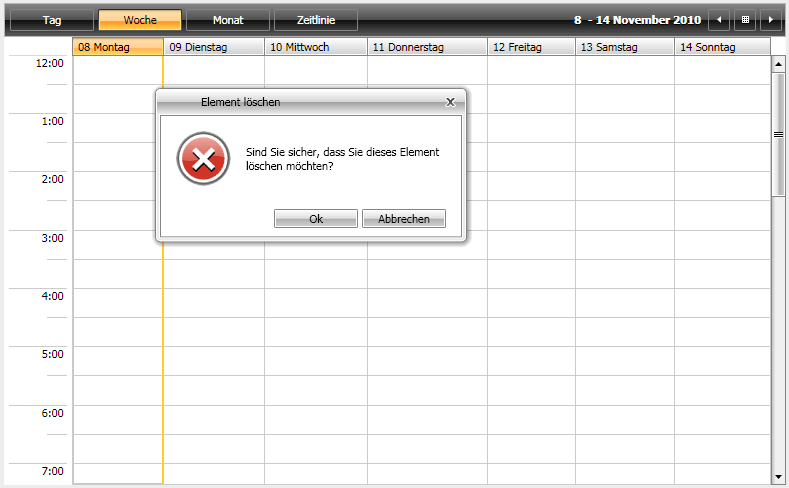
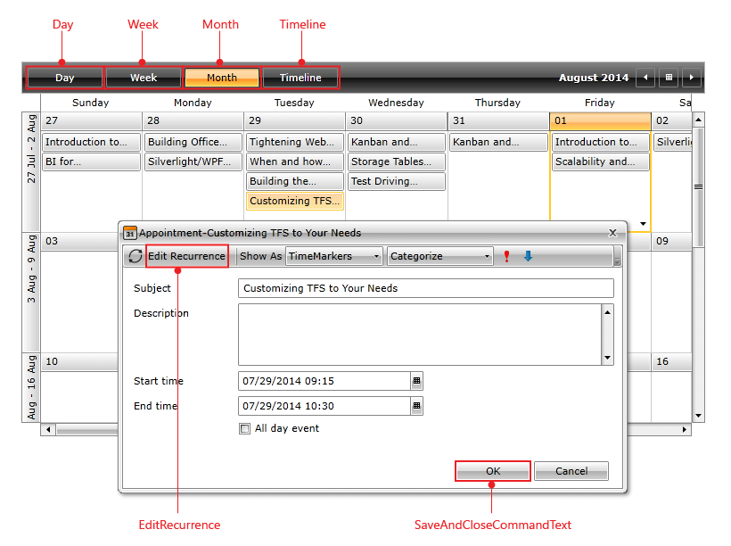
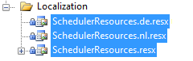
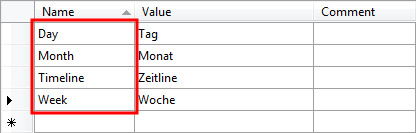
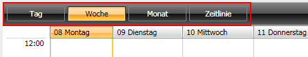

# Localization

The built-in localization mechanism in Silverlight and WPF allows you to localize any string resource used by the standard __RadScheduleView__ control. Once translated you might use your resources in Silverlight and WPF projects without changing anything.



## Supported Languages

__RadScheduleView__ can be translated in one of the following supported languages using the framework’s localization mechanism:

* English
* German
* Spanish
* French
* Italian
* Dutch
* Turkish

More information on how to achieve this you can find in the [Localization Using Built-in Resources] () article.

## LocalizationManager

The __Telerik.Windows.Controls.LocalizationManager__ allows you to easily localize any of the Telerik controls.

To apply custom localization to your controls just instantiate your custom __LocalizationManager__ and set it to the static property __LocalizationManager.Manager__, before the creation of the UI.


```C#
	LocalizationManager.Manager = new CustomLocalizationManager();
```
```VB.NET
	LocalizationManager.Manager = New CustomLocalizationManager()
```

>__Note that you have to set the localization manager before the creation of the UI, otherwise some parts might remain not-localized.__

## Resource Keys

__RadScheduleView__ is a complex user interface control and its strings for localization are numerous. In order to be able to distinguish these resources, a unique identifier, called __resource key__, is assigned to each localizable string.

On the picture below you can see some of the resource keys and the strings they are associated with. A complete list of the __RadScheduleView__ resource keys can be found [here](#radscheduleview-resource-keys).



## Localization Using ResourceManager

You can base your localization on the standard resource files provided by the .NET framework. For that purpose you will have to create a separate __.ResX file__ for each one of the languages that your application will support.

Imagine that you want to translate your schedule control into English, German and Dutch. For that purpose you will have to add three new resource files to your project:

* __ScheduleViewResources.resx__ - this resource file will store the __English(default)__ resources for the ScheduleView control. Set the __AccessModifier__ property to __Public__.

* __ScheduleViewResources.de.resx__ - this resource file will store the __German__ resources for the ScheduleView control. Set the __AccessModifier__ property to __No code generation__.

* __ScheduleViewResources.nl.resx__ - this resource file will store the __Dutch__ resources for the ScheduleView control. Set the __AccessModifier__ property to __No code generation__.



Now, having the needed files, it's time to illustrate the idea and localize for example the text for the Day, Week, Month and Timeline navigation strings. For that purpose you need to create four resource strings in each one of the three resource files and translate them to the appropriate language.

>Note that the name of the resource string should be the same as the resource key for the string you are localizing i.e. the resource key for the Day is __Day__, for the Week is __Week__, for Month is __Month__ and for the Timeline is __Timeline__.

The snapshot below shows the content of the __ScheduleViewResources.de.resx__ file. The resource name of the other two files should be the same. The Value column will contain the translation for the appropriate language.



The last step is to instantiate the __LocalizationManager__ class and set its __ResourceManager__ to the resources that have been just created.


```C#
	LocalizationManager.Manager = new LocalizationManager()
	{
	   ResourceManager = ScheduleViewResources.ResourceManager
	};
```
```VB.NET
	LocalizationManager.Manager = New LocalizationManager()
	LocalizationManager.Manager.ResourceManager = ScheduleViewResources.ResourceManager
```


>If you rely on culture settings to load the right resources automatically, you have to write some code inside your application's project file. For example, >if you have to support English and Dutch languages, you can store the localized strings in __Resources.resx__ and __Resources.nl.resx__ files. For the >__Resources.resx__ file you can set __ResXFileCodeGenerator__ to __Internal__ or __Public__ and for others - to __No code generation__. Then, open the project >file in a text-mode and insert the code below into the __<PropertyGroup>__ section. In this way you notify the framework about the supported cultures.
> <SupportedCultures>en;nl</SupportedCultures>


Here is how the localized __RadScheduleView__ looks like:



##  Localization Using Custom Localization Manager

The other way to localize your __RadScheduleView__ control is to create a class that derives from the __ScheduleViewLocalizationManager__ object and to override its method __GetStringOverride()__. The logic is pretty simple, you just have to create a switch statement and return the correct translation for each resource key, as it is shown below:


```C#
	public class CustomLocalizationManager : ScheduleViewLocalizationManager
	{
	   public override string GetStringOverride( string key )
	   {
	       switch( key )
	       {
	           case "Timeline":
	               return "Zeitline";
	           case "Day":
	               return "Tag";
	           case "Week":
	               return "Woche";
	           case "Month":
	               return "Monat";
	           case "SaveAndCloseCommandText":
	               return "Speichern & Sliessen";
	           case "EditRecurrence":
	               return "Serie bearbeithen";
	           case "Categories":
	               return "Kategrisieren";
	       }
	       return base.GetStringOverride( key );
	   }
	}
```
```VB.NET
	Public Class CustomLocalizationManager
	    Inherits ScheduleViewLocalizationManager
	    Public Overloads Overrides Function GetStringOverride(ByVal key As String) As String
	        Select Case key
	            Case "Timeline"
	                Return "Zeitline"
	            Case "Day"
	                Return "Tag"
	            Case "Week"
	                Return "Woche"
	            Case "Month"
	                Return "Monat"
	            Case "SaveAndCloseCommandText"
	                Return "Speichern & Sliessen"
	            Case "EditRecurrence"
	                Return "Serie bearbeithen"
	            Case "Categories"
	                Return "Kategrisieren"
	        End Select
	        Return MyBase.GetStringOverride(key)
	    End Function
	End Class
```

>important It is important for the custom localization manager to derive from __ScheduleViewLocalizationManager__ and not from __LocalizationManager__. 

Of course, if you don't want to hard-code your translation inside your source code, you can always use resource files:


```C#
	public override string GetStringOverride( string key )
	{
	   switch( key )
	   {
	       //----------------------
	       case "Timeline":
	           return ScheduleViewResources.Timeline;
	       //----------------------
	   }
	   return base.GetStringOverride( key );
	}
```
```VB.NET
	Public Overloads Overrides Function GetStringOverride(ByVal key As String) As String
	    Select Case key
	        '----------------------
	        Case "Timeline"
	            Return ScheduleViewResources.Timeline
	        '----------------------
	    End Select
	    Return MyBase.GetStringOverride(key)
	End Function
```

## RadScheduleView Resource Keys

The following __Resource Keys__ are available:
        

* __AllDayEvent__

* __Appointment__

* __AppointmentRecurrence__

* __AppointmentTime__

* __Body__

* __Busy__

* __Cancel__

* __Categorize__

* __CreateAppointment__

* __Daily__

* __Day__

* __Days__

* __DeleteAppointment__

* __DeleteItem__

* __DeleteItemQuestion__

* __DeleteOccurrence__

* __DeleteRecurringItem__

* __DeleteRecurringItemQuestion__

* __DeleteSeries__

* __DurationColon__

* __DurationDay__

* __DurationDays__

* __DurationHour__

* __DurationHours__

* __DurationMinute__

* __DurationMinutes__

* __DurationWeek__

* __DurationWeeks__

* __EditAppointment__

* __EditParentAppointment__

* __EditRecurrence__

* __EditRecurrenceCommandText__

* __EditRecurrenceRule__

* __EndAfter__

* __EndBy__

* __EndColon__

* __EndDateBeforeStart__

* __EndTime__

* __Event__

* __Every__

* __EveryDay__

* __EveryWeekday__

* __First__

* __Fourth__

* __Free__

* __HighImportance__

* __InvalidRecurrenceRuleMessage__

* __InvalidRecurrenceRuleTitle__

* __Last__

* __LowImportance__

* __Month__

* __Monthly__

* __Months__

* __NoEndDate__

* __Occurrences__

* __Of__

* __OfEvery__

* __Ok__

* __OpenOccurrence__

* __OpenRecurringItem__

* __OpenRecurringItemQuestion__

* __OpenSeries__

* __OutOfOffice__

* __RangeOfRecurrence__

* __RecurEvery__

* __RecurrencePattern__

* __RemoveRecurrence__

* __SaveAndClose__

* __SaveAndCloseCommandText__

* __SaveAppointment__

* __SaveRecurrence__

* __Second__

* __SetDayViewMode__

* __SetMonthViewMode__

* __SetTimelineViewMode__

* __SetWeekViewMode__

* __ShowAs__

* __Start__

* __StartColon__

* __StartTime__

* __Subject__

* __Tentative__

* __The__

* __Third__

* __Timeline__

* __Untitled__

* __Week__

* __WeekDays__

* __WeekendDays__

* __Weekly__

* __WeeksOn__

* __Yearly__

* __DragRecurringWarning__

## Using Built-In Resources

__RadScheduleView__ provides you with built-in resources for several cultures:  __Spanish, German, Italian, Turkish, Dutch__.

To change the default culture, you should set the __CurrentCulture__ and the __CurrentUICulture__ of the __CurrentThread__. Note that this must happen in the code-behind of your __Application__ (__App.xaml.cs__) file, right before the UI initialization. The next code-snippet shows you how to change the __CurrentCulture__ to __Dutch__.


```C#
	public partial class App : Application
	{
	   public App()
	   {
	       System.Threading.Thread.CurrentThread.CurrentCulture = new System.Globalization.CultureInfo( "nl" );
	       System.Threading.Thread.CurrentThread.CurrentUICulture = new System.Globalization.CultureInfo( "nl" );
	       InitializeComponent();
	   }
	}
```
