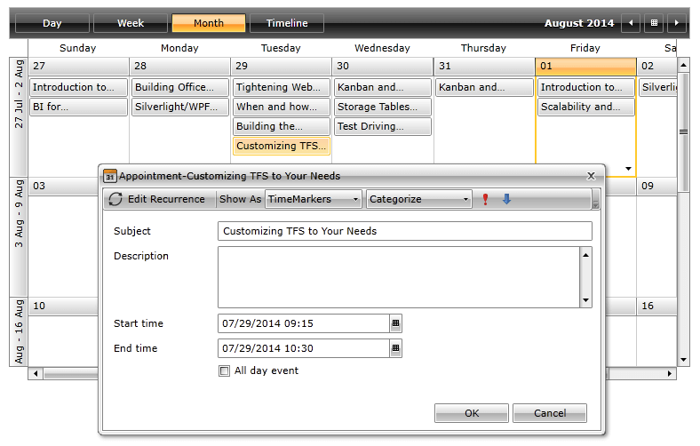

# Overview








Thank you for choosing Telerik __RadScheduleView__.

__RadScheduleView__ is a radically different scheduling component, going beyond the standard Microsoft Outlook-style control. RadScheduleView empowers the end user with unprecedented control over precision and flexibility when handling their appointments. This is achieved through features such as multi-level grouping, powerful zoom for smart navigation through a large number of appointments and blazing fast scrolling.

## Key Features

* __Rich User Experience__: The RadScheduleView control allows you to perform various operations in an interactive manner. You can drag tasks to new time slots or days, resize tasks to change their length, create all day appointments or modify your appointments through inline editing.

* __Performance__: The control provides blazing fast performance via the built-in UI virtualization feature that creates and re-uses containers only for the current viewport.

* __Edit forms__: You can easily create and edit appointments using the edit forms the control provides. The forms are displayed in built-in dialog windows. Read more about this in the [End-User Capabilities]() article.

* __Built-in and custom views__: RadScheduleView comes with few predefined views - day, week, month and timeline - which can be customized. Read more about this in the [ViewDefinintions]() section.

* __Multi-level grouping__: You can display multiple resources and group the appointments accordingly. Also, you can assign appointments to several resources and then group them as you need. Read more about this in the [Grouping]() article.

* __Orientation__: The control allows you to change the view definitions orientation. Read more about this in the ViewDefinitions [Configuration]() article.

* __Dragging multiple appointments__: The control supports drag/drop of multiple appointments at once. With the improved API you can fully customize the drag-drop and the resize operations. Read more about this in the [Drag and Drop]() article.

* __Zooming__: The scheduleview supports zoom-in/out the appointments within the visible area of the schedule. This way, you can navigate through a big amount of appointments while keeping the fast performance of the control.

* __Snap аppointments__: You can easily snap appointments according to the size of the defined TimeSlot items with setting the SnapAppointments property. Read more about this in the [Snapping Appointments]() article

>tip Get started with the control with its [Getting Started]() help article that shows how to use it in a basic scenario.

> Check out the control's demos at [demos.telerik.com](http://demos.telerik.com/silverlight/#ScheduleView)[demos.telerik.com](http://demos.telerik.com/wpf/)

## See Also 
 * [Key Features]()
 * [Understanding Appointments]()
 * [Visual Structure]()