# Table Definitions and Relationships

The database diagram is very common to the class diagram of the RadScheduleView interfaces:

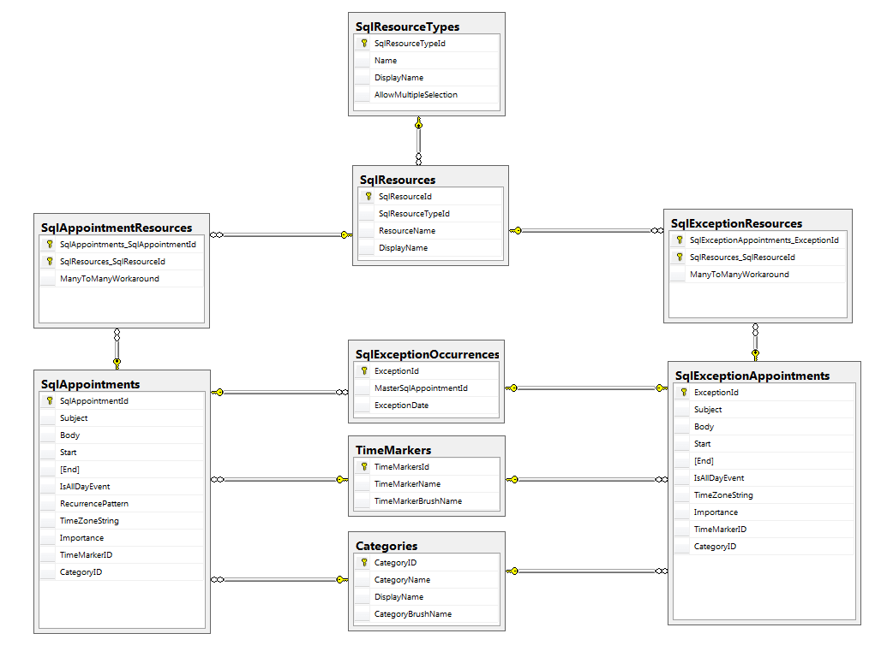

## Table Definitions

We have table definitions in the database according for the following types in the RadScheduleView:

| Class Diagram | Table Definition |
|	---	|	---	|
|	IAppointment & IExtendedAppointment 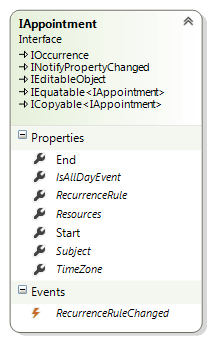 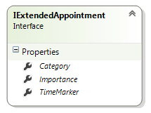	|	SqlAppointments 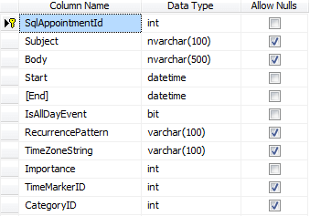	|
|	IResource 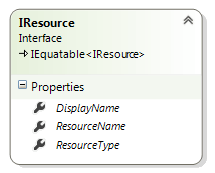	|	SqlResources 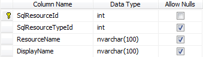	|
|	IExceptionOccurrence 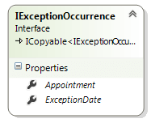	|	SqlExceptionOccurrences 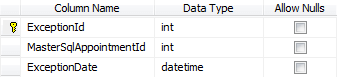	|
|	IResourceType 	|	SqlResourceTypes 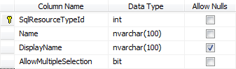	|
|	ICategory 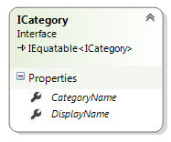	|	Categories 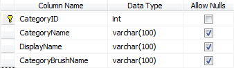	|
|	ITimeMarker 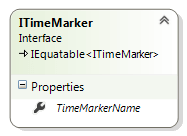	|	TimeMarkers 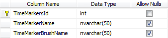	|

## Relationships

Here are some explanations about the keys and the relationships in the data tables:

Name	|	Between	|	Type	|	Update/delete rule
---	|	---	|	---	|	---
FK_SqlResources_SqlResourceTypes	|	SqlResourceTypes - SqlResources	|	One-to-many	|	No Action
FK_SqlAppointmentResources_SqlResource	|	SqlResources - SqlAppointmentResources	|	One-to-many	|	Cascade
FK_SqlExceptionResources_SqlResource	|	SqlResources - SqlExceptionResources	|	One-to-many	|	Cascade
FK_SqlExceptionOccurrences_SqlAppointments	|	SqlAppointments - SqlExceptionOccurrences	|	One-to-many	|	Cascade
FK_SqlExceptionAppointments_SqlExceptionOccurrences	|	SqlExceptionOccurrences - SqlExceptionAppointments	|	One-to-many	|	Cascade

* There is no table definition for the __IRecurrenceRule__ type because we don’t need it. Storing the __RecurrencePattern__ is enough to generate the recurrence rules at run-time.
* We cannot save the Brush type into the database directly, that’s why we can save a string that represents the color and convert the string to __SolidColerBrush__ object when the TimeMarkers & Categories are loaded.
* The __SqlAppointmentResource__ and __SqlExceptionResources__ are cross-tables between:
	* SqlAppointments & SqlResources
	* SqlExceptionAppointments & SqlResources