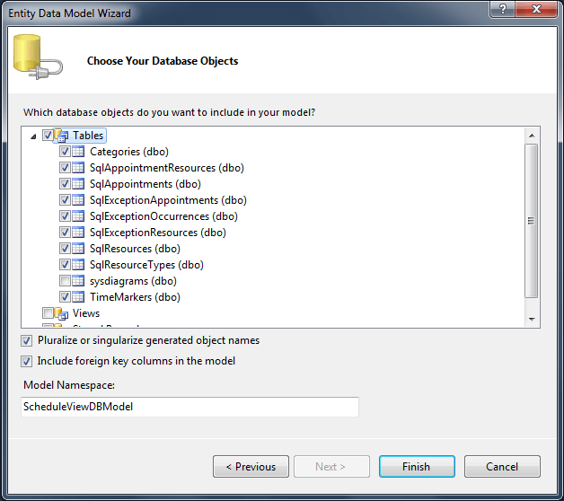
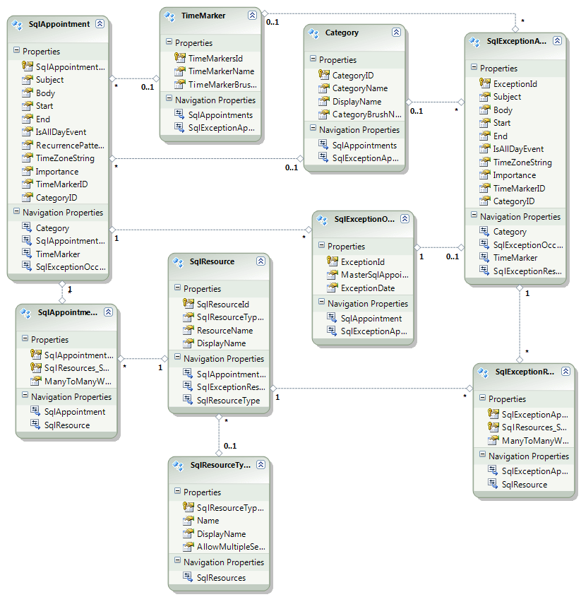

# Entity Model

## 

Now, when we have the table definitions that match the types in the RadScheduleView control in a very common way, we can continue with generating the Entity Model:

* Select the project and select Add -> New item -> ADO.NET Entity Data Model

* Enter a name and select Add

* From the __Entity Data Model Wizard__ select __Generate from database__ model and click next

* Set a connection string to the database and click next

* Select the tables from the database that will be used.
      		

* Click Finish. The generated model looks like the following diagram:

# See Also

 * [Models]()
