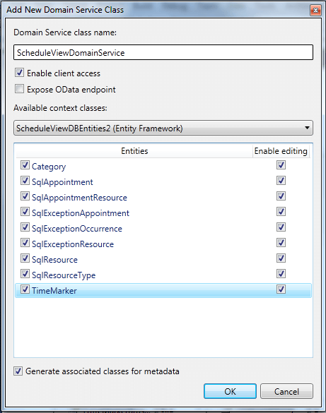

# Entity Model, DomainContext

## 

Now, when we have the table definitions that match the types in the RadScheduleView control in a very common way, we can continue with generating the Entity Model:

* Select the web project and select Add -> New item -> ADO.NET Entity Data Model

* Enter a name and select Add

* From the __Entity Data Model Wizard__ select __Generate from database__ model and click next

* Set a connection string to the database and click next

* Select the tables from the database that will be used.
      		

* Click Finish. The generated model looks like the following diagram:

Once the entity model is ready, rebuild the project. We will use the WCF RIA Service to generate the types on the client side (Silverlight) and to synchronize the objects in the client side and server side. So, we can focus on the business logic and add a new domain service class:
        

* Select the web project and select Add -> New item -> Domain Service class

* Enter name and click Add

* The “Add New Domain Service Class” dialog opens. Select the DataContext and check all the Entities for editing. Please, note that “Enable client access” and “Generate associated classes for metadata” must be checked.
        

>Note that in Visual Studio 2012 there are some changes regarding Entity Framework and more specifically code generation strategy (before the code that was generated was using entities based on EntityObject and a context class derived from the ObjectContext class. VS2012 by default generates POCO entities and DbContext derived context). So in order to create a Domain Service class following our tutorial in VS 2012, you should implement the next steps:
          

* Remove .tt files from the generated ADO.NET Entity Data Model from your solution to avoid having both contexts and duplicate entities.

* Right-click on the designer surface and select properties.

* Change the "Code Generation Strategy" from "None" to "Default".

Once the domain service class is added, rebuild the project as well. Let’s add the __GetSqlAppointmentsByRange(DateTime start, DateTime end)__ method to the DomainService class because we want to load only the visible appointments:
        

#### __C#__

{{region radscheduleview-populating-with-data-binding-to-db-midtier_0}}
	private int[] GetSqlAppointmentsIdsByRange(DateTime start, DateTime end)
	{
		var result = this.ObjectContext.SqlAppointments.Where(a => (a.Start >= start && a.End <= end)).ToList<SqlAppointment>();
	
		return result.OfType<SqlAppointment>().Select(e => e.SqlAppointmentId).ToArray();
	}
	
	public IQueryable<SqlAppointment> GetSqlAppointmentsByRange(DateTime start, DateTime end)
	{
		var ids = GetSqlAppointmentsIdsByRange(start, end);
	
		var result = this.ObjectContext.SqlAppointments.Where(a => ids.Contains(a.SqlAppointmentId)).ToList<SqlAppointment>();
	
		// Load the recurrent appointments
		foreach (var item in this.ObjectContext.SqlAppointments.Where(a => !string.IsNullOrEmpty(a.RecurrencePattern)))
		{
			if (Helper.IsOccurrenceInRange(item.RecurrencePattern, start, end) && !result.Contains(item))
			{
				result.Add(item);
			}
		}
	
		// Load the exceptions
		foreach (var item in this.ObjectContext.SqlAppointments.Where(a => a.Start < end && a.SqlExceptionOccurrences.Count != 0))
		{
			if (item.SqlExceptionOccurrences.Any(e => e.SqlExceptionAppointment != null && 
														e.SqlExceptionAppointment.Start >= start && 
														e.SqlExceptionAppointment.End <= end))
			{
				result.Add(item);
			}
		}
	
		return result.AsQueryable<SqlAppointment>();
	}
	{{endregion}}

# See Also

 * [Silverlight Part]()
