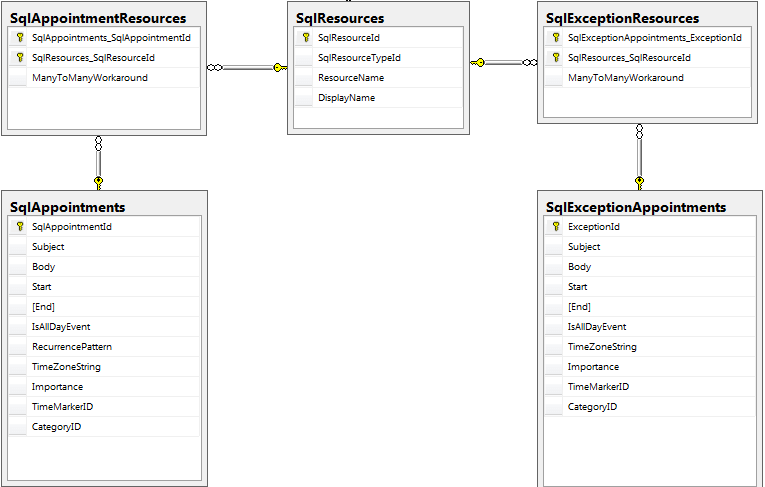

# Silverlight Part

## 

We are ready with the implementation on the service side and we can focus on the Silverlight project.

>With the current version (v1.0 SP2) WCF RIA Services doesn’t support Many-To-Many relationships between the Entities,
					but we have such ones in the database. To work around this limitation, we use an additional property which forces EF to create a
					Many-To-Many table:
				Once the table is created we have to update manually the data in it.

All generated entities from the WCF RIA Services are partial classes and we could extend them to implement the ScheduleView interfaces:
      	

* public partial class Category : ICategory 

* public partial class SqlAppointment : IAppointment, IObjectGenerator<IRecurrenceRule> 

* public partial class SqlExceptionAppointment : IEditableObject, IAppointment, IObjectGenerator<IRecurrenceRule>

* public partial class SqlExceptionOccurrence : IExceptionOccurrence

* public class SqlRecurrenceRule : ViewModelBase, IRecurrenceRule

* public partial class SqlResource : IResource

* public partial class SqlResourceType : IResourceType

* public partial class TimeMarker : ITimeMarker

Most of the properties are already implemented from the entity, so we need to add the others manually. The tricky part here is the IAppointment implementation (the SqlExceptionAppointment implementation is very similar to the IAppointment, the only difference is that the exceptions don’t have RecurrenceRule). Please, note that the Copy() method is called when the appointment is being copied (for example – when is dragging with ctrl control pressed). In this case, we need to copy all the properties form the original appointment to the copy.
      	

# See Also

 * [Models]()
