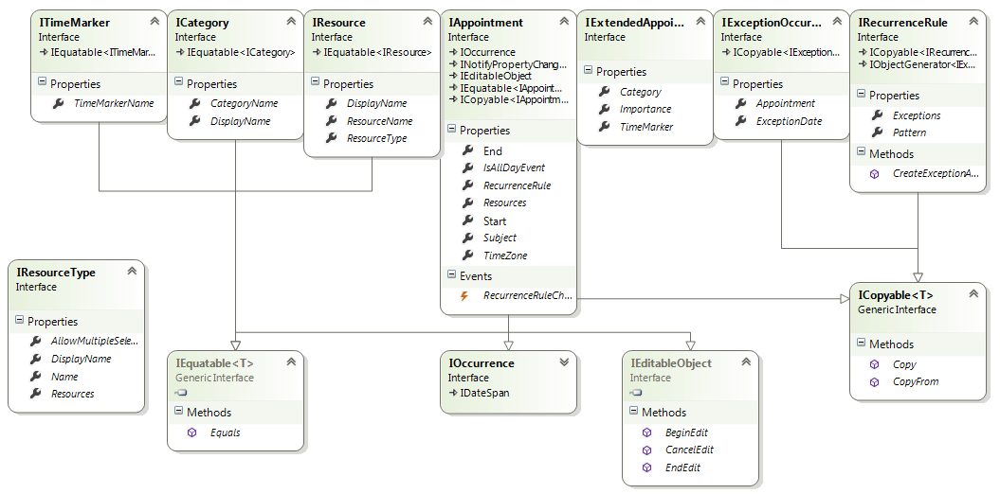

# RadScheduleView Types and Sources

## 

The ScheduleView control exposes several Sources that enable data binding:

* __AppointmentsSource__ - gets or sets the data source (__IEnumerable__) used to generate  the Appointments

* __ResourceTypesSource__ - gets or sets the data source (__IEnumerable__) used to generate the ResourceTypes

* __CategoriesSource__ - gets or sets the data source (__IEnumerable__) used to generate the Categories

* __TimeMarkersSource__ - gets or sets the data source (__IEnumerable__) used to generate the TimeMarkers

With its current version RadScheduleView exposes several important interfaces: __ITimeMarker, IResourceType, IResource, IRecurrenceRule, IExceptionOccurrence, IAppointment, IExtendedAppointment, ICategory__. Implementing these interfaces allows the developer to plug custom objects and to not work with the default ones (Appointment, Resource, RecurrenceRule, ExceptionOccurrence, Category, TimeMarker). We are going to use these interfaces to plug the entities from the Entity Framework.

Here you could refer to the class diagram for more detailed information about the interfaces:

# See Also

 * [Table Definitions and Relationships]()
