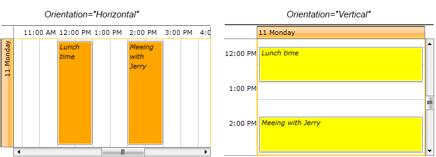
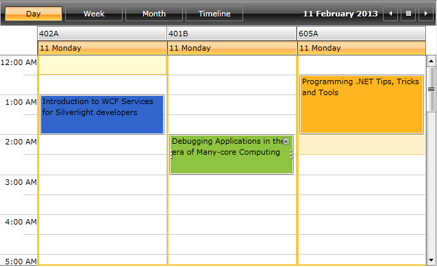

# Appointment Style

__RadScheduleView__ control makes it easy to customize the look & feel of an __Appointment__. Not only you can customize the way Appointments look (a simple and basic customization), but you can also create a custom AppointmentStyleSelector to conditionally apply different appointment styles depending on resource types, for example.			

This article will cover the following topics:

* [How to generate and use AppointmentStyleSelector](#generate-and-use-appointmentstyleselector)

* [How to create a custom AppointmentStyleSelector.](#create-a-custom-appointmentstyleselector)

## Generate and use AppointmentStyleSelector

Any change on the appearance of an Appointment depends on the AppointmentStyleSelector and the containing styles. The selector is oriented, meaning it contains orientation dependant styles – horizontal and vertical.				

Firstly, you should obtain the source code of AppointmentStyleSelector:				

In the UI for SilverlightWPF installation folder on your pc, go to Themes folder (Themes.Implicit in case you're using [Implicit Styles]()) and select the theme that you use in your application. Drill down to find the __Telerik.Windows.Controls.ScheduleView.xaml__ file in that directory. From this resource dictionary you can extract the AppointmentStyleSelector and any needed resources that it uses.				

The end result should include the following:				

__Example 1: The default AppointmentStyleSelector__

<snippet id='radscheduleview-styles-and-templates-appointment-style-block_1-xaml' />

where "*local*" is:

__Example 2: Defining the local namespace__

<snippet id='radscheduleview-styles-and-templates-appointment-style-block_2-xaml' />

>important If you are using the default OfficeBlack theme or you've set a different theme with StyleManager, you should copy all the referenced resources from the RadScheduleView XAML file into your project. If you are using [Implicit Styles]() and merge the ResourceDictionaries, you will be able to reference the needed resources directly.				

Note that you have both __HorizontalStyle__ and __VerticalStyle__. RadScheduleView supports __Orientation__ for all its view definitions. Therefore a HorizontalStyle is applied when the appointment is horizontally oriented, while the VerticalStyle is applied when the appointment is vertically oriented.				

>tip When making changes to the generated AppointmentStyleSelector, you should apply those changes to both the HorizontalStyle and the VerticalStyle in order for your appointments to look consistent in all views.					

So, let's for example modify the background color and style of the appointments:

__Example 3: Modified AppointmentStyleSelector__

<snippet id='radscheduleview-styles-and-templates-appointment-style-block_3-xaml' />

And assign the AppointmentStyleSelector to the ScheduleView:

__Example 4: Assigning the modified AppointmentStyleSelector__

<snippet id='radscheduleview-styles-and-templates-appointment-style-block_4-xaml' />

The end result in DayViewDefinition with both Horizontal and Vertical Orientation is displayed below:

## Create a custom AppointmentStyleSelector

The __AppointmentStyleSelector__ is a regular Style Selector and allows you to apply different appointment styles based on some custom logic. In the following example, we will apply a different style to appointments belonging to different [Resource Types]().			

We will use a scenario in which we have an application containing a RadScheduleView with three conference rooms set as three resources. We assume that we already have an Appointment collection which is set as an __AppointmentSource__ of RadScheduleView , and each Appointment has been set a ResourceName and ResourceType via its __Resource__ property.				

Next ,we are going to use these resources and create the selector. Create a new Class which inherits __OrientedAppointmentItemStyleSelector__. Override its __SelectStyle()__ method and use __activeViewDefinition.GetOrientation()__ to determine whether to apply a horizontal or a vertical Style in your selector.  Then, your AppointmentStyleSelector would look like this:				

__Example 5: Custom AppointmentStyleSelector__

<snippet id='radscheduleview-styles-and-templates-appointment-style-block_5-cs' />

>tip Note that you need to ensure that both horizontal and vertical cases have their corresponding styles - __horizontal styles__ are applied when the appointments have horizontal orientation (either by default or when the view they are placed in has been explicitly set a horizontal orientation), __vertical styles__ are applied when the appointments have vertical orientation(either by default or when the view they are placed in has been explicitly set a vertical orientation).					

We add all needed Resources and group our ScheduleView by the "Room" ResourceType:				

__Example 6: Adding the resources to the RadScheduleView control__

<snippet id='radscheduleview-styles-and-templates-appointment-style-block_6-xaml' />

Add the custom AppointmentStyleSelector with all the defined Styles:

__Example 7: AppointmentStyleSelector with all defined Styles__

<snippet id='radscheduleview-styles-and-templates-appointment-style-block_7-xaml' />

And assign it to the ScheduleView:			

__Example 8: Assign the AppointmentStyleSelector to the RadScheduleView control__

<snippet id='radscheduleview-styles-and-templates-appointment-style-block_8-xaml' />

Now that we have our Resources set and our __AppointmentStyleSelector__ ready, let's see the final result. The appointment styles are applied in accordance with each Resource:

## See Also

 * [Resources]()

 * [Understanding Appointments]()

 * [Custom Appointment]()