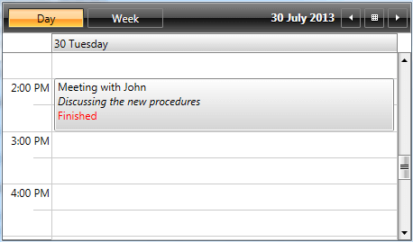
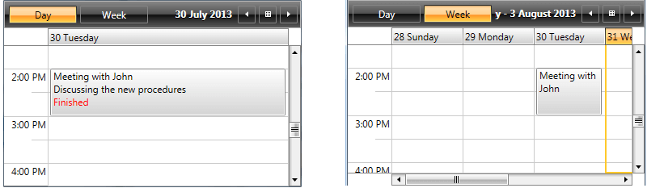

# Appointment Template

This help topic explains in details how you can customize the template of the appointments using AppointmentItemContentTemplate or AppointmentItemContentTemplateSelector properties. The second approach is used when you need to apply different templates according to some custom logic.

## Setting AppointmentItemContentTemplate

RadScheduleView provides an easy way to change the appointment template through its __AppointmentContentTemplate__ property.

The DataContext of the defined DataTemplate that we will be set to __AppointmentContentTemplate__ is of type __AppointmentProxy__ - it holds the most important properties of the Appointment and the Appointment itself. 

Let's for example have a [Custom Appointment]() with IsDone custom property:

<snippet id='radscheduleview-styles-and-templates-appointment-template-block_1-cs' />

We will create the following DataTemplate in order to show some additional information about the appointment:

<snippet id='radscheduleview-styles-and-templates-appointment-template-block_2-xaml' />

>Note that custom properties should be bound through Appointment property of the DataContext.

Then the DataTemplate should be set to __AppointmentContentTemplate__ property of the ScheduleView control:        

<snippet id='radscheduleview-styles-and-templates-appointment-template-block_3-xaml' />

Here is the end result:

## Setting AppointmentItemContentTemplateSelector

In some cases there is a need to apply different templates to the appointments according to some condition - this can be achieved by setting __AppointmentItemContentTemplateSelector__ property of the ScheduleView control.

Let's, for example create separate appointment templates for the different ViewDefinitions of the control - a more detailed template for DayViewDefinition and a simple template for WeekViewDefinition.

First, we will have to create a custom class which inherits from Telerik.Windows.Controls.ScheduleViewDataTemplateSelector, define the needed DataTemplates in it and override SelectTemplate method:

<snippet id='radscheduleview-styles-and-templates-appointment-template-block_4-cs' />

Then define the CustomAppointmentTemplateSelector and the DataTemplates in XAML:

<snippet id='radscheduleview-styles-and-templates-appointment-template-block_5-xaml' />

And apply it to the ScheduleView:

<snippet id='radscheduleview-styles-and-templates-appointment-template-block_6-xaml' />

The following screenshot shows how the same appointment looks in different ViewDefinitions:

