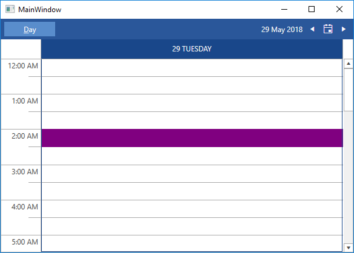
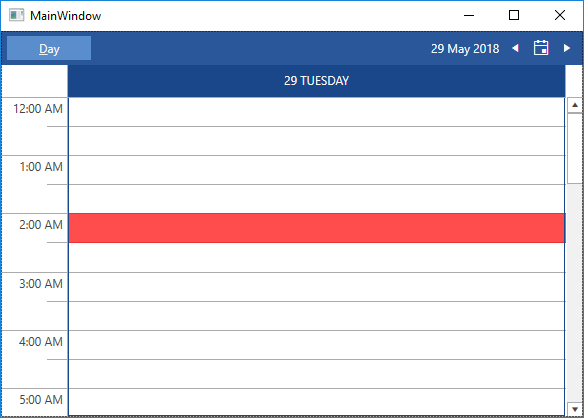

# Customizing the MouseOver and SelectionHighlight

The __RadScheduleView__ makes it possible to customize the mouseover and selection highlights of the slots in the control. The next examples will demonstrate how to do that by setting the __MouseOverHighlightStyle__ and __SelectionHighlightStyle__ properties of the RadScheduleView.

>The following examples use implicit styles. Before proceeding with them, you should read about [Implicit Styles]().

## Customizing the MouseOverHighlightStyle

In order to customize the __MouseOverHighlightStyle__ using implicit styles you can follow these steps:

1. Add references to the [NoXaml](#noxaml-assemblies) binaries that the RadScheduleView requires.

2. Merge the necessary ResourceDictionaries in the App.xaml file (the Office 2016 theme is used in this example):

    __Example 1: Merge the necessary ResourceDictionaries__

    ```XAML
        <ResourceDictionary>
            <ResourceDictionary.MergedDictionaries>
                <ResourceDictionary Source="/Telerik.Windows.Themes.Office2016;component/Themes/System.Windows.xaml"/>
                <ResourceDictionary Source="/Telerik.Windows.Themes.Office2016;component/Themes/Telerik.Windows.Controls.xaml"/>
                <ResourceDictionary Source="/Telerik.Windows.Themes.Office2016;component/Themes/Telerik.Windows.Controls.Input.xaml"/>
                <ResourceDictionary Source="/Telerik.Windows.Themes.Office2016;component/Themes/Telerik.Windows.Controls.Navigation.xaml"/>
                <ResourceDictionary Source="/Telerik.Windows.Themes.Office2016;component/Themes/Telerik.Windows.Controls.ScheduleView.xaml"/>
            </ResourceDictionary.MergedDictionaries>
        </ResourceDictionary>
    ```

3. Create a Style that targets __HighlightItem__, base it on the MouseOverHighlightStyle StaticResource and set the Background property:

    __Example 2: Define the custom style__

    ```XAML
        <Style x:Key="MyMouseOverHighlightStyle" TargetType="telerik:HighlightItem" BasedOn="{StaticResource MouseOverHighlightStyle}">
            <Setter Property="Background" Value="Purple"/>
        </Style>
    ```

4. Next we will need to set the newly created Style to the MouseOverHighlightStyle property of the RadScheduleView:

    __Example 3: Set the MouseOverHighlightStyle property__

    ```XAML
        <telerik:RadScheduleView AppointmentsSource="{Binding Appointments}"
                            MouseOverHighlightStyle="{StaticResource MyMouseOverHighlightStyle}">
            <telerik:RadScheduleView.ViewDefinitions>
                <telerik:DayViewDefinition/>
            </telerik:RadScheduleView.ViewDefinitions>
        </telerik:RadScheduleView>
    ```

#### Figure 1: Result from Example 3 after hovering over a slot in the Office 2016 theme


## Customizing the SelectionHighlightStyle

In order to customize the __SelectionHighlightStyle__ using implicit styles you can do step 1 and step 2 from the previous example and then:

1. Create a Style that targets the __HighlightItem__, base it on the SelectionHighlightStyle StaticResource and set the Background property:

	__Example 4: Define the custom style__

	```XAML
		<Style x:Key="MySelectionHighlightStyle" TargetType="telerik:HighlightItem" BasedOn="{StaticResource SelectionHighlightStyle}">
			<Setter Property="Background" Value="Red"/>
		</Style>
	```

2. Next we will need to set the newly created Style to the SelectionHighlightStyle of the RadScheduleView:

	__Example 5: Set the custom style__

	```XAML
		<telerik:RadScheduleView AppointmentsSource="{Binding Appointments}"
							SelectionHighlightStyle="{StaticResource MySelectionHighlightStyle}">
			<telerik:RadScheduleView.ViewDefinitions>
				<telerik:DayViewDefinition/>
			</telerik:RadScheduleView.ViewDefinitions>
		</telerik:RadScheduleView>
	```

#### Figure 2: Result from Example 5 after selecting a slot in the Office 2016 theme__


## See Also
 * [Appointment Style]()
 * [Customizing the Resize and DragDropHighlight]()
