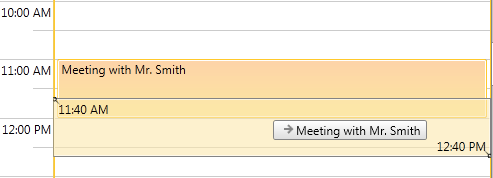
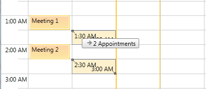
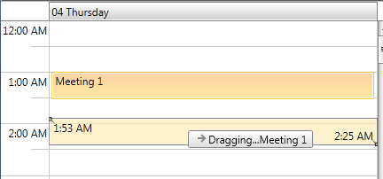
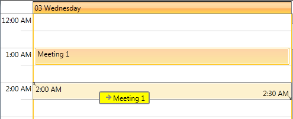

# Customizing the DragVisual

This help article explains how you could customize the visual element that is shown while the user is dragging an appointment in the __ScheduleView__ control.



You could change its look by setting DragVisualTemplate and DragVisualStyle properties.  We will go through each of them separately:

* [DragVisualTemplate](#dragvisualtemplate)

* [DragVisualStyle](#dragvisualstyle)

## DragVisualTemplate

__DragVisualTemplate__ property is of type DataTemplate and is used to define the content of the DragVisual.  It receives as DataContext a list of the dragged appointments (or occurrences in case of recurrent appointments). 

Here is the default DragVisualTemplate:


```XAML
	<DataTemplate x:Key="DragVisualContentTemplate">
		<TextBlock Text="{Binding Converter={StaticResource DraggedAppointmentsToLocalizedStringConverter}}" 
			TextWrapping="Wrap" 
			MaxWidth="200" 
			MaxHeight="66" 
			TextTrimming="WordEllipsis" />
	</DataTemplate>  
```

Note the use of DraggedAppointmentsToLocalizedStringConverter – it is needed to cover  the cases when multiple appointments are dragged:



Let’s for example, change the DataTemplate  as following:


```XAML
	<DataTemplate x:Key="DragVisualContentTemplate">
		<StackPanel Orientation="Horizontal">
			<TextBlock Text="Dragging..." />
			<TextBlock Text="{Binding Converter={StaticResource DraggedAppointmentsToLocalizedStringConverter}}" 
					TextWrapping="Wrap" 
					MaxWidth="200" 
					MaxHeight="66" 
					TextTrimming="WordEllipsis" />
		</StackPanel>
	</DataTemplate>
```

>If you’re using [Implicit Styles](), you will be able to reference DraggedAppointmentsToLocalizedStringConverter directly.  In other case you should manually add it as a resource before the DragVisualContentTemplate declaration: 


```XAML
    <telerik:DraggedAppointmentsToLocalizedStringConverter x:Key="DraggedAppointmentsToLocalizedStringConverter" />
```

Then set the newly created template to the DragVisualTemplate property of the ScheduleView:


```XAML
	<telerik:RadScheduleView AppointmentsSource="{Binding Appointments}"
							DragVisualTemplate="{StaticResource DragVisualContentTemplate}">
		...
	</telerik:RadScheduleView>
```

Here is the result:



## DragVisualStyle

__DragVisualStyle__ property defines the look and behavior of the DragVisual element.

There are two approaches for customizing the DragVisualStyle according to the way you’re setting a theme to RadScheduleView:

* If you’re using [Implicit Styles]() and merge the needed XAML files as ResourceDictionaries in App.xaml, then you could create there a new Style for DragVisual element based on the default style. This way you will be able to modify only certain properties of the default style. Here is a simple example below:           


```XAML
	<Application.Resources>
	    <ResourceDictionary>
	        <ResourceDictionary.MergedDictionaries>
	            …
	            <ResourceDictionary Source="/Telerik.Windows.Themes.Office_Black;component/Themes/Telerik.Windows.Controls.ScheduleView.xaml"/>
	        </ResourceDictionary.MergedDictionaries>
	    </ResourceDictionary>
	    <Style x:Key="CustomDragVisualStyle" TargetType="telerik:DragVisual" BasedOn="{StaticResource DragVisualStyle}">
		    <Setter Property="Background" Value="Yellow" />
		    <Setter Property="BorderThickness" Value="2" />
	    </Style>
	</Application.Resources>
```

>The complete definition of the DragVisualStyle can be found in UI for SilverlightWPF installation folder in Themes.Impicit folder.  Select the theme that you’re using and open Telerik.Windows.Controls.ScheduleView.xaml. Then search for “DragVisualStyle” in this XAML file.

>important You should reference the Telerik NoXaml assemblies when using implicit styles.

* In case you’re using the default OfficeBlack theme or you've set a different theme with StyleManager:You should extract the complete DragVisualStyle from the RadScheduleView XAML file. The needed XAML file can be found in the UI for SilverlightWPFs installation folder. Go into the Themes folder and select the theme that you have chosen to use. Drill down to find the Telerik.Windows.Controls.ScheduleView.xaml file in the directory that corresponds to your theme.  From this resource dictionary extract the DragVisualStyle and all the resources it uses, such as brushes and styles, into your own project.  Then you will be able to make the needed customizations, for example:


```XAML
	<SolidColorBrush x:Key="RadScheduleForeground" Color="Black" />
	<SolidColorBrush x:Key="DragVisualBorder" Color="#FF848484" />
	...
	<Style TargetType="local:DragVisual" x:Key="CustomDragVisualStyle">
		<Setter Property="Foreground" Value="{StaticResource DragVisualForeground}" />
		<Setter Property="BorderBrush" Value="{StaticResource DragVisualBorder}" />
		<Setter Property="Background" Value="Yellow" />
		<Setter Property="BorderThickness" Value="2" />
		<Setter Property="Margin" Value="0" />
		<Setter Property="Padding" Value="0 0 6 0" />
		<Setter Property="HorizontalContentAlignment" Value="Left" />
		<Setter Property="VerticalContentAlignment" Value="Center" />
		<Setter Property="SnapsToDevicePixels" Value="True" />
		<Setter Property="Template">
			<Setter.Value>
				<ControlTemplate TargetType="local:DragVisual">
				...
				</ControlTemplate>
			</Setter.Value>
		</Setter>
	</Style>
```

Where *local* is:


```XAML
	xmlns:local="clr-namespace:Telerik.Windows.Controls;assembly=Telerik.Windows.Controls.ScheduleView”
```

>The custom __DragVisualStyle__ must be always created in the App.xaml file as the __DragVisualProvider__ is placed inside of another visual tree and cannot be targeted from the Page/Window where RadScheduleView is placed.            

Either approach you’ve selected, the final step is to set the custom DragVisual style to DragVisualStyle property of the ScheduleView:


```XAML
	<telerik:RadScheduleView AppointmentsSource="{Binding Appointments}"
							 DragVisualStyle="{StaticResource CustomDragVisualStyle}">
		...
	</telerik:RadScheduleView>
```

The result is:

