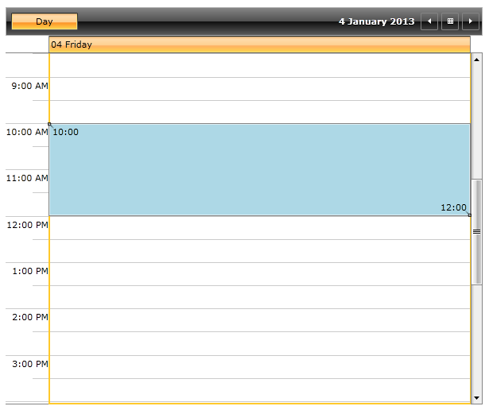
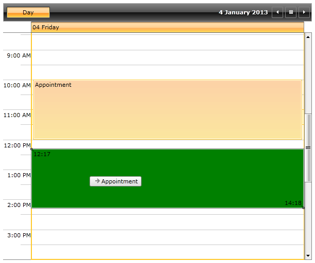

# Customizing the Resize and DragDropHighlight

In __RadScheduleView__ it is possible to customize the resize and drag and drop highlight of appointments in the control.

The next examples will demonstrate how to customize the background of the __ResizeHighlight__ and __DragDropHighlight__ by setting the ResizeHighlightStyle and DragDropHighlightStyle of RadScheduleView control.

>The following examples use Implicit Styles in order to customize the Background property of the ResizeHighlightStyle/DragDropHighlightStyle. Before proceeding with the following examples you should read about [Implicit Styles]().

## Customizing the ResizeHighlightStyle

In order to customize the __ResizeHighlightStyle__ using Implicit Styles you will need to do the following steps:

1. Add reference to the ScheduleView NoXaml binaries.

2. Merge the necessary ResourceDictionary in the App.xaml file (the Office Black theme is used in this example):

	#### __XAML__

	```XAML
		<ResourceDictionary>
			<ResourceDictionary.MergedDictionaries>
				<ResourceDictionary Source="/Telerik.Windows.Themes.Office_Black;component/Themes/System.Windows.xaml"/>
				<ResourceDictionary Source="/Telerik.Windows.Themes.Office_Black;component/Themes/Telerik.Windows.Controls.xaml"/>
				<ResourceDictionary Source="/Telerik.Windows.Themes.Office_Black;component/Themes/Telerik.Windows.Controls.Input.xaml"/>
				<ResourceDictionary Source="/Telerik.Windows.Themes.Office_Black;component/Themes/Telerik.Windows.Controls.Navigation.xaml"/>
				<ResourceDictionary Source="/Telerik.Windows.Themes.Office_Black;component/Themes/Telerik.Windows.Controls.ScheduleView.xaml"/>
			</ResourceDictionary.MergedDictionaries>
		</ResourceDictionary>
	```

3. Create a Style that targets the __HighlightItem__, base it on the StaticResource ResizeHighlightStyle and set the Background property:

	#### __XAML__

	```XAML
		<Style x:Key="MyResizeHighlightStyle" TargetType="telerik:HighlightItem" BasedOn="{StaticResource ResizeHighlightStyle}">
			<Setter Property="Background" Value="LightBlue"/>
		</Style>
	```

4. Next we will need to set the newly created Style to the ResizeHighlightStyle of the ScheduleView control:

	#### __XAML__

	```XAML
		<telerik:RadScheduleView AppointmentsSource="{Binding Appointments}"
							ResizeHighlightStyle="{StaticResource MyResizeHighlightStyle}">
			<telerik:RadScheduleView.ViewDefinitions>
				<telerik:DayViewDefinition/>
			</telerik:RadScheduleView.ViewDefinitions>
		</telerik:RadScheduleView>
	```

	The next screenshot shows the final result when resizing an appointment:

	

## Customizing the DragDropHighlightStyle

In order to customize the __DragDropHighlightStyle__ using Implicit Styles you will need to do step 1 and step 2 from the previous example and then:

1. Create a Style that targets the __HighlightItem__, base it on the StaticResource DragDropHighlightStyle and set the Background property:

	#### __XAML__

	```XAML
		<Style x:Key="MyHighlightItemStyle" TargetType="telerik:HighlightItem" BasedOn="{StaticResource DragDropHighlightStyle}">
			<Setter Property="Background" Value="Green"/>
		</Style>
	```

2. Next we will need to set the newly created Style to the DragDropHighlightStyle of the ScheduleView control:

	#### __XAML__

	```XAML
		<telerik:RadScheduleView AppointmentsSource="{Binding Appointments}"
							DragDropHighlightStyle="{StaticResource MyHighlightItemStyle}">
			<telerik:RadScheduleView.ViewDefinitions>
				<telerik:DayViewDefinition/>
			</telerik:RadScheduleView.ViewDefinitions>
		</telerik:RadScheduleView>
	```

	The next screenshot shows the final result when dragging an appointment:



## See Also

 * [Appointment Style]()
