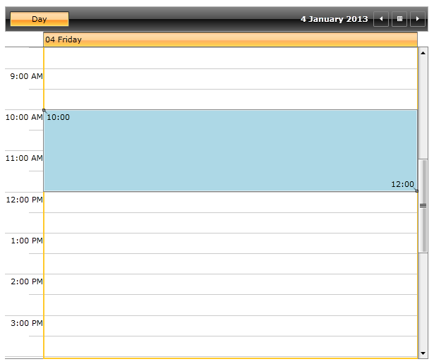
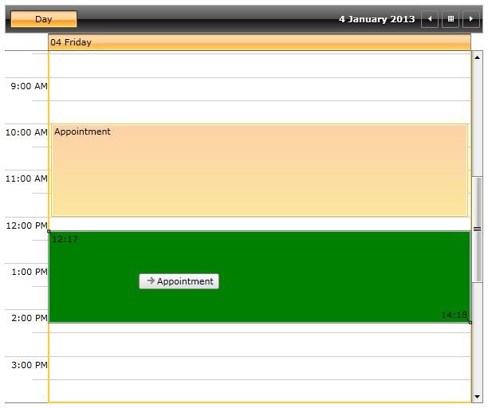

# Customizing the Resize and DragDropHighlight

In __RadScheduleView__ it is possible to customize the resize and drag and drop highlight of appointments in the control.

The next examples will demonstrate how to customize the background of the __ResizeHighlight__ and __DragDropHighlight__ by setting the ResizeHighlightStyle and DragDropHighlightStyle of RadScheduleView control.

>The following examples use Implicit Styles in order to customize the Background property of the ResizeHighlightStyle/DragDropHighlightStyle. Before proceeding with the following examples you should read about [Implicit Styles]().

## Customizing the ResizeHighlightStyle

In order to customize the __ResizeHighlightStyle__ using Implicit Styles you will need to do the following steps:

1. Add reference to the ScheduleView NoXaml binaries.

2. Merge the necessary ResourceDictionary in the App.xaml file (the Office Black theme is used in this example):

	<snippet id='radscheduleview-styles-and-templates-customizing-resize-drag-highlight-block_1-xaml' />

3. Create a Style that targets the __HighlightItem__, base it on the StaticResource ResizeHighlightStyle and set the Background property:

	<snippet id='radscheduleview-styles-and-templates-customizing-resize-drag-highlight-block_2-xaml' />

4. Next we will need to set the newly created Style to the ResizeHighlightStyle of the ScheduleView control:

	<snippet id='radscheduleview-styles-and-templates-customizing-resize-drag-highlight-block_3-xaml' />

	The next screenshot shows the final result when resizing an appointment:

	

## Customizing the DragDropHighlightStyle

In order to customize the __DragDropHighlightStyle__ using Implicit Styles you will need to do step 1 and step 2 from the previous example and then:

1. Create a Style that targets the __HighlightItem__, base it on the StaticResource DragDropHighlightStyle and set the Background property:

	<snippet id='radscheduleview-styles-and-templates-customizing-resize-drag-highlight-block_4-xaml' />

2. Next we will need to set the newly created Style to the DragDropHighlightStyle of the ScheduleView control:

	<snippet id='radscheduleview-styles-and-templates-customizing-resize-drag-highlight-block_5-xaml' />

	The next screenshot shows the final result when dragging an appointment:

## See Also

 * [Appointment Style]()