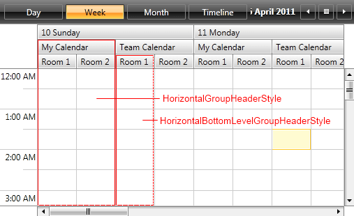
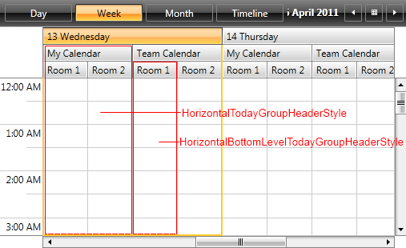
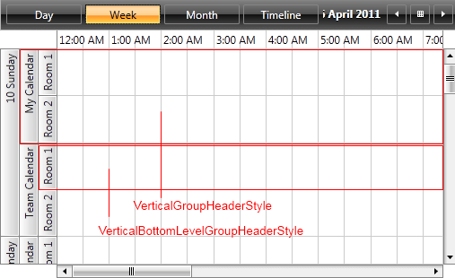
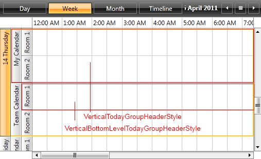
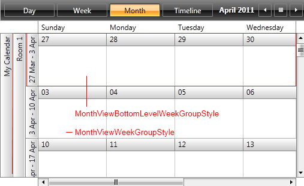
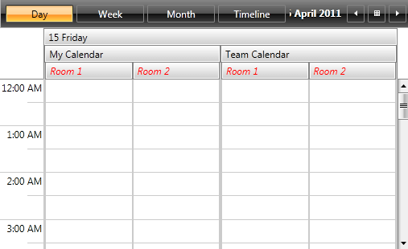
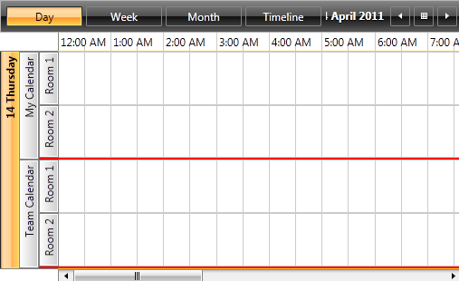

# Styling the GroupHeaders

It is a common scenario to use resources in **RadScheduleView** and group the appointments according to the resource they are assigned to. This article discusses how you can customize the **GroupHeaders**. It also explains the use of RadScheduleView's **GroupHeaderStyleSelector** property in order to apply separate styles to the GroupHeaders.

For the purposes of this article, we will use the following RadScheduleView grouped by **Date**, "**Calendar**" and "**Room**" resources.

__Example 1: RadScheduleView grouped by  Date, "Calendar" and "Room"__

```XAML
	<telerik:RadScheduleView x:Name="scheduleView" AppointmentsSource="{Binding Appointments}" >         
	    <telerik:RadScheduleView.ResourceTypesSource>
	        <telerik:ResourceTypeCollection>
	            <telerik:ResourceType Name="Calendar">
	                <telerik:Resource ResourceName="MyCalendar" DisplayName="My Calendar"  />
	                <telerik:Resource ResourceName="TeamCalendar" DisplayName="Team Calendar"  />
	            </telerik:ResourceType>
	            <telerik:ResourceType Name="Room">
	                <telerik:Resource ResourceName="Room1" DisplayName="Room 1" />
	                <telerik:Resource ResourceName="Room2" DisplayName="Room 2" />
	            </telerik:ResourceType>
	        </telerik:ResourceTypeCollection>
	    </telerik:RadScheduleView.ResourceTypesSource>
	    <telerik:RadScheduleView.GroupDescriptionsSource>
	        <telerik:GroupDescriptionCollection>
	            <telerik:DateGroupDescription />
	            <telerik:ResourceGroupDescription ResourceType="Calendar" />
	            <telerik:ResourceGroupDescription ResourceType="Room" />
	        </telerik:GroupDescriptionCollection>
	    </telerik:RadScheduleView.GroupDescriptionsSource>
	    <telerik:RadScheduleView.ViewDefinitions>                
	        <telerik:DayViewDefinition />
	        <telerik:WeekViewDefinition />
	        <telerik:MonthViewDefinition />
	        <telerik:TimelineViewDefinition />
	    </telerik:RadScheduleView.ViewDefinitions>
	</telerik:RadScheduleView>
```

## The GroupHeaderStyleSelector

Any change on the appearance of a GroupHeader depends on the GroupHeaderStyleSelector class and its containing styles. The selector is oriented, meaning it contains **orientation-dependent styles** – **horizontal** and **vertical**.        

The GroupHeaderStyleSelector contains the following styles:

* **HorizontalGroupHeaderStyle** and **HorizontalBottomLevelGroupHeaderStyle**



* **HorizontalTodayGroupHeaderStyle** and **HorizontalBottomLevelTodayGroupHeaderStyle**



* **VerticalGroupHeaderStyle** and **VerticalBottomLevelGroupHeaderStyle**



* **VerticalTodayGroupHeaderStyle** and **VerticalBottomLevelTodayGroupHeaderStyle**



* **MonthViewWeekGroupStyle** and **MonthViewBottomLevelWeekGroupStyle**



You can choose one of the following approaches to obtain the source code of GroupHeaderStyleSelector:

## Extract GroupHeaderStyleSelector from installation folder

In the **UI for** **Silverlight****WPF** installation folder on your computer, go to the **Themes.Implicit** folder and select the theme that you use in your application. Drill down to find the **Telerik.Windows.Controls.ScheduleView.xaml** file in that directory. From this resource dictionary you can extract the GroupHeaderStyleSelector and any needed resources that it uses. 

## Generate GroupHeaderStyleSelector from RadScheduleView template

You can also generate the RadScheduleView template in **Microsoft Blend** by right-clicking on the control (either in the **Design view** or in the **Objects and Timeline** pane) and selecting **Edit Template -> Edit a Copy**. You should then search for the GroupHeaderStyleSelector and copy the style together with all needed resources that it uses.

The extracted style will have the following content:

__Example 2: The default RadScheduleView style__

```XAML
    <telerikScheduleView:OrientedGroupHeaderStyleSelector x:Key="GroupHeaderStyleSelector"
            HorizontalStyle="{StaticResource HorizontalGroupHeaderStyle}"
            HorizontalTodayStyle="{StaticResource HorizontalTodayGroupHeaderStyle}"
            HorizontalBottomLevelStyle="{StaticResource HorizontalBottomLevelGroupHeaderStyle}"
            HorizontalTodayBottomLevelStyle="{StaticResource HorizontalBottomLevelTodayGroupHeaderStyle}"
            VerticalStyle="{StaticResource VerticalGroupHeaderStyle}"
            VerticalTodayStyle="{StaticResource VerticalTodayGroupHeaderStyle}"
            VerticalBottomLevelStyle="{StaticResource VerticalBottomLevelGroupHeaderStyle}"
            VerticalTodayBottomLevelStyle="{StaticResource VerticalBottomLevelTodayGroupHeaderStyle}"
            MonthViewWeekGroupStyle="{StaticResource MonthViewWeekGroupStyle}"
            MonthViewBottomLevelWeekGroupStyle="{StaticResource MonthViewBottomLevelWeekGroupStyle}"/>
```

You can now modify the styleselector and set it through RadScheduleView's GroupHeaderStyleSelector property as demonstrated in **Example 3**.

__Example 3: Setting RadScheduleView's GroupHeaderStyleSelector__

```XAML
	<telerik:RadScheduleView x:Name="scheduleView" AppointmentsSource="{Binding Appointments}" GroupHeaderStyleSelector="{StaticResource GroupHeaderStyleSelector}">
```

Let's modify the __HorizontalBottomLevelStyle__ and observe the result.

__Example 4: The modified HorizontalBottomLevelGroupHeaderStyle__

```XAML
	<Style x:Key="HorizontalBottomLevelGroupHeaderStyle" TargetType="telerik:GroupHeader" BasedOn="{StaticResource GroupHeaderBaseStyle}">
		<Setter Property="Margin" Value="0 0 -1 0" />
		<Setter Property="Padding" Value="0 0 5 0" />
		<Setter Property="Canvas.ZIndex" Value="-2" />
		<Setter Property="Foreground" Value="Red"/>
		<Setter Property="FontStyle" Value="Italic"/>
	</Style>
```

#### __Figure 1: RadScheduleView with the modified HorizontalBottomLevelGroupHeaderStyle__



## Create a custom GroupHeaderStyleSelector

In order to set different styles for the different resource GroupHeaders, you should create a custom class which inherits from the **OrientedGroupHeaderStyleSelector** class and overrides its **SelectStyle** method.  You also need to define **Style** properties for **Date** and "**Calendar**" resource headers and return the corresponding Style.

__Example 5: The custom OrientedGroupHeaderStyleSelector__

```C#
	public class CustomGroupHeaderStyleSelector : OrientedGroupHeaderStyleSelector 
	{
	    public Style CalendarStyle { get; set; }

	    public Style DateStyle { get; set; }

	    public override Style SelectStyle(object item, DependencyObject container, ViewDefinitionBase activeViewDeifinition)
	    {
	        var groupHeader = container as GroupHeader;
	        if (groupHeader != null)
	        {
	            var groupKey = groupHeader.GroupKey as Resource;
	            if (groupKey != null && groupKey.ResourceType == "Calendar")
	            {
	                return this.CalendarStyle;
	            }
	            else if (groupHeader.GroupKey is DateTime)
	            {
	                return this.DateStyle;
	            }
	        }

	        return base.SelectStyle(item, container, activeViewDeifinition);
	    }
	}
```
```VB.NET
	Public Class CustomGroupHeaderStyleSelector
	    Inherits OrientedGroupHeaderStyleSelector

	    Public Property CalendarStyle() As Style
	        Get
	            Return m_CalendarStyle
	        End Get
	        Set(value As Style)
	            m_CalendarStyle = value
	        End Set
	    End Property
	    Private m_CalendarStyle As Style

	    Public Property DateStyle() As Style
	        Get
	            Return m_DateStyle
	        End Get
	        Set(value As Style)
	            m_DateStyle = value
	        End Set
	    End Property
	    Private m_DateStyle As Style

	    Public Overrides Function SelectStyle(item As Object, container As DependencyObject, activeViewDeifinition As ViewDefinitionBase) As Style
	        Dim groupHeader = TryCast(container, GroupHeader)
	        If groupHeader IsNot Nothing Then
	            Dim groupKey = TryCast(groupHeader.GroupKey, Resource)
	            If groupKey IsNot Nothing AndAlso groupKey.ResourceType = "Calendar" Then
	                Return Me.CalendarStyle
	            ElseIf TypeOf groupHeader.GroupKey Is DateTime Then
	                Return Me.DateStyle
	            End If
	        End If
	        Return MyBase.SelectStyle(item, container, activeViewDeifinition)
	    End Function
	End Class
```

You then need to define the styles in XAML as demonstrated in **Example 6**.

__Example 6: Defining the styles in XAML__

```XAML
	<local:CustomGroupHeaderStyleSelector x:Key="CustomGroupHeaderStyleSelector">
	     <local:CustomGroupHeaderStyleSelector.CalendarStyle>
	          <Style TargetType="telerik:GroupHeader">
	              <Setter Property="BorderThickness" Value="0, 0, 0, 2" />
	              <Setter Property="BorderBrush" Value="Red" />
	          </Style>
	      </local:CustomGroupHeaderStyleSelector.CalendarStyle>
	      <local:CustomGroupHeaderStyleSelector.DateStyle>
	          <Style TargetType="telerik:GroupHeader">
	               <Setter Property="FontWeight" Value="Bold" />
	          </Style>
	      </local:CustomGroupHeaderStyleSelector.DateStyle>
	</local:CustomGroupHeaderStyleSelector>
```

And finally set the GroupHeaderStyleSelector property of the RadScheduleView:

__Example 7: Setting RadScheduleView's GroupHeaderStyleSelector__

```XAML
	<telerik:RadScheduleView x:Name="scheduleView" AppointmentsSource="{Binding Appointments}"   GroupHeaderStyleSelector="{StaticResource CustomGroupHeaderStyleSelector}">
```

#### __Figure 2: RadScheduleView with the custom GroupHeaderStyleSelector__


