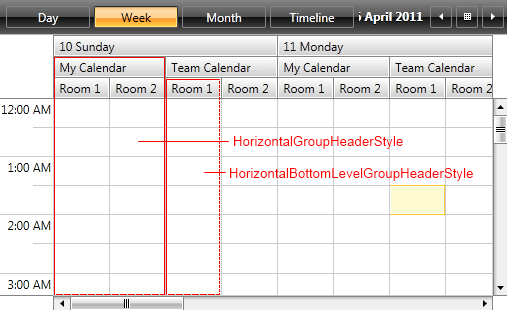
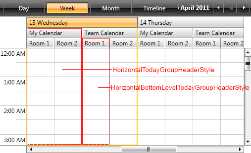
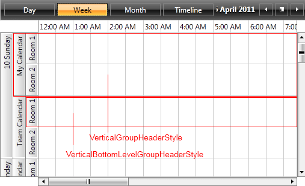
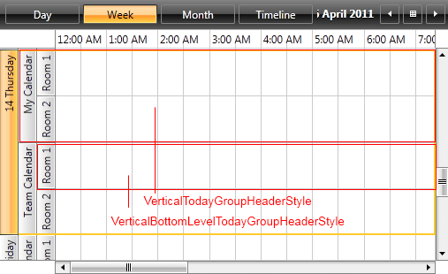
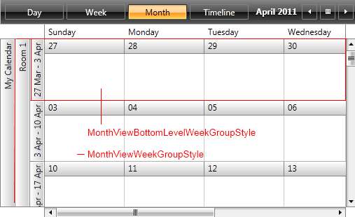
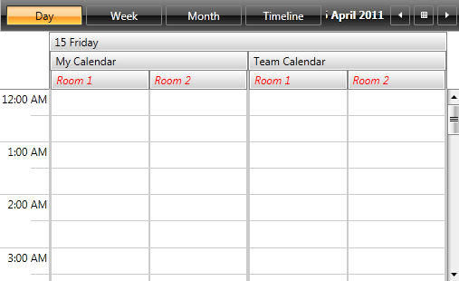
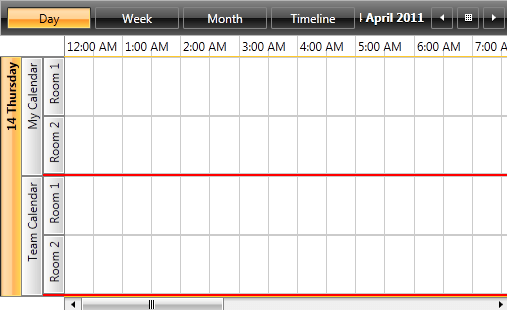

# Styling the GroupHeaders

It is a common scenario to use resources in **RadScheduleView** and group the appointments according to the resource they are assigned to. This article discusses how you can customize the **GroupHeaders**. It also explains the use of RadScheduleView's **GroupHeaderStyleSelector** property in order to apply separate styles to the GroupHeaders.

For the purposes of this article, we will use the following RadScheduleView grouped by **Date**, "**Calendar**" and "**Room**" resources.

__Example 1: RadScheduleView grouped by  Date, "Calendar" and "Room"__

<snippet id='radscheduleview-styles-and-templates-styling-groupheaders-block_1-xaml' />

## The GroupHeaderStyleSelector

Any change on the appearance of a GroupHeader depends on the GroupHeaderStyleSelector class and its containing styles. The selector is oriented, meaning it contains **orientation-dependent styles** – **horizontal** and **vertical**.        

The GroupHeaderStyleSelector contains the following styles:

* **HorizontalGroupHeaderStyle** and **HorizontalBottomLevelGroupHeaderStyle**

* **HorizontalTodayGroupHeaderStyle** and **HorizontalBottomLevelTodayGroupHeaderStyle**

* **VerticalGroupHeaderStyle** and **VerticalBottomLevelGroupHeaderStyle**

* **VerticalTodayGroupHeaderStyle** and **VerticalBottomLevelTodayGroupHeaderStyle**

* **MonthViewWeekGroupStyle** and **MonthViewBottomLevelWeekGroupStyle**

You can choose one of the following approaches to obtain the source code of GroupHeaderStyleSelector:

## Extract GroupHeaderStyleSelector from installation folder

In the **UI for** **Silverlight****WPF** installation folder on your computer, go to the **Themes.Implicit** folder and select the theme that you use in your application. Drill down to find the **Telerik.Windows.Controls.ScheduleView.xaml** file in that directory. From this resource dictionary you can extract the GroupHeaderStyleSelector and any needed resources that it uses. 

## Generate GroupHeaderStyleSelector from RadScheduleView template

You can also generate the RadScheduleView template in **Microsoft Blend** by right-clicking on the control (either in the **Design view** or in the **Objects and Timeline** pane) and selecting **Edit Template -> Edit a Copy**. You should then search for the GroupHeaderStyleSelector and copy the style together with all needed resources that it uses.

The extracted style will have the following content:

__Example 2: The default RadScheduleView style__

<snippet id='radscheduleview-styles-and-templates-styling-groupheaders-block_2-xaml' />

You can now modify the styleselector and set it through RadScheduleView's GroupHeaderStyleSelector property as demonstrated in **Example 3**.

__Example 3: Setting RadScheduleView's GroupHeaderStyleSelector__

<snippet id='radscheduleview-styles-and-templates-styling-groupheaders-block_3-xaml' />

Let's modify the __HorizontalBottomLevelStyle__ and observe the result.

__Example 4: The modified HorizontalBottomLevelGroupHeaderStyle__

<snippet id='radscheduleview-styles-and-templates-styling-groupheaders-block_4-xaml' />

#### __Figure 1: RadScheduleView with the modified HorizontalBottomLevelGroupHeaderStyle__

## Create a custom GroupHeaderStyleSelector

In order to set different styles for the different resource GroupHeaders, you should create a custom class which inherits from the **OrientedGroupHeaderStyleSelector** class and overrides its **SelectStyle** method.  You also need to define **Style** properties for **Date** and "**Calendar**" resource headers and return the corresponding Style.

__Example 5: The custom OrientedGroupHeaderStyleSelector__

<snippet id='radscheduleview-styles-and-templates-styling-groupheaders-block_5-cs' />
<snippet id='radscheduleview-styles-and-templates-styling-groupheaders-block_6-vb' />

You then need to define the styles in XAML as demonstrated in **Example 6**.

__Example 6: Defining the styles in XAML__

<snippet id='radscheduleview-styles-and-templates-styling-groupheaders-block_7-xaml' />

And finally set the GroupHeaderStyleSelector property of the RadScheduleView:

__Example 7: Setting RadScheduleView's GroupHeaderStyleSelector__

<snippet id='radscheduleview-styles-and-templates-styling-groupheaders-block_8-xaml' />

#### __Figure 2: RadScheduleView with the custom GroupHeaderStyleSelector__

