# Styling the TimeRulerItems

The __RadScheduleView__ control offers a wide range of customizable TimeRulerItems. The term TimeRulerItem in RadScheduleView encompasses the following elements: ticks and lines, date group item headers, day and expand buttons in month view.      

This article discusses how to use the TimeRulerItemStyleSelector to customize the appearance of TimeRulerItems. We will dig further into the customization process and create a custom TimeRulerItemStyleSelector, as well. This article covers the following topics:

* [How to generate and use the TimeRulerItemStyleSelector](#generate-and-use-the-timeruleritemstyleselector)

* [How to create a custom TimeRulerItemStyleSelector](#create-a-custom-timeruleritemstyleselector)

## Generate and use the TimeRulerItemStyleSelector

Any change on the appearance of a TimeRulerItem depends on the TimeRulerItemStyleSelector and the containing styles. The selector is oriented, meaning it contains orientation dependant styles – horizontal and vertical. The TimeRulerItemStyleSelector contains the following styles:        

* ExpandMonthViewButtonStyle: 

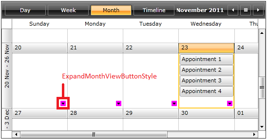

* GoToDayButtonStyle: 

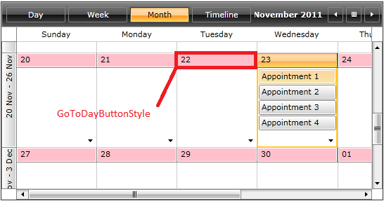

* GoToDayTodayButtonStyle: 

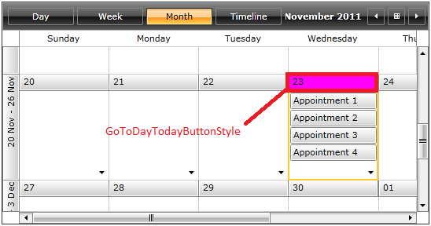

* GoToDayVerticalButtonStyle: 

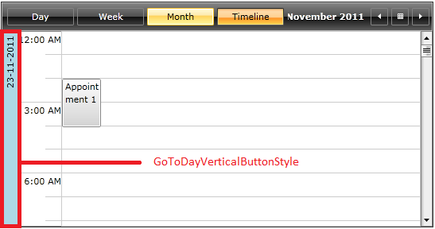

* MajorHorizontalTimeRulerItemStyle: 

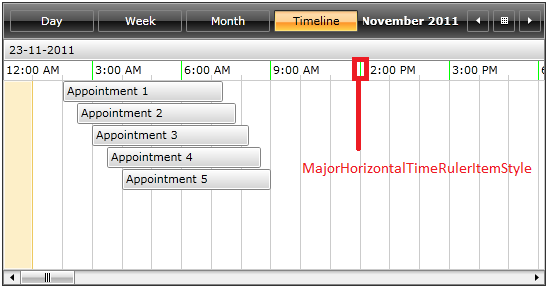

* MajorVerticalTimeRulerItemStyle: 

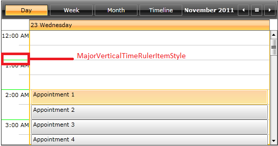

* MinorHorizontalTimeRulerItemStyle: 

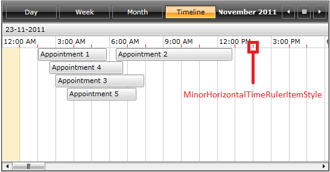

* MinorVerticalTimeRulerItemStyle: 

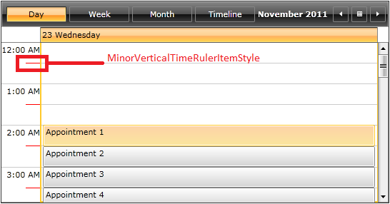

* TimeRulerGroupItemStyle: 

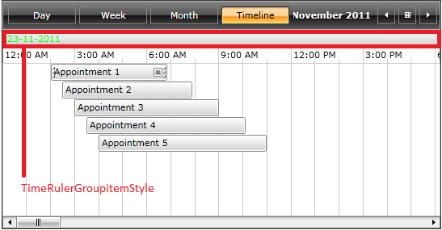

* TimeRulerLineStyle: 

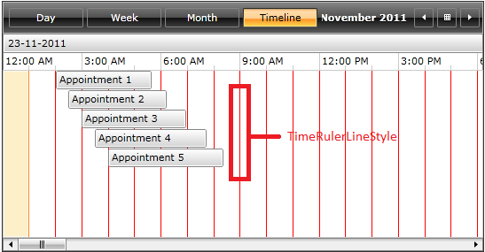

* TimeRulerMonthViewGroupItemStyle: 

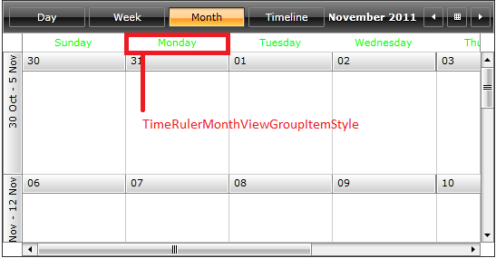

* TimeRulerMonthViewItemStyle: 

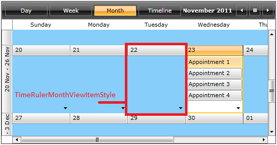

* TimeRulerMonthViewTodayItemStyle: 


There are two ways to obtain the source code of RadScheduleView TimeRulerItemStyleSelector: from UI for SilverlightWPF installation folder and from the generated template for RadScheduleView in Expression Blend.

__Get TimeRulerItemStyleSelector source code from UI for SilverlightWPF installation folder__

Navigate to the installation folder of UI for SilverlightWPF on your computer. Go into the Themes folder and select the theme that you have chosen to use as a customization base for RadScheduleView. Drill down to find the __ScheduleView.xaml__ file in the directory that corresponds to your theme. From this resource dictionary extract the __TimeRulerItemStyleSelector__ and the resources it uses, such as brushes and styles, into your own project. 

__Get TimeRulerItemStyleSelector from RadScheduleView control template__

Generate the RadScheduleView template from Expression Blend by right clicking the control and selecting __Edit Template > Edit a Copy__. Search for the TimeRulerItemStyleSelector and copy the selector together with all needed resources, into your own project.

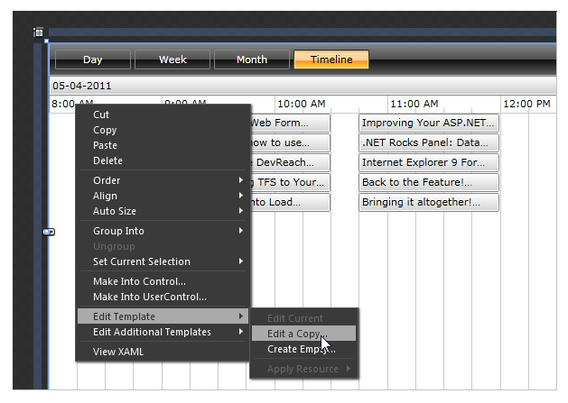

After choosing one of the two approaches the end result should include the following:


```XAML
	<!-- Brushes -->
	    ...
	
	    <!-- Styles-->
			<Style x:Key="GoToDayButtonStyle" TargetType="telerik:RadButton">
				...
			</Style>
			<Style x:Key="GoToDayVerticalButtonStyle" TargetType="telerik:RadButton">
				...
			</Style>
			<Style x:Key="GoToDayTodayButtonStyle" TargetType="telerik:RadButton">
				...
			</Style>
			<Style x:Key="GoToDayTodayVerticalButtonStyle" TargetType="telerik:RadButton">
				...
			</Style>
			<Style x:Key="ExpandMonthViewButtonStyle" TargetType="telerik:RadToggleButton">
				...
			</Style>
			<Style x:Key="TimeRulerGroupItemStyle" TargetType="local:TimeRulerGroupItem">
				...
			</Style>
			<Style x:Key="TimeRulerGroupItemStyle_Vertical" TargetType="local:TimeRulerGroupItem" BasedOn="{StaticResource TimeRulerGroupItemStyle}">
				...
			</Style>
			<Style x:Key="MajorHorizontalTimeRulerItemStyle" TargetType="local:TimeRulerItem">
				...
			</Style>
			<Style x:Key="MinorHorizontalTimeRulerItemStyle" TargetType="local:TimeRulerItem">
				...
			</Style>
			<Style x:Key="MajorVerticalTimeRulerItemStyle" TargetType="local:TimeRulerItem">
				...
			</Style>
			<Style x:Key="MinorVerticalTimeRulerItemStyle" TargetType="local:TimeRulerItem">
				...
			</Style>
			<Style x:Key="TimeRulerLineStyle" TargetType="local:TimeRulerLine">
				...
			</Style>
			<Style x:Key="TimeRulerMonthViewGroupItemStyle" TargetType="local:TimeRulerMonthViewGroupItem">
				...
			</Style>
			<Style x:Key="TimeRulerMonthViewItemStyle" TargetType="local:TimeRulerMonthViewItem">
				...
			</Style>
			<Style x:Key="TimeRulerMonthViewTodayItemStyle" TargetType="local:TimeRulerMonthViewItem">
				...
			</Style>
	
			<!-- TimeRulerItemStyleSelector-->
			<local:OrientedTimeRulerItemStyleSelector x:Key="TimeRulerItemStyleSelector"
				MonthViewGroupStyle="{StaticResource TimeRulerMonthViewGroupItemStyle}"
				MonthViewTickStyle="{StaticResource TimeRulerMonthViewItemStyle}"
				MonthViewTodayTickStyle="{StaticResource TimeRulerMonthViewTodayItemStyle}"
				HorizontalGroupItemStyle="{StaticResource TimeRulerGroupItemStyle}"
				VerticalGroupItemStyle="{StaticResource TimeRulerGroupItemStyle_Vertical}"
				MajorHorizontalTickStyle="{StaticResource MajorHorizontalTimeRulerItemStyle}"
				MajorVerticalTickStyle="{StaticResource MajorVerticalTimeRulerItemStyle}"
				MinorHorizontalTickStyle="{StaticResource MinorHorizontalTimeRulerItemStyle}"
				MinorVerticalTickStyle="{StaticResource MinorVerticalTimeRulerItemStyle}"
				HorizontalLineStyle="{StaticResource TimeRulerLineStyle}"
				VerticalLineStyle="{StaticResource TimeRulerLineStyle}">
			</local:OrientedTimeRulerItemStyleSelector>			
```

Note the use of the __local__ namespace from the raw source:


```XAML
	xmlns:local="clr-namespace:Telerik.Windows.Controls;assembly=Telerik.Windows.Controls.ScheduleView"
```

The selector is applied to our instance of RadScheduleView:


```XAML
	<telerik:RadScheduleView TimeRulerItemStyleSelector="{StaticResource TimeRulerItemStyleSelector}" AppointmentsSource="{Binding Appointments}" />
```

Now that all TimeRulerItem styles are in place, we can apply any desired customizations and watch the TimeRulerItems change. Let’s modify the __TimeRulerGroupItemStyle__, for example – make the item bold and with a different font color:


```XAML
	<Style x:Key="TimeRulerGroupItemStyle" TargetType="telerik:TimeRulerGroupItem">
				<Setter Property="Foreground" Value="Chocolate" />
				<Setter Property="FontWeight" Value="Bold" />
				<Setter Property="Background" Value="{StaticResource GroupHeaderHeaderBackground}" />
				<Setter Property="BorderBrush" Value="{StaticResource GroupHeaderHeaderOuterBorder}" />
				<Setter Property="BorderThickness" Value="1" />
				<Setter Property="HorizontalContentAlignment" Value="Left" />
				<Setter Property="VerticalContentAlignment" Value="Top" />
				<Setter Property="Margin" Value="0 0 -1 -1" />
				<Setter Property="Padding" Value="4 2" />
				<Setter Property="Template">
					<Setter.Value>
						<ControlTemplate TargetType="telerik:TimeRulerGroupItem">
							<telerik:RadButton Style="{StaticResource GoToDayButtonStyle}" Padding="{TemplateBinding Padding}" 
											   HorizontalContentAlignment="{TemplateBinding HorizontalContentAlignment}" 
											   VerticalAlignment="{TemplateBinding VerticalContentAlignment}" 
											   Command="telerik:RadScheduleViewCommands.SetDayViewMode" 
											   Foreground="{TemplateBinding Foreground}"
											   CommandParameter="{Binding RelativeSource={RelativeSource TemplatedParent}, Path=Content.DateTime.Date}">
								<ContentPresenter x:Name="Content" />
							</telerik:RadButton>
						</ControlTemplate>
					</Setter.Value>
				</Setter>
			</Style>	
```

The TimeRulerGroupItemStyle has been modified:

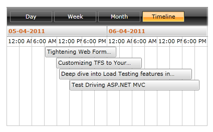

## Create a custom TimeRulerItemStyleSelector

Let’s say we wish to customize the lines that correspond to the minor and major ticks in Timeline view:

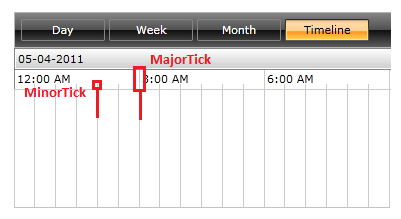

Because both lines share one and the same __TimeRulerLineStyle__, in order to style them differently, we are going to need two separate styles.  We need to create a custom TimeRulerItemStyleSelector that provides these additional styles.

To create a custom TimeRulerItemStyleSelector, inherit the __OrientedTimeRulerItemStyleSelector__ and override the __SelectStyle__ method. Also, prepare two properties of type Style that will hold the new styles:


```C#
	public class CustomTimeRulerItemStyleSelector : OrientedTimeRulerItemStyleSelector
	{
		public Style MinorTickLineStyle { get; set;}
		public Style MajorTickLineStyle { get; set; }

		public override Style SelectStyle(object item, DependencyObject container, ViewDefinitionBase activeViewDeifinition)
		{
			if (container is TimeRulerLine)
			{
				TickData tick = item as TickData;
				if (tick.Type == TickType.Major)
				{
					return MajorTickLineStyle;
				}
				return MinorTickLineStyle;
			}
			return base.SelectStyle(item, container, activeViewDeifinition);
	    }
	}
```
```VB.NET
	Public Class CustomTimeRulerItemStyleSelector
	 Inherits OrientedTimeRulerItemStyleSelector
	 Public Property MinorTickLineStyle() As Style
	  Get
	   Return m_MinorTickLineStyle
	  End Get
	  Set
	   m_MinorTickLineStyle = Value
	  End Set
	 End Property
	 Private m_MinorTickLineStyle As Style
	 Public Property MajorTickLineStyle() As Style
	  Get
	   Return m_MajorTickLineStyle
	  End Get
	  Set
	   m_MajorTickLineStyle = Value
	  End Set
	 End Property
	 Private m_MajorTickLineStyle As Style
	 Public Overrides Function SelectStyle(item As Object, container As DependencyObject, activeViewDeifinition As ViewDefinitionBase) As Style
	  If TypeOf container Is TimeRulerLine Then
	   Dim tick As TickData = TryCast(item, TickData)
	   If tick.Type = TickType.Major Then
	    Return MajorTickLineStyle
	   End If
	   Return MinorTickLineStyle
	  End If
	  Return MyBase.SelectStyle(item, container, activeViewDeifinition)
	 End Function
	End Class
```

>tipIf you need to take advantage of the __activeViewDefinition__ in the body of the SelectStyle method, it is important to inherit the __OrientedTimeRulerItemStyleSelector__, which is located in __Telerik.Windows.Controls__ namespace, rather than the regular StyleSelector class.

We use the __Type__ property of the __TickData__ class to determine whether the item is a major or a minor tick. Other properties of the TickData class include: __DateData__, __DateTime__, __Duration__ and __Offset__.

We are going to use the default selector to create the XAML for the custom selector. 

The next step is to prepare the actual styles for both types of TimeRulerLines. Since it is the TimeRulerLineStyle we wish to divide into two styles, the TimeRulerLineStyle is copied into the new styles. Any subsequent changes are made upon the new tick line styles:

```XAML	
	<local:CustomTimeRulerItemStyleSelector.MajorTickLineStyle>
		<Style TargetType="scheduleView:TimeRulerLine">
			<Setter Property="BorderBrush" Value="LightCoral" />
			<Setter Property="Background" Value="White" />
			<Setter Property="Template">
				<Setter.Value>
					<ControlTemplate TargetType="scheduleView:TimeRulerLine">
						<Border x:Name="LineVisual" BorderBrush="{TemplateBinding BorderBrush}" Background="{TemplateBinding Background}" BorderThickness="0 1 0 0"/>
						<ControlTemplate.Triggers>
							<Trigger Property="Orientation" Value="Horizontal">
								<Setter TargetName="LineVisual" Property="BorderThickness" Value="1 0 0 0" />
							</Trigger>
						</ControlTemplate.Triggers>
					</ControlTemplate>
				</Setter.Value>
			</Setter>
		</Style>
	</local:CustomTimeRulerItemStyleSelector.MajorTickLineStyle>

	<local:CustomTimeRulerItemStyleSelector.MinorTickLineStyle>
		<Style TargetType="scheduleView:TimeRulerLine">
			<Setter Property="BorderBrush" Value="Khaki" />
			<Setter Property="Background" Value="White" />
			<Setter Property="Template">
				<Setter.Value>
					<ControlTemplate TargetType="scheduleView:TimeRulerLine">
						<Border x:Name="LineVisual" BorderBrush="{TemplateBinding BorderBrush}" Background="{TemplateBinding Background}" BorderThickness="0 1 0 0"/>
						<ControlTemplate.Triggers>
							<Trigger Property="Orientation" Value="Horizontal">
								<Setter TargetName="LineVisual" Property="BorderThickness" Value="1 0 0 0" />
							</Trigger>
						</ControlTemplate.Triggers>
					</ControlTemplate>
				</Setter.Value>
			</Setter>
		</Style>
	</local:CustomTimeRulerItemStyleSelector.MinorTickLineStyle>
```

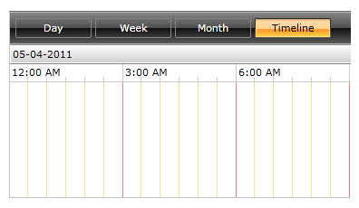