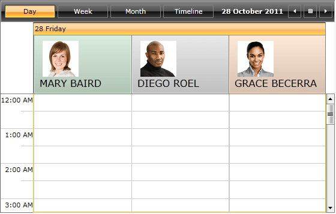

# Templating the GroupHeaders

This help article explains in details how to use GroupHeaderContentTemplateSelector in order to set different DataTemplates to the GroupHeaders of __RadScheduleView__.

The article covers the following topics:

* [How to generate and use GroupHeaderContentTemplateSelector](#how-to-generate-and-use-groupheadercontenttemplateselector)

* [How to create a custom GroupHeaderContentTemplateSelector](#how-to-create-a-custom-groupheadercontenttemplateselector)

## How to generate and use GroupHeaderContentTemplateSelector

Choose one of the following approaches to obtain the source code of GroupHeaderContentTemplateSelector:

* __Generate GroupHeaderContentTemplateSelector from installation folder__ - In the UI for SilverlightWPF installation folder on your computer, go to Themes folder and select the theme that you use in your application. Drill down to find the ScheduleView.xaml file in that directory. From this resource dictionary you can extract the GroupHeaderContentTemplateSelector and any needed resources that it uses.
        	

* __Generate GroupHeaderContentTemplateSelector from RadScheduleView template__ - Generate first the RadScheduleView template from Expression Blend ( Edit Template > Edit a Copy). Search for the GroupHeaderContentTemplateSelector and copy the style together with all needed resources that it uses.        	

The end result should include the following XAML code:

#### __XAML__

```XAML
	<local:GroupHeaderTemplateSelector x:Key="GroupHeaderContentTemplateSelector">
		<local:GroupHeaderTemplateSelector.HorizontalTemplate>
			<DataTemplate>
				<ContentPresenter Content="{Binding FormattedName}" Height="16" Margin="4" />
			</DataTemplate>
		</local:GroupHeaderTemplateSelector.HorizontalTemplate>
	
		<local:GroupHeaderTemplateSelector.VerticalTemplate>
			<DataTemplate>
				<telerikPrimitives:LayoutTransformControl VerticalAlignment="Top">
					<telerikPrimitives:LayoutTransformControl.LayoutTransform>
						<RotateTransform Angle="-90" />
					</telerikPrimitives:LayoutTransformControl.LayoutTransform>
					<ContentPresenter Content="{Binding FormattedName}" Margin="4" Height="16"  />
				</telerikPrimitives:LayoutTransformControl>
	
			</DataTemplate>
		</local:GroupHeaderTemplateSelector.VerticalTemplate>
	</local:GroupHeaderTemplateSelector>
```

Note the use of the local  and telerikPrimitives namespaces from the raw source:

#### __XAML__

```XAML
	xmlns:local="clr-namespace:Telerik.Windows.Controls;assembly=Telerik.Windows.Controls.ScheduleView"
	xmlns:telerikPrimitives="clr-namespace:Telerik.Windows.Controls.Primitives;assembly=Telerik.Windows.Controls"
```

The selector is applied to our instance of RadScheduleView:

#### __XAML__

```XAML
	<telerik:RadScheduleView x:Name="scheduleView" 
	        AppointmentsSource="{Binding Appointments}" 
	        GroupHeaderContentTemplateSelector="{StaticResource GroupHeaderContentTemplateSelector }">
```

## How to create a custom GroupHeaderContentTemplateSelector

Let’s, for example, create a custom Resource like this:

#### __C#__

```C#
	public class EmployeeResource : Resource
	{
		public string Photo { get; set; }
		public Brush Brush { get; set; }
	}
```

And add the EmployeeResource to “Employee” ResourceType. Note that the RadScheduleView is grouped by this resource type.       

#### __XAML__

```XAML
	<telerik:RadScheduleView AppointmentsSource="{Binding Appointments}" >
		<telerik:RadScheduleView.ViewDefinitions>
			<telerik:DayViewDefinition />		
		</telerik:RadScheduleView.ViewDefinitions>
		<telerik:RadScheduleView.GroupDescriptionsSource>
			<telerik:GroupDescriptionCollection>
				<telerik:DateGroupDescription />
				<telerik:ResourceGroupDescription ResourceType="Employee" />
			</telerik:GroupDescriptionCollection>
		</telerik:RadScheduleView.GroupDescriptionsSource>
		<telerik:RadScheduleView.ResourceTypesSource>
			<telerik:ResourceTypeCollection>
				<telerik:ResourceType Name="Employee">
					<local:EmployeeResource ResourceName="Mary Baird" DisplayName="MARY BAIRD"  Photo="Images/image1.png" Brush="#2D309B46" />
					<local:EmployeeResource ResourceName="Diego Roel" DisplayName="DIEGO ROEL"  Photo="Images/image2.png" Brush="#2D808080" />
					<local:EmployeeResource ResourceName="Grace Becerra" DisplayName="GRACE BECERRA" Photo="Images/image3.png" Brush="#26FF6900 " />
				</telerik:ResourceType>
			</telerik:ResourceTypeCollection>
		</telerik:RadScheduleView.ResourceTypesSource>
	</telerik:RadScheduleView>   
```

In order to set different templates  to the GroupHeaders , we should create a custom class which inherits ScheduleViewDataTemplateSelector  and overrides its SelectTemplate method. Also we need to add the DataTemplates  for resource  and date GroupHeaders and return the corresponding template:       

#### __C#__

```C#
	public class CustomGroupHeaderContentTemplateSelector : ScheduleViewDataTemplateSelector
	{
		public DataTemplate HorizontalTemplate { set; get; }
		public DataTemplate VerticalTemplate { set; get; }
		public DataTemplate HorizontalResourceTemplate { set; get; }
		public DataTemplate VerticalResourceTemplate { set; get; }
	
		public override DataTemplate SelectTemplate(object item, DependencyObject container, ViewDefinitionBase activeViewDeifinition)
		{
			CollectionViewGroup cvg = item as CollectionViewGroup;
			if (cvg != null && cvg.Name is IResource)
			{
				if (activeViewDeifinition.GetOrientation() == Orientation.Vertical)
				{
					if (this.HorizontalResourceTemplate != null)
					{
						return this.HorizontalResourceTemplate;
					}
				}
				else
				{
					if (this.VerticalResourceTemplate != null)
					{
						return this.VerticalResourceTemplate;
					}
				}
			}
	
			if (cvg != null && cvg.Name is DateTime)
			{
				if (activeViewDeifinition.GetOrientation() == Orientation.Vertical)
				{
					return this.HorizontalTemplate;
				}
				else
				{
					return this.VerticalTemplate;
				}
			}
			return base.SelectTemplate(item, container, activeViewDeifinition);
		}
	}
```

Add the DataTemplates to the XAML:

#### __XAML__

```XAML
	<local:CustomGroupHeaderContentTemplateSelector x:Key="CustomGroupHeaderContentTemplateSelector">
		<local:CustomGroupHeaderContentTemplateSelector.HorizontalTemplate>
			<DataTemplate>
				<TextBlock Margin="4" Text="{Binding Name, StringFormat=dd dddd}"/>
			</DataTemplate>
		</local:CustomGroupHeaderContentTemplateSelector.HorizontalTemplate>
		<local:CustomGroupHeaderContentTemplateSelector.VerticalTemplate>
			<DataTemplate>
				<telerik:LayoutTransformControl>
					<telerik:LayoutTransformControl.LayoutTransform>
						<RotateTransform Angle="-90" />
					</telerik:LayoutTransformControl.LayoutTransform>
					<TextBlock Margin="4" Text="{Binding Name, StringFormat=dd dddd}" VerticalAlignment="Top" />
				</telerik:LayoutTransformControl>
			</DataTemplate>
		</local:CustomGroupHeaderContentTemplateSelector.VerticalTemplate>
		<local:CustomGroupHeaderContentTemplateSelector.HorizontalResourceTemplate>
			<DataTemplate>
				<Border Background="{Binding Name.Brush}" Height="100" Margin="1 1 1 0">
					<StackPanel Margin="10 10 10 10">
						<Image Width="60" Height="60" Margin="5 0 10 0" HorizontalAlignment="Left" Stretch="UniformToFill" Source="{Binding Name.Photo}" />
						<TextBlock  FontSize="16" Margin="0" Text="{Binding Name.DisplayName}" />
					</StackPanel>
				</Border>
			</DataTemplate>
		</local:CustomGroupHeaderContentTemplateSelector.HorizontalResourceTemplate>
		<local:CustomGroupHeaderContentTemplateSelector.VerticalResourceTemplate>
			<DataTemplate>
				<Border Background="{Binding Name.Brush}"  Width="140" Margin="0 2 2 2">
					<StackPanel Margin="15 13 0 10">
						<Image Width="60" Height="60" Margin="0" HorizontalAlignment="Left" VerticalAlignment="Top" Stretch="UniformToFill" Source="{Binding Name.Photo}" />
						<TextBlock Margin="-2 3 0 5" FontSize="16" Text="{Binding Name.DisplayName}" />
					</StackPanel>
				</Border>
			</DataTemplate>
		</local:CustomGroupHeaderContentTemplateSelector.VerticalResourceTemplate>
	</local:CustomGroupHeaderContentTemplateSelector>
```

>Note how the properties of the custom resource are bound using Name property:

#### __XAML__

```XAML
	Source="{Binding Name.Photo}"
```

Finally, set the GroupHeaderContentTemplateSelector property of the ScheduleView:

#### __XAML__

```XAML
	<telerik:RadScheduleView AppointmentsSource="{Binding Appointments}" 
			GroupHeaderContentTemplateSelector="{StaticResource CustomGroupHeaderContentTemplateSelector}">
		...	
	</telerik:RadScheduleView>
```

Here is the result:



>tip Check out the [online demo](https://demos.telerik.com/silverlight/#ScheduleView/CustomStyles/GroupHeaderTemplate)GroupHeaderTemplate Example at [WPF demos](https://demos.telerik.com/wpf/) to see the GroupHeaderContentTemplateSelector in action.
