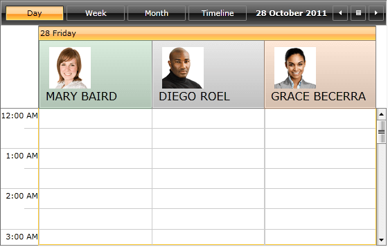

# Templating the GroupHeaders

This help article explains in details how to use GroupHeaderContentTemplateSelector in order to set different DataTemplates to the GroupHeaders of __RadScheduleView__.

The article covers the following topics:

* [How to generate and use GroupHeaderContentTemplateSelector](#how-to-generate-and-use-groupheadercontenttemplateselector)

* [How to create a custom GroupHeaderContentTemplateSelector](#how-to-create-a-custom-groupheadercontenttemplateselector)

## How to generate and use GroupHeaderContentTemplateSelector

Choose one of the following approaches to obtain the source code of GroupHeaderContentTemplateSelector:

* __Generate GroupHeaderContentTemplateSelector from installation folder__ - In the UI for SilverlightWPF installation folder on your computer, go to Themes folder and select the theme that you use in your application. Drill down to find the ScheduleView.xaml file in that directory. From this resource dictionary you can extract the GroupHeaderContentTemplateSelector and any needed resources that it uses.
        	

* __Generate GroupHeaderContentTemplateSelector from RadScheduleView template__ - Generate first the RadScheduleView template from Expression Blend ( Edit Template > Edit a Copy). Search for the GroupHeaderContentTemplateSelector and copy the style together with all needed resources that it uses.        	

The end result should include the following XAML code:

<snippet id='radscheduleview-styles-and-templates-templating-groupheaders-block_1-xaml' />

Note the use of the local  and telerikPrimitives namespaces from the raw source:

<snippet id='radscheduleview-styles-and-templates-templating-groupheaders-block_2-xaml' />

The selector is applied to our instance of RadScheduleView:

<snippet id='radscheduleview-styles-and-templates-templating-groupheaders-block_3-xaml' />

## How to create a custom GroupHeaderContentTemplateSelector

Let’s, for example, create a custom Resource like this:

<snippet id='radscheduleview-styles-and-templates-templating-groupheaders-block_4-cs' />

And add the EmployeeResource to “Employee” ResourceType. Note that the RadScheduleView is grouped by this resource type.       

<snippet id='radscheduleview-styles-and-templates-templating-groupheaders-block_5-xaml' />

In order to set different templates  to the GroupHeaders , we should create a custom class which inherits ScheduleViewDataTemplateSelector  and overrides its SelectTemplate method. Also we need to add the DataTemplates  for resource  and date GroupHeaders and return the corresponding template:       

<snippet id='radscheduleview-styles-and-templates-templating-groupheaders-block_6-cs' />

Add the DataTemplates to the XAML:

<snippet id='radscheduleview-styles-and-templates-templating-groupheaders-block_7-xaml' />

>Note how the properties of the custom resource are bound using Name property:

<snippet id='radscheduleview-styles-and-templates-templating-groupheaders-block_8-xaml' />

Finally, set the GroupHeaderContentTemplateSelector property of the ScheduleView:

<snippet id='radscheduleview-styles-and-templates-templating-groupheaders-block_9-xaml' />

Here is the result:

>tip Check out the [online demo](https://demos.telerik.com/silverlight/#ScheduleView/CustomStyles/GroupHeaderTemplate)GroupHeaderTemplate Example at [WPF demos](https://demos.telerik.com/wpf/) to see the GroupHeaderContentTemplateSelector in action.