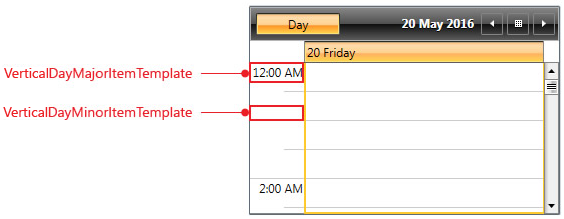
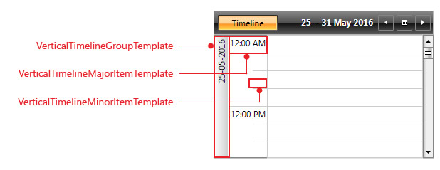
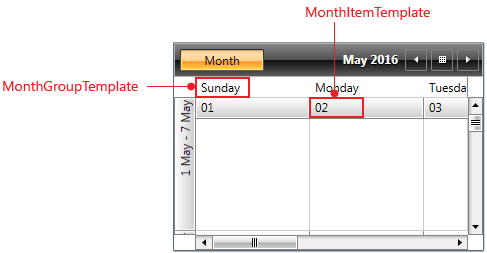

# Templating the TimeRulerItems

__RadScheduleView__ provides a wide range of customizable __TimeRulerItems__. The term __TimeRulerItem__ refers to the major and minor ticks inside the TimRuler, date group headers in TimelineView as well as day buttons and weekdays headers in MonthView.

>tip See [Configuring the TimeRuler ticks]() topic for further details on the different TimeRuler items.

This topic explains how to define __TimeRulerItemTemplateSelector__ property of RadScheduleView in order to customize the templates of the TimeRuler items.

__TimeRulerItemTemplateSelector__ is used to set a DataTemplate to the TimeRulerItems according to their type and the current ViewDefintion of the ScheduleView. Additionally, __TimeRulerItemTemplateSelector__ provides a separate template for Vertical and Horizontal Orientation of the ViewDefinitions (except MonthViewDefinition as it does not support Orientation).

The next images show the templates in the different ViewDefinitions of RadScheduleView.

#### __Figure 1: TimeRulerItems templates in DayViewDefinition with Orientation = "Vertical"__

#### __Figure 2: TimeRulerItems templates in DayViewDefinition with Orientation = "Horizontal"__

#### __Figure 3: TimeRulerItems templates in WeekViewDefinition with Orientation = "Vertical"__

#### __Figure 4: TimeRulerItems templates in WeekViewDefinition with Orientation = "Horizontal"__

#### __Figure 5: TimeRulerItems templates in TimelineViewDefinition with Orientation = "Horizontal"__

#### __Figure 6: TimeRulerItems templates in TimelineViewDefinition with Orientation = "Vertical"__

#### __Figure 7: TimeRulerItems templates in MonthViewDefinition__

>tipMinor tick templates are by design empty. This could be easily changed by assigning a StringFormat through the [Formatting properties]() of the ViewDefinitions.

The next example shows how to configure DayViewDefinition and the corresponding VerticalDayMajorItem and VerticalDayMinorItem templates in order to achieve more detailed view of the TimeRuler.

First, you will need to retrieve the default __TimeRulerItemTemplateSelector__ from the UI for WPF installation folder. Go to the Themes.Implicit folder and select the theme that you use in your application. Drill down to find the Telerik.Windows.Controls.ScheduleView.xaml file in that directory. From this resource dictionary extract the __TimeRulerItemTemplateSelector__ and copy it to the Resources inside your application.

__Example__ 1 shows TimeRulerItemTemplateSelector with modified VerticalDayMajorItemTemplate and VerticalDayMinorItemTemplate.

#### __[XAML] Example 1: Modified TimeRulerItemTemplateSelector__

{{region radscheduleview-styles-and-templates-templating-timeruleritems_0}}
	<telerikScheduleView:TimeRulerItemTemplateSelector x:Key="TimeRulerItemTemplateSelector">
		...    
		<telerikScheduleView:TimeRulerItemTemplateSelector.VerticalDayMajorItemTemplate>
			<DataTemplate>
				<TextBlock Text="{Binding FormattedValue}" TextAlignment="Right" FontSize="11" MinWidth="50"/>
			</DataTemplate>
		</telerikScheduleView:TimeRulerItemTemplateSelector.VerticalDayMajorItemTemplate>
		<telerikScheduleView:TimeRulerItemTemplateSelector.VerticalDayMinorItemTemplate>
			<DataTemplate>                
				<TextBlock Text="{Binding FormattedValue}" FontSize="10" Foreground="Gray" TextAlignment="Right" MinWidth="50"/>
			</DataTemplate>
		</telerikScheduleView:TimeRulerItemTemplateSelector.VerticalDayMinorItemTemplate>   
		...
	</telerikScheduleView:TimeRulerItemTemplateSelector>
{{endregion}}

>The text of the TextBlock inside the templates is bound to __FormattedValue__ property which is formed after the StringFormat set through the [Formatting properties]() of the ViewDefinitions is applied.

>The DataContext of the templates is of type _TimeRulerItemProxy_ - it contains information about the DateTime and the Duration of the TimeRulerItem.

All that is left is to set __TimeRulerItemTemplateSelector__ property of the ScheduleView. Additionally, DayViewDefinition has its MajorTickLength and MinorTickLength set to 1h and 15min respectively as well as TimerulerMinorTickStringFormat is set to display the minutes.

__Example 2__ shows how RadScheduleView is defined.

#### __[XAML] Example 2: RadScheduleView with TimeRulerItemTemplateSelector set__

{{region radscheduleview-styles-and-templates-templating-timeruleritems_1}}
	<telerik:RadScheduleView AppointmentsSource="{Binding Appointments}" 
            TimeRulerItemTemplateSelector="{StaticResource TimeRulerItemTemplateSelector}">
		<telerik:RadScheduleView.ViewDefinitions>
			<telerik:DayViewDefinition MajorTickLength="1h" MinorTickLength="15min" 
									   TimerulerMinorTickStringFormat=":{0:mm}" />            
		</telerik:RadScheduleView.ViewDefinitions>
	</telerik:RadScheduleView>   
{{endregion}}

__Figure 8__ shows the final result.

#### __Figure 8: RadScheduleView with customized TimeRuler__

# See Also

 * [Configuring the TimeRuler ticks]()

 * [Formatting properties]()
 
 * [Styling the TimeRulerItems]()
