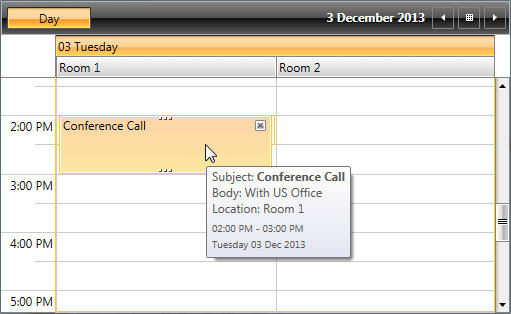

# Templating the ToolTip

This help article will show you how to set a custom Appointment ToolTip by using the __ToolTipTemplate__ property of __RadScheduleView__.      

If you have for example __RadScheduleView__ set up the following way:

<snippet id='radscheduleview-styles-and-templates-templating-tooltip-block_1-xaml' />

And you want to replace the default ToolTip with custom one which shows the full information of the Appointment including the location of the Appoinment. In this case you can use the ToolTipTemplate property of the __RadScheduleView__. Firstly you need to define appropriate DataTemplate as a resource like shown below:       

<snippet id='radscheduleview-styles-and-templates-templating-tooltip-block_2-xaml' />

>Note that the ToolTip receives object of type AppointmentItemProxy as a DataContext which contains the actual Appointment. You can easily bind to its properties like shown above.          

>important If you are using a custom Appointment with custom properties you won't be able to bind directly to them. You should access them through the Appointment property of the AppointmentItemProxy object the following way: Appointment.*CustomProperty*.          

Aftewards you just need to set the DataTemplate as a __ToolTipTemplate__ the following way:        

<snippet id='radscheduleview-styles-and-templates-templating-tooltip-block_3-xaml' />
And here is the final result:

## See Also

 * [Implicit Styles]()