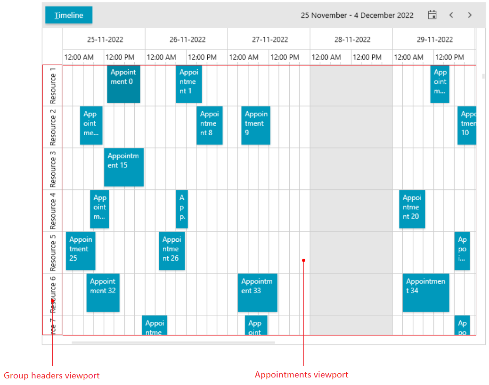

# UI Virtualization

RadScheduleView utilizes UI virtualization feature that generates containers only for the appointments and group headers within the viewport range, thus optimizing the performance greatly.

The UI virtualization of appointments and special slots is always enabled. Scrolling up and down or left and right will recycle the already generated `AppointmentItem` and `HighlightItem` containers or it will generate new ones, based on the current situation.

The UI virtualization of group headers is enabled by default, but it can be disabled, if needed, by setting the `IsGroupHeadersVirtualizationEnabled` property of `RadScheduleView` to `false`. The group headers virtualization will create containers only for the groups that are visible within the viewport. This is valid only for the group headers on the first level. If you have nested group headers, all children of the generated root header visuals will be generated as well. This feature is available since the __R1 2023__ release.

__Group and appointment viewports with vertically arranged groups__  
 

## See Also  
 * [Getting Started]()
 * [Understanding Appointments]()
