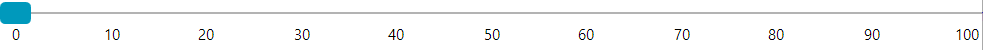
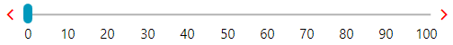
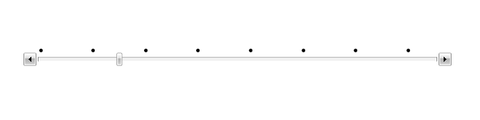

# Customizing Appearance

`RadSlider` allows you to easily modify its appearance by providing some useful properties.

## ThumbStyle

The `ThumbStyle` property allows you to control the appearance of the thumb, which is used to control the `Value`.

If you are using the [implicit styles](#setting-a-theme-using-implicit-styles) theming approach, base the custom style on the default __RadTickBarStyle__ using the `BasedOn` property.

__Creating a custom style for the ThumbStyle property when using implicit styles theming approach__
```XAML
    <Grid>
        <Grid.Resources>
            <Style x:Key="CustomThumbStyle" TargetType="Thumb" BasedOn="{StaticResource ThumbStyle}">
                <Setter Property="Width" Value="25" />
            </Style>
        </Grid.Resources>
        <telerik:RadSlider Minimum="0" 
                           Maximum="100" 
                           TickFrequency="10"
                           TickPlacement="BottomRight" 
                           ThumbStyle="{StaticResource CustomThumbStyle}">
            <telerik:RadSlider.TickTemplate>
                <DataTemplate>
                    <TextBlock Text="{Binding}" />
                </DataTemplate>
            </telerik:RadSlider.TickTemplate>
        </telerik:RadSlider>
    </Grid>
```

If you are using the [StyleManager](#setting-a-theme-using-stylemanager) theming approach, merge the generic resource dictionary for the used theme. This resource dictionary is contained in the __Telerik.Windows.Controls__ assembly. Then, base the custom style on the default __TrackStyle__ using the `BasedOn` property. In the following example, the __GenericFluent.xaml__ dictionary of the __Telerik.Windows.Controls__ assembly is merged, because the __Fluent__ theme is used.

__Creating a custom style for the ThumbStyle property when using StyleManager theming approach__
```XAML
    <Grid>
        <Grid.Resources>
            <ResourceDictionary>
                <ResourceDictionary.MergedDictionaries>
                    <ResourceDictionary Source="/Telerik.Windows.Controls;component/Themes/GenericFluent.xaml"/>
                </ResourceDictionary.MergedDictionaries>
                <Style x:Key="CustomThumbStyle" TargetType="Thumb" BasedOn="{StaticResource ThumbStyle}">
                    <Setter Property="Width" Value="25" />
                </Style>
            </ResourceDictionary>
            
        </Grid.Resources>
        <telerik:RadSlider Minimum="0" 
                           Maximum="100" 
                           TickFrequency="10"
                           TickPlacement="BottomRight"
                           ThumbStyle="{StaticResource CustomThumbStyle}">
            <telerik:RadSlider.TickTemplate>
                <DataTemplate>
                    <TextBlock Text="{Binding}" />
                </DataTemplate>
            </telerik:RadSlider.TickTemplate>
        </telerik:RadSlider>
    </Grid>
```

>tip If another theme is used, for example, __Office_Black__, change the __GenericFluent.xaml__ to __GenericOfficeBlack.xaml__.

__RadSlider with custom ThumbStyle__



## SelectionMiddleThumbStyle

The `SelectionMiddleThumbStyle` property lets you control the appearance of the middle thumb, which is displayed when the `IsSelectionRangeEnabled` property is __True__.

If you are using the [implicit styles](#setting-a-theme-using-implicit-styles) theming approach, base the custom style on the default __SelectionMiddleThumbStyle__ using the `BasedOn` property.

__Creating a custom style for the SelectionMiddleThumbStyle property using the implicit styles theming approach__
```XAML
    <Grid>
        <Grid.Resources>
            <Style x:Key="CustomSelectionMiddleThumbStyle" TargetType="Thumb" BasedOn="{StaticResource SelectionMiddleThumbStyle}">
                <Setter Property="Height" Value="10" />
            </Style>
        </Grid.Resources>
        <telerik:RadSlider Minimum="0" 
                           Maximum="100" 
                           TickFrequency="10"
                           TickPlacement="BottomRight" 
                           IsSelectionRangeEnabled="True"
                           Margin="5"
                           SelectionMiddleThumbStyle="{StaticResource CustomSelectionMiddleThumbStyle}">
            <telerik:RadSlider.TickTemplate>
                <DataTemplate>
                    <TextBlock Text="{Binding}" />
                </DataTemplate>
            </telerik:RadSlider.TickTemplate>
        </telerik:RadSlider>
    </Grid>
```

If you are using the [StyleManager](#setting-a-theme-using-stylemanager) theming approach, merge the generic resource dictionary for the used theme. This resource dictionary is contained in the __Telerik.Windows.Controls__ assembly. Then, base the custom style on the default __SelectionMiddleThumbStyle__ using the `BasedOn` property. In the following example, the __GenericFluent.xaml__ dictionary of the __Telerik.Windows.Controls__ assembly is merged, because the __Fluent__ theme is used.

__Creating a custom style for the SelectionMiddleThumbStyle property using the StyleManager theming approach__
```XAML
    <Grid>
        <Grid.Resources>
            <ResourceDictionary>
                <ResourceDictionary.MergedDictionaries>
                    <ResourceDictionary Source="/Telerik.Windows.Controls;component/Themes/GenericFluent.xaml"/>
                </ResourceDictionary.MergedDictionaries>
                <Style x:Key="CustomSelectionMiddleThumbStyle" TargetType="Thumb" BasedOn="{StaticResource SelectionMiddleThumbStyle}">
                    <Setter Property="Height" Value="10" />
                </Style>
            </ResourceDictionary>  
        </Grid.Resources>
        <telerik:RadSlider Minimum="0" 
                           Maximum="100" 
                           TickFrequency="10"
                           IsSelectionRangeEnabled="True"
                           VerticalAlignment="Center"
                           TickPlacement="BottomRight"
                           SelectionMiddleThumbStyle="{StaticResource CustomSelectionMiddleThumbStyle}">
            <telerik:RadSlider.TickTemplate>
                <DataTemplate>
                    <TextBlock Text="{Binding}" />
                </DataTemplate>
            </telerik:RadSlider.TickTemplate>
        </telerik:RadSlider>
    </Grid>
```

>tip If another theme is used, for example, __Office_Black__, change the __GenericFluent.xaml__ to __GenericOfficeBlack.xaml__.

__RadSlider with custom SelectionMiddleThumbStyle__


## DecreaseHandleStyle and IncreaseHandleStyle

The `DecreaseHandleStyle` and `IncreaseHandleStyle` properties allow you to modify the appearance of the two repeat buttons, which increase and decrease the `Value`. They are shown when the `HandlesVisibility` is __True__.

If you are using the [implicit styles](#setting-a-theme-using-implicit-styles) theming approach, base the custom styles on the default __DecreaseHandleStyle__ and __IncreaseHandleStyle__ styles using the `BasedOn` property.

__Creating custom Styles for the DecreaseHandleStyle and IncreaseHandleStyle properties when using the implicit styles theming approach__
```XAML
    <Grid>
        <Grid.Resources> 
            <Style x:Key="CustomDecreaseHandleStyle" TargetType="RepeatButton" BasedOn="{StaticResource DecreaseHandleStyle}">
                <Setter Property="Foreground" Value="Red" />
            </Style>
            <Style x:Key="CustomIncreaseHandleStyle" TargetType="RepeatButton" BasedOn="{StaticResource IncreaseHandleStyle}">
                <Setter Property="Foreground" Value="Red" />
            </Style>
        </Grid.Resources>
        <telerik:RadSlider Minimum="0" 
                           Maximum="100" 
                           TickFrequency="10"
                           TickPlacement="BottomRight" 
                           Margin="5"
                           HandlesVisibility="Visible"
                           DecreaseHandleStyle="{StaticResource CustomDecreaseHandleStyle}"
                           IncreaseHandleStyle="{StaticResource CustomIncreaseHandleStyle}">
            <telerik:RadSlider.TickTemplate>
                <DataTemplate>
                    <TextBlock Text="{Binding}" />
                </DataTemplate>
            </telerik:RadSlider.TickTemplate>
        </telerik:RadSlider>
    </Grid>
```

If you are using the [StyleManager](#setting-a-theme-using-stylemanager) theming approach, merge the generic resource dictionary for the used theme. This resource dictionary is contained in the __Telerik.Windows.Controls__ assembly. Then, base the custom styles on the default __DecreaseHandleStyle__ and __IncreaseHandleStyle__ styles using the `BasedOn` property. In the following example, the __GenericFluent.xaml__ dictionary of the __Telerik.Windows.Controls__ assembly is merged, because the __Fluent__ theme is used.

__Creating custom Styles for the DecreaseHandleStyle and IncreaseHandleStyle properties when using the StyleManager theming approach__
```XAML
    <Grid>
        <Grid.Resources>
            <ResourceDictionary>
                <ResourceDictionary.MergedDictionaries>
                    <ResourceDictionary Source="/Telerik.Windows.Controls;component/Themes/GenericFluent.xaml"/>
                </ResourceDictionary.MergedDictionaries>
                <Style x:Key="CustomDecreaseHandleStyle" TargetType="RepeatButton" BasedOn="{StaticResource DecreaseHandleStyle}">
                    <Setter Property="Foreground" Value="Red" />
                </Style>
                <Style x:Key="CustomIncreaseHandleStyle" TargetType="RepeatButton" BasedOn="{StaticResource IncreaseHandleStyle}">
                    <Setter Property="Foreground" Value="Red" />
                </Style>
            </ResourceDictionary>
        </Grid.Resources>
        <telerik:RadSlider Minimum="0" 
                           Maximum="100" 
                           TickFrequency="10"
                           TickPlacement="BottomRight" 
                           Margin="5"
                           HandlesVisibility="Visible"
                           DecreaseHandleStyle="{StaticResource CustomDecreaseHandleStyle}"
                           IncreaseHandleStyle="{StaticResource CustomIncreaseHandleStyle}">
            <telerik:RadSlider.TickTemplate>
                <DataTemplate>
                    <TextBlock Text="{Binding}" />
                </DataTemplate>
            </telerik:RadSlider.TickTemplate>
        </telerik:RadSlider>
    </Grid>
```

>tip If another theme is used, for example, __Office_Black__, change the __GenericFluent.xaml__ to __GenericOfficeBlack.xaml__.

__RadSlider with custom DecreaseHandleStyle and IncreaseHandleStyle__



## TickBarStyle

The `TickBarStyle` property allows you to modify the appearance of the bottom and top tickbars - the controls which displays the ticks.

If you are using the [implicit styles](#setting-a-theme-using-implicit-styles) theming approach, base the custom style on the default __RadTickBarStyle__ using the `BasedOn` property as shown in the following example:

__Creating a custom style for the TickBarStyle property when using the implicit styles theming approach__
```XAML
    <Grid>
        <Grid.Resources>
            <Style x:Key="TickBarStyle" TargetType="telerik:RadTickBar" BasedOn="{StaticResource RadTickBarStyle}">
                <Setter Property="Foreground" Value="Red" />
            </Style>
        </Grid.Resources>
        <telerik:RadSlider Minimum="0" 
                           Maximum="100" 
                           TickFrequency="10"
                           TickPlacement="BottomRight" 
                           Margin="10"
                           TickBarStyle="{StaticResource TickBarStyle}">
            <telerik:RadSlider.TickTemplate>
                <DataTemplate>
                    <TextBlock Text="{Binding}" />
                </DataTemplate>
            </telerik:RadSlider.TickTemplate>
        </telerik:RadSlider>
    </Grid>
```

If you are using the [StyleManager](#setting-a-theme-using-stylemanager) theming approach, set the `ItemsPanel` property of the `RadTickBar` element to a new instance of the `TickBarPanel` object.

__Creating a custom style for the TickBarStyle property when using the StyleManager theming approach__
```XAML
    <Grid>
        <Grid.Resources>
            <Style x:Key="CustomTickBarStyle" TargetType="telerik:RadTickBar">
                <Setter Property="Foreground" Value="Red" />
                <Setter Property="ItemsPanel">
                    <Setter.Value>
                        <ItemsPanelTemplate>
                            <telerik:TickBarPanel Background="Transparent"/>
                        </ItemsPanelTemplate>
                    </Setter.Value>
                </Setter>
            </Style>
        </Grid.Resources>
        <telerik:RadSlider Minimum="0" 
                           Maximum="100" 
                           TickFrequency="10"
                           TickPlacement="BottomRight" 
                           Margin="10"
                           TickBarStyle="{StaticResource CustomTickBarStyle}">
            <telerik:RadSlider.TickTemplate>
                <DataTemplate>
                    <TextBlock Text="{Binding}" />
                </DataTemplate>
            </telerik:RadSlider.TickTemplate>
        </telerik:RadSlider>
    </Grid>
```

__RadSlider with custom TickBarStyle__


## TrackStyle

The `TrackStyle` property lets you modify the appearance of the RadSlider's track. 

When using the [implicit styles](#setting-a-theme-using-implicit-styles) theming approach and __NoXaml__ binaries, base the custom style on the default __TrackStyle__. This style comes from the chosen theme using the `BasedOn` property.

__Creating a custom style for the TrackStyle property when using the implicit styles theming approach__
```XAML
    <Grid>
        <Grid.Resources>
            <Style x:Key="CustomTrackStyle" TargetType="ContentControl" BasedOn="{StaticResource TrackStyle}">
                <Setter Property="Height" Value="25" />
            </Style>
        </Grid.Resources>
        <telerik:RadSlider Minimum="0" 
                           Maximum="100" 
                           TickFrequency="10"
                           TickPlacement="BottomRight" 
                           Margin="10"
                           TrackStyle="{StaticResource CustomTrackStyle}">
            <telerik:RadSlider.TickTemplate>
                <DataTemplate>
                    <TextBlock Text="{Binding}" />
                </DataTemplate>
            </telerik:RadSlider.TickTemplate>
        </telerik:RadSlider>
    </Grid>
```

When using the [StyleManager](#setting-a-theme-using-stylemanager) and __Xaml__ binaries, merge the resource dictionary for the used theme. This resource dictionary is contained in the __Telerik.Windows.Controls__ assembly. Then, base the custom style on the default __TrackStyle__ using the `BasedOn` property. In the following example, the __GenericFluent.xaml__ dictionary of the __Telerik.Windows.Controls__ assembly is merged, because the __Fluent__ theme is used.

__Creating a custom style for the TrackStyle property when using the StyleManager theming approach__
```XAML
    <Grid>
        <Grid.Resources>
            <ResourceDictionary>
                <ResourceDictionary.MergedDictionaries>
                    <ResourceDictionary Source="/Telerik.Windows.Controls;component/Themes/GenericFluent.xaml"/>
                </ResourceDictionary.MergedDictionaries>
                <Style x:Key="CustomTrackStyle" TargetType="ContentControl" BasedOn="{StaticResource TrackStyle}">
                    <Setter Property="Height" Value="25" />
                </Style>
            </ResourceDictionary>
        </Grid.Resources>
        <telerik:RadSlider Minimum="0"  
                       Maximum="100"  
                       TickFrequency="10" 
                       TickPlacement="BottomRight"  
                       Margin="10" 
                       TrackStyle="{StaticResource CustomTrackStyle}">
            <telerik:RadSlider.TickTemplate>
                <DataTemplate>
                    <TextBlock Text="{Binding}" />
                </DataTemplate>
            </telerik:RadSlider.TickTemplate>
        </telerik:RadSlider>
    </Grid>
```

>tip If another theme is used, for example, __Office_Black__, change the __GenericFluent.xaml__ to __GenericOfficeBlack.xaml__.

__RadSlider with custom TrackStyle__


## Using the TickTemplateSelector

The `TickTemplateSelector` property property of `RadSlider` allows to customize the appearance of the ticks, based on different conditions. The following example shows how to use the selector.

>important The `TickTemplate` property needs to be set to `null` for the `TickTemplateSelector` property to get applied.

__Implementing the selector__  
```C#
	public class TickTemplateSelector : DataTemplateSelector
	{
	    public DataTemplate EllipseTemplate { get; set; }
	    public DataTemplate EmptyTemplate { get; set; }
	    public override DataTemplate SelectTemplate(object item, DependencyObject container)
	    {
	        double tick = Convert.ToDouble(item);
	        if (tick % 4 == 0.0)
	        {
	            return EllipseTemplate;
	        }
	        else
	        {
	            return EmptyTemplate;
	        }
	    }
	}
```

__Defining the template selector__  
```XAML
	<local:TickTemplateSelector x:Key="TickTemplateSelector">
		<local:TickTemplateSelector.EllipseTemplate>
			<DataTemplate>
				<Ellipse Width="5" Height="5" Fill="Black" />
			</DataTemplate>
		</local:TickTemplateSelector.EllipseTemplate>
		<local:TickTemplateSelector.EmptyTemplate>
			<DataTemplate/>
		</local:TickTemplateSelector.EllipseTemplate>
	</local:TickTemplateSelector>
```

__Defining the slider and setting the template selector__  
```XAML
	<telerik:RadSlider HandlesVisibility="Visible"
	                   IsSnapToTickEnabled="True"
	                   Maximum="30"
	                   SmallChange="1"
	                   TickFrequency="1"
	                   TickPlacement="TopLeft"
	                   TickTemplate="{x:Null}"
	                   TickTemplateSelector="{StaticResource TickTemplateSelector}" />
```



## Customizing the Thumb Shape

By default the thumb of the slider is a rectangle visual. To change this and use custom shape or any other visual, you can [re-templated]() the `Thumb` element. The custom template can be assigned with the `ThumbStyle` property of `RadSlider`. The following example shows how to replace the default rectangle with an ellipse shape.

__Custom Thumb ControlTemplate based on the Fluent theme__
```XAML
    <Grid>
        <Grid.Resources>
            <ResourceDictionary>
                <ResourceDictionary.MergedDictionaries>
                    <ResourceDictionary Source="/Telerik.Windows.Controls;component/Themes/GenericFluent.xaml"/>
                </ResourceDictionary.MergedDictionaries>
            </ResourceDictionary>
        </Grid.Resources>
		<telerik:RadSlider Width="400" VerticalAlignment="Center" telerik:StyleManager.Theme="Fluent">
			<telerik:RadSlider.ThumbStyle>
				<Style TargetType="Thumb" BasedOn="{StaticResource ThumbStyle}">
					<Setter Property="Width" Value="20"/>
					<Setter Property="Height" Value="20"/>
					<Setter Property="Template">
						<Setter.Value>
							<ControlTemplate TargetType="Thumb">
								<Ellipse x:Name="ThumbVisual" Fill="{TemplateBinding Background}"/>
								<ControlTemplate.Triggers>
									<Trigger Property="IsFocused" Value="True">
										<Setter TargetName="ThumbVisual" Property="Fill" Value="{telerik:FluentResource ResourceKey=AccentFocusedBrush}"/>
									</Trigger>
									<Trigger Property="IsMouseOver" Value="True">
										<Setter TargetName="ThumbVisual" Property="Fill" Value="{telerik:FluentResource ResourceKey=AccentMouseOverBrush}"/>
									</Trigger>
									<Trigger Property="IsDragging" Value="True">
										<Setter TargetName="ThumbVisual" Property="Fill" Value="{telerik:FluentResource ResourceKey=AccentPressedBrush}"/>
									</Trigger>
									<Trigger Property="IsEnabled" Value="False">
										<Setter TargetName="ThumbVisual" Property="Fill" Value="{telerik:FluentResource ResourceKey=ComplementaryBrush}"/>
									</Trigger>
								</ControlTemplate.Triggers>
							</ControlTemplate>
						</Setter.Value>
					</Setter>
				</Style>
			</telerik:RadSlider.ThumbStyle>
		</telerik:RadSlider>
    </Grid>
```


>tip In order to learn how to further modify any of the elements referenced in the article by extracting their control template, read the [Editing Control Templates]() article.
