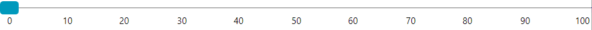
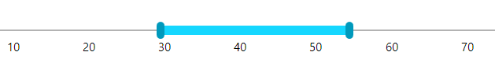
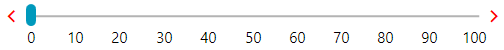
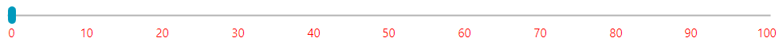
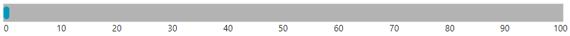
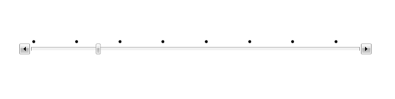

# Customizing Appearance

`RadSlider` allows you to easily modify its appearance by providing some useful properties.

## ThumbStyle

The `ThumbStyle` property allows you to control the appearance of the thumb, which is used to control the `Value`.

If you are using the [implicit styles](#setting-a-theme-using-implicit-styles) theming approach, base the custom style on the default __RadTickBarStyle__ using the `BasedOn` property.

__Creating a custom style for the ThumbStyle property when using implicit styles theming approach__
<snippet id='radslider-customizing-styles-block_1-xaml' />

If you are using the [StyleManager](#setting-a-theme-using-stylemanager) theming approach, merge the generic resource dictionary for the used theme. This resource dictionary is contained in the __Telerik.Windows.Controls__ assembly. Then, base the custom style on the default __TrackStyle__ using the `BasedOn` property. In the following example, the __GenericFluent.xaml__ dictionary of the __Telerik.Windows.Controls__ assembly is merged, because the __Fluent__ theme is used.

__Creating a custom style for the ThumbStyle property when using StyleManager theming approach__
<snippet id='radslider-customizing-styles-block_2-xaml' />

>tip If another theme is used, for example, __Office_Black__, change the __GenericFluent.xaml__ to __GenericOfficeBlack.xaml__.

__RadSlider with custom ThumbStyle__

## SelectionMiddleThumbStyle

The `SelectionMiddleThumbStyle` property lets you control the appearance of the middle thumb, which is displayed when the `IsSelectionRangeEnabled` property is __True__.

If you are using the [implicit styles](#setting-a-theme-using-implicit-styles) theming approach, base the custom style on the default __SelectionMiddleThumbStyle__ using the `BasedOn` property.

__Creating a custom style for the SelectionMiddleThumbStyle property using the implicit styles theming approach__
<snippet id='radslider-customizing-styles-block_3-xaml' />

If you are using the [StyleManager](#setting-a-theme-using-stylemanager) theming approach, merge the generic resource dictionary for the used theme. This resource dictionary is contained in the __Telerik.Windows.Controls__ assembly. Then, base the custom style on the default __SelectionMiddleThumbStyle__ using the `BasedOn` property. In the following example, the __GenericFluent.xaml__ dictionary of the __Telerik.Windows.Controls__ assembly is merged, because the __Fluent__ theme is used.

__Creating a custom style for the SelectionMiddleThumbStyle property using the StyleManager theming approach__
<snippet id='radslider-customizing-styles-block_4-xaml' />

>tip If another theme is used, for example, __Office_Black__, change the __GenericFluent.xaml__ to __GenericOfficeBlack.xaml__.

__RadSlider with custom SelectionMiddleThumbStyle__

## DecreaseHandleStyle and IncreaseHandleStyle

The `DecreaseHandleStyle` and `IncreaseHandleStyle` properties allow you to modify the appearance of the two repeat buttons, which increase and decrease the `Value`. They are shown when the `HandlesVisibility` is __True__.

If you are using the [implicit styles](#setting-a-theme-using-implicit-styles) theming approach, base the custom styles on the default __DecreaseHandleStyle__ and __IncreaseHandleStyle__ styles using the `BasedOn` property.

__Creating custom Styles for the DecreaseHandleStyle and IncreaseHandleStyle properties when using the implicit styles theming approach__
<snippet id='radslider-customizing-styles-block_5-xaml' />

If you are using the [StyleManager](#setting-a-theme-using-stylemanager) theming approach, merge the generic resource dictionary for the used theme. This resource dictionary is contained in the __Telerik.Windows.Controls__ assembly. Then, base the custom styles on the default __DecreaseHandleStyle__ and __IncreaseHandleStyle__ styles using the `BasedOn` property. In the following example, the __GenericFluent.xaml__ dictionary of the __Telerik.Windows.Controls__ assembly is merged, because the __Fluent__ theme is used.

__Creating custom Styles for the DecreaseHandleStyle and IncreaseHandleStyle properties when using the StyleManager theming approach__
<snippet id='radslider-customizing-styles-block_6-xaml' />

>tip If another theme is used, for example, __Office_Black__, change the __GenericFluent.xaml__ to __GenericOfficeBlack.xaml__.

__RadSlider with custom DecreaseHandleStyle and IncreaseHandleStyle__

## TickBarStyle

The `TickBarStyle` property allows you to modify the appearance of the bottom and top tickbars - the controls which displays the ticks.

If you are using the [implicit styles](#setting-a-theme-using-implicit-styles) theming approach, base the custom style on the default __RadTickBarStyle__ using the `BasedOn` property as shown in the following example:

__Creating a custom style for the TickBarStyle property when using the implicit styles theming approach__
<snippet id='radslider-customizing-styles-block_7-xaml' />

If you are using the [StyleManager](#setting-a-theme-using-stylemanager) theming approach, set the `ItemsPanel` property of the `RadTickBar` element to a new instance of the `TickBarPanel` object.

__Creating a custom style for the TickBarStyle property when using the StyleManager theming approach__
<snippet id='radslider-customizing-styles-block_8-xaml' />

__RadSlider with custom TickBarStyle__

## TrackStyle

The `TrackStyle` property lets you modify the appearance of the RadSlider's track. 

When using the [implicit styles](#setting-a-theme-using-implicit-styles) theming approach and __NoXaml__ binaries, base the custom style on the default __TrackStyle__. This style comes from the chosen theme using the `BasedOn` property.

__Creating a custom style for the TrackStyle property when using the implicit styles theming approach__
<snippet id='radslider-customizing-styles-block_9-xaml' />

When using the [StyleManager](#setting-a-theme-using-stylemanager) and __Xaml__ binaries, merge the resource dictionary for the used theme. This resource dictionary is contained in the __Telerik.Windows.Controls__ assembly. Then, base the custom style on the default __TrackStyle__ using the `BasedOn` property. In the following example, the __GenericFluent.xaml__ dictionary of the __Telerik.Windows.Controls__ assembly is merged, because the __Fluent__ theme is used.

__Creating a custom style for the TrackStyle property when using the StyleManager theming approach__
<snippet id='radslider-customizing-styles-block_10-xaml' />

>tip If another theme is used, for example, __Office_Black__, change the __GenericFluent.xaml__ to __GenericOfficeBlack.xaml__.

__RadSlider with custom TrackStyle__

## Using the TickTemplateSelector

The `TickTemplateSelector` property property of `RadSlider` allows to customize the appearance of the ticks, based on different conditions. The following example shows how to use the selector.

>important The `TickTemplate` property needs to be set to `null` for the `TickTemplateSelector` property to get applied.

__Implementing the selector__  
<snippet id='radslider-customizing-styles-block_11-cs' />

__Defining the template selector__  
<snippet id='radslider-customizing-styles-block_12-xaml' />

__Defining the slider and setting the template selector__  
<snippet id='radslider-customizing-styles-block_13-xaml' />

## Customizing the Thumb Shape

By default the thumb of the slider is a rectangle visual. To change this and use custom shape or any other visual, you can [re-templated]() the `Thumb` element. The custom template can be assigned with the `ThumbStyle` property of `RadSlider`. The following example shows how to replace the default rectangle with an ellipse shape.

__Custom Thumb ControlTemplate based on the Fluent theme__
<snippet id='radslider-customizing-styles-block_14-xaml' />

>tip In order to learn how to further modify any of the elements referenced in the article by extracting their control template, read the [Editing Control Templates]() article.