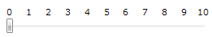
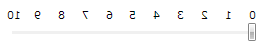
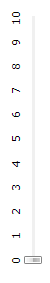
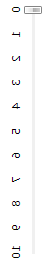

# Direction


## 

The __IsDirectionReversed__ property determines whether the direction of increasing __Value__ is reversed from the default direction. By default the property is __false__ and values increase __from left to right for a horizontal slider__. 
        

For a __vertical Slider the values increase from bottom to top__. When you set the __IsDirectionReversed__ property to __true__, the direction of increasing value reverses.

#### __XAML__

```XAML
	<telerik:RadSlider Maximum="10" TickFrequency="1" TickPlacement="TopLeft" IsDirectionReversed="False">
	    <telerik:RadSlider.TickTemplate>
	        <DataTemplate>
	            <Grid>
	                <TextBlock Text="{Binding}" FontSize="11" />
	            </Grid>
	        </DataTemplate>
	    </telerik:RadSlider.TickTemplate>
	</telerik:RadSlider>
```



#### __XAML__

```XAML
	<telerik:RadSlider Maximum="10" TickFrequency="1" TickPlacement="TopLeft" IsDirectionReversed="True">
	    <telerik:RadSlider.TickTemplate>
	        <DataTemplate>
	            <Grid>
	                <TextBlock Text="{Binding}" FontSize="11" />
	            </Grid>
	        </DataTemplate>
	    </telerik:RadSlider.TickTemplate>
	</telerik:RadSlider>
```



#### __XAML__

```XAML
	<telerik:RadSlider Height="250" 
	           Margin="10"
	           IsDirectionReversed="False"
	           Maximum="10"
	           Orientation="Vertical"
	           TickFrequency="1"
	           TickPlacement="TopLeft">
	    <telerik:RadSlider.TickTemplate>
	        <DataTemplate>
	            <Grid>
	                <TextBlock FontSize="11" Text="{Binding}" />
	            </Grid>
	        </DataTemplate>
	    </telerik:RadSlider.TickTemplate>
	</telerik:RadSlider>
```



#### __XAML__

```XAML
	<telerik:RadSlider Height="250" 
	           Margin="10"
	           IsDirectionReversed="True"
	           Maximum="10"
	           Orientation="Vertical"
	           TickFrequency="1"
	           TickPlacement="TopLeft">
	    <telerik:RadSlider.TickTemplate>
	        <DataTemplate>
	            <Grid>
	                <TextBlock FontSize="11" Text="{Binding}" />
	            </Grid>
	        </DataTemplate>
	    </telerik:RadSlider.TickTemplate>
	</telerik:RadSlider>
```


