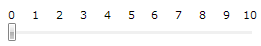
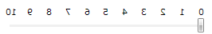
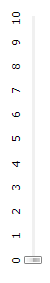
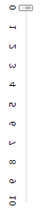

# Direction

## 

The __IsDirectionReversed__ property determines whether the direction of increasing __Value__ is reversed from the default direction. By default the property is __false__ and values increase __from left to right for a horizontal slider__. 
        

For a __vertical Slider the values increase from bottom to top__. When you set the __IsDirectionReversed__ property to __true__, the direction of increasing value reverses.

<snippet id='radslider-features-direction-block_1-xaml' />

<snippet id='radslider-features-direction-block_2-xaml' />

<snippet id='radslider-features-direction-block_3-xaml' />

<snippet id='radslider-features-direction-block_4-xaml' />

