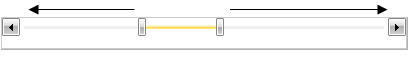

# Increase/decrease handles


## 

RadSlider provides an increase and decrease handles, which provide an alternative way of moving the thumb along the track. To enable the handles you have to set the __HandlesVisibility__ property to __Visible__.


```XAML
	<telerik:RadSlider HandlesVisibility="Visible" />
```


In case you enable the handles when __RadSlider__ is in selection range mode, then by default clicking for example the __increase(right)__ handle will __increase__ the value of __SelectionEnd__, while clicking the __decrease(left)__ handle will __decrease__ the value of __SelectionStart__.


```XAML
	<telerik:RadSlider x:Name="slider" 
	               HandlesVisibility="Visible"
	               IsSelectionRangeEnabled="True"
	               Maximum="15"
	               Minimum="0"
	               SelectionEnd="8"
	               SelectionStart="5" />
```



If you want to control the behavior of the __RadSlider's Handles__ when the __SelectionRange__ is enabled, you can take advantage of the __StepAction__ property. The property is enumeration of type __StepAction__ and exposes the following members:

* __ChangeRange__ - clicking the handles will increase the __SelectionEnd__ or decrease the __SelectionStart__ of the selection range. This is the default behavior of the control.

* __MoveRange__ - clicking the handles will move the selection 
