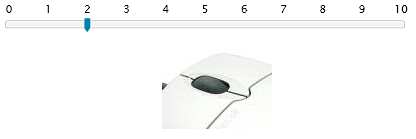

# Keyboard and Mouse support

## Mouse Wheel Support

__RadSlider__ allows you to specify whether you want the wheel of the mouse to be used to move the thumb. This can be done by setting the __IsMouseWheelEnabled__ property to __true__. Every time you move the mouse wheel the value is increased/decreased by the amount specified in the __LargeChange__ property.

In case a __SelectionRange__ is enabled, the mouse wheel will increase/decrease the currently focused thumb.

## Keyboard support

When a __RadSlider__ thumb is focused, it can be moved using the mouse, the mouse wheel and the keyboard.

* The __RightArrow/UpArrow__ keys __increase__ the focused thumb by the amount specified in the __SmallChange__ property.

* The __LeftArrow/DownArrow__ keys __decrease__ the focused thumb by the amount specified in the __SmallChange__ property.

* The __PageUp__ key __increases__ the focused thumb by the amount specified in the __LargeChange__ property.

* The __PageDown__ key __decreases__ the focused thumb by the amount specified in the __LargeChange__ property.

* The __Home__ key moves the focused thumb to the first possible position.

* The __End__ key moves the focused thumb to the last possible position.
