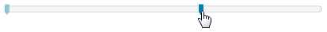

# Move to point


## 

When the __IsMoveToPointEnabled__ property is set to __true__ and you click somewhere on the track, the thumb will move directly to the point of click, ignoring the __LargeChange__ property.

#### __XAML__

```XAML
	<telerik:RadSlider Maximum="10" IsMoveToPointEnabled="True"/>
```



#### __XAML__

```XAML
	<telerik:RadSlider IsMoveToPointEnabled="True" 
	           IsSelectionRangeEnabled="True"
	           Maximum="10"
	           SelectionEnd="5"
	           SelectionStart="3" />
```


