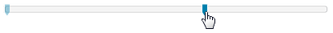

# Move to point

## 

When the __IsMoveToPointEnabled__ property is set to __true__ and you click somewhere on the track, the thumb will move directly to the point of click, ignoring the __LargeChange__ property.

<snippet id='radslider-features-move-to-point-block_1-xaml' />

<snippet id='radslider-features-move-to-point-block_2-xaml' />

