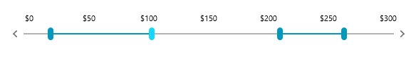
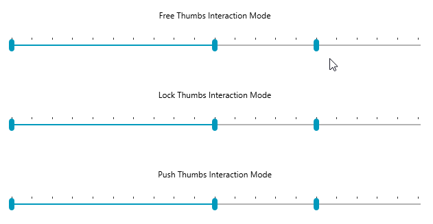

# Multiple Thumbs

As of **R3 2020**, the RadSlider allows you to define multiple thumbs with which to control its values and ranges.



This feature can be enabled by adding instances of the **SliderThumb** and **RangeSliderThumb** classes to its new **Thumbs** collection.

__Example 1: Defining multiple thumbs__

```XAML
    <telerik:RadSlider Minimum="0" Maximum="300">
        <telerik:RadSlider.Thumbs>
            <telerik:RangeSliderThumb RangeStart="0" RangeEnd="100" />
            <telerik:SliderThumb Value="150" />
            <telerik:RangeSliderThumb RangeStart="200" RangeEnd="250" />
        </telerik:RadSlider.Thumbs>
    </telerik:RadSlider>
```

#### Figure 1: RadSlider with multiple thumbs


Both the SliderThumb and RangeSliderThumb classes provide the [InteractionMode](#interactionmode) and [ThumbStyle](#thumbstyle) properties as they inherit from the common **SliderThumbBase** class, but in turn they also expose specific members described in the next two sections.

## SliderThumb

The SliderThumb represents a single thumb which can be dragged by the user and exposes a single **Value** property of type **double**.

#### Figure 2: The SliderThumb


## RangeSliderThumb

The RangeSliderThumb, on the other hand, represents a control with two draggable thumbs (of type **SliderThumb**) as well as an extra thumb (of type **Thumb**) in between to drag the whole range.

#### Figure 3: The RangeSliderThumb


It exposes the following properties:

- **RangeStart**: The smallest value of a specified range.
- **RangeEnd**: The largest value of a specified range.
- **MinimumRangeSpan**: The minimum value distance between SelectionStart and SelectionEnd.
- **MaximumRangeSpan**: The maximum value distance between SelectionStart and SelectionEnd.
- **SelectedRange**: A property of type **SelectionRange\<double>** which can be used to set the **Start** and **End** of the range.
- **MiddleThumbStyle**: The style for the middle thumb of the RangeSliderThumb element. The style needs to target the Thumb type.
- **AlternateThumbStyle**: The style for the right thumb of the RangeSliderThumb element. The style needs to target the SliderThumb type.

In addition, the RangeSliderThumb provides the **SelectedRangeChanged** event which is fired each time a certain range changes.

## InteractionMode

You can control the action of the individual thumbs when they come in contact with another thumb by setting their **InteractionMode** property. It accepts the following values of the **ThumbInteractionMode** enumeration:

- **Free**: When the active thumb interacts with the thumb in free mode, there is no special interaction between both thumbs.
- **Lock**: When the active thumb interacts with the locked thumb it is not possible to pass through this thumb.
- **Push**: When the active thumb interacts with the thumb in push mode, its position will be changed to the position of the active thumb.

#### Figure 4: The effect of the different interaction modes



## ActiveThumb

To aid the usage of multiple thumbs, the RadSlider now also exposes an **ActiveThumb** property which corresponds to the last thumb the user interacted with.

>If the ActiveThumb property is set to **null**, interaction with the [increase and decrease handles]() will be disabled.

## ThumbStyle

Through the **ThumbStyle** property of the SliderThumbs, you can apply a specific style only to a certain thumb.

In the case of the RangeSliderThumb, this style is only applied to the left-most thumb and if you need to change the appearance of the other two thumbs, you need to also use the **MiddleThumbStyle** and **AlternateThumbStyle** to style the middle and right thumbs, respectively.

__Example 2: Styling the thumbs individually__

```XAML
    <Grid>
        <Grid.Resources>
            <!-- If you're not using the NoXaml binaries, you need to remove the BasedOn attributes of the styles -->
            <Style x:Key="RedThumbStyle" TargetType="Thumb" BasedOn="{StaticResource ThumbStyle}">
                <Setter Property="Background" Value="Red" />
            </Style>
            <Style x:Key="GreenStyle" TargetType="Thumb" BasedOn="{StaticResource SelectionMiddleThumbStyle}">
                <Setter Property="Background" Value="Green" />
            </Style>
            <Style x:Key="BlueThumbStyle" TargetType="Thumb" BasedOn="{StaticResource ThumbStyle}">
                <Setter Property="Background" Value="Blue" />
            </Style>
        </Grid.Resources>
        <telerik:RadSlider Minimum="0" Maximum="100">
            <telerik:RadSlider.Thumbs>
                <telerik:SliderThumb Value="30" ThumbStyle="{StaticResource RedThumbStyle}" />
                <telerik:RangeSliderThumb ThumbStyle="{StaticResource RedThumbStyle}" AlternateThumbStyle="{StaticResource BlueThumbStyle}" MiddleThumbStyle="{StaticResource GreenStyle}" RangeStart="50" RangeEnd="80" />
            </telerik:RadSlider.Thumbs>
        </telerik:RadSlider>
    </Grid>
```

>importantPlease note that when using the [StyleManager theming approach]() you need to also define the **Height** for the middle thumb. This has been demonstrated in the following [knowledge base article]().

Alternatively, you can set the ThumbStyle, **SelectionMiddleThumbStyle** and AlternateThumbStyle properties on the RadSlider control itself and they will be passed onto all thumbs from the **Thumbs** collection.

__Example 3: Styling the thumbs through the properties of the RadSlider__

```XAML
    <!-- ... -->
    <telerik:RadSlider ThumbStyle="{StaticResource RedThumbStyle}" SelectionMiddleThumbStyle="{StaticResource GreenStyle}" AlternateThumbStyle="{StaticResource BlueThumbStyle}" Minimum="0" Maximum="100">
    <!-- ... -->
```

#### Figure 5: Styling the thumbs


>You can see more examples of creating styles for the RadSlider control in the [Styling and Appearance]() article.

## See Also

* [Increase and Decrease Handles]()
* [Styling and Appearance]()
