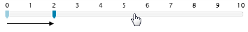
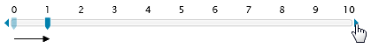

# Step size


## 

__RadSlider's__ properties - __LargeChange__ and __SmallChange__ allow you to define the amount of value that will be used as a step-size. Setting __LargeChange__, for example, will control how much the thumb will travel when the track is clicked.

#### __XAML__

```XAML
	<telerik:RadSlider LargeChange="2" Maximum="10" />
```



__SmallChange__ on the other hand is used when __RadSlider__ has its handles visible. Clicking any of the handles will increase/decrease the value by the amount specified in __SmallChange__.

#### __XAML__

```XAML
	<telerik:RadSlider SmallChange="1" HandlesVisibility="Visible" Maximum="10" />
```



The same applies for the thumbs when the __RadSlider__ is in selection range mode.
        
