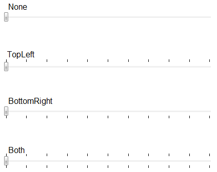

# Tick placement

## 

Displaying ticks along the track can be done by setting the __TickPlacement__ 
        property. The __TickPlacement__ property sets the position of ticks(marks) with respect
        to the track of __RadSlider__ and its orientation. Below is a list of the allowed 
        values for the __TickPlacement__ property:

* __None__ - No ticks appear.

* __TopLeft__ - ticks appear above the track for a horizontal __RadSlider__, or to the left of the track for a vertical __RadSlider__.

* __BottomRight__ - ticks appear below the track for a horizontal __RadSlider__, or to the right of the track for a vertical __RadSlider__.

* __Both__ - ticks appear above and below the track bar for a horizontal __RadSlider__, or to the left and right of the track for a vertical __RadSlider__. 
