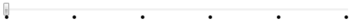

# Tick template

Changing the look of the tick marks can be done by setting the __TickTemplate__ property, which is of type __DataTemplate__.


```XAML
	<telerik:RadSlider Maximum="10" TickFrequency="2" TickPlacement="BottomRight">
	    <telerik:RadSlider.TickTemplate>
	        <DataTemplate>
	            <Grid>
	                <Ellipse Width="5" Height="5" Fill="Black" />
	            </Grid>
	        </DataTemplate>
	    </telerik:RadSlider.TickTemplate>
	</telerik:RadSlider>
```



If you want to display the numeric value of each tick, you have to add a __TextBlock__ to the template and bind its __Text__ property as shown in the example bellow:


```XAML
	<telerik:RadSlider Maximum="10" TickFrequency="1" TickPlacement="Both">
	    <telerik:RadSlider.TickTemplate>
	        <DataTemplate>
	            <Grid>
	                <TextBlock Text="{Binding}" FontSize="11"/>
	            </Grid>
	        </DataTemplate>
	    </telerik:RadSlider.TickTemplate>
	</telerik:RadSlider>
```


More information how to use a value converter and display not only numeric values, can be found [here](https://www.telerik.com/blogs/using-valueconverter-to-edit-slider-s-ticktemplate).
