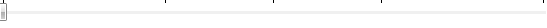
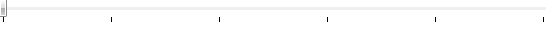

# Ticks and Tick frequency

## 

The __Ticks__ property allows you to place marks(ticks) along the track in a 
        __non-uniform__ manner, unlike the __TickFrequency__ property 
        which places the ticks on equal intervals. The __Ticks__ property is of type 
        __DoubleCollection__ and its default value is null. This property has to be combined 
        with setting __TickPlacement__ to something different than __None__.
        

#### __XAML__

{{region radslider-ticks-and-tick-frequency_0}}
	<telerik:RadSlider Maximum="10" Ticks="3,5,7" TickPlacement="TopLeft" />
	{{endregion}}

#### __C#__

{{region radslider-ticks-and-tick-frequency_1}}
	RadSlider radSlider1 = new RadSlider();
	radSlider1.Maximum = 10;
	DoubleCollection tickCollection = new DoubleCollection();
	tickCollection.Add(3);
	tickCollection.Add(5);
	tickCollection.Add(7);
	radSlider1.Ticks = tickCollection;
	radSlider1.TickPlacement = TickPlacement.TopLeft;
	LayoutRoot.Children.Add(radSlider1);
	{{endregion}}

#### __VB.NET__

{{region radslider-ticks-and-tick-frequency_2}}
	Dim radSlider1 As New RadSlider()
	radSlider1.Maximum = 10
	Dim tickCollection As New DoubleCollection()
	tickCollection.Add(3)
	tickCollection.Add(5)
	tickCollection.Add(7)
	radSlider1.Ticks = tickCollection
	radSlider1.TickPlacement = TickPlacement.TopLeft
	LayoutRoot.Children.Add(radSlider1)
	{{endregion}}

The __TickFrequency__ property on the other hand allows you to place marks(ticks) along the track in a __uniform__ manner. On the example bellow, since the __Maximum__is 10 and the __TickFrequency__ is 2, this means that there will be tick marks at 0, 2, 4, 6, 8 and 10.

#### __XAML__

{{region radslider-ticks-and-tick-frequency_3}}
	<telerik:RadSlider Maximum="10" TickFrequency="2" TickPlacement="BottomRight" />
	{{endregion}}

