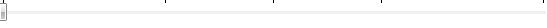
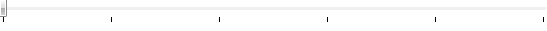

# Ticks and Tick frequency

## 

The __Ticks__ property allows you to place marks(ticks) along the track in a __non-uniform__ manner, unlike the __TickFrequency__ property which places the ticks on equal intervals. The __Ticks__ property is of type __DoubleCollection__ and its default value is null. This property has to be combined with setting __TickPlacement__ to something different than __None__.
        

<snippet id='radslider-features-tick-marks-ticks-and-tick-frequency-block_1-xaml' />

<snippet id='radslider-features-tick-marks-ticks-and-tick-frequency-block_2-cs' />
<snippet id='radslider-features-tick-marks-ticks-and-tick-frequency-block_3-vb' />

The __TickFrequency__ property on the other hand allows you to place marks(ticks) along the track in a __uniform__ manner. On the example bellow, since the __Maximum__ is 10 and the __TickFrequency__ is 2, this means that there will be tick marks at 0, 2, 4, 6, 8 and 10.

<snippet id='radslider-features-tick-marks-ticks-and-tick-frequency-block_4-xaml' />

