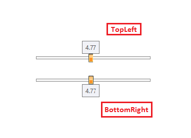
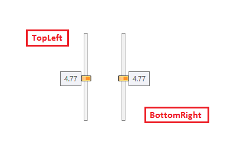

# ToolTip

The tooltip of RadSlider enables the user to see the value of the slider's thumb while dragging it. In order to enable the ToolTip in the RadSlider component, you can set the __AutoToolTipPlacement__ property. The property is an enumeration of type AutoToolTipPlacement and the possible values which can be set are __None__, __TopLeft__, __BottomRight__. The default value of the __AutoToolTipPlacement__ property is __None__.

#### __[XAML] Example 1: Set AutoToolTipPlacement property to TopLeft in horizontal orientation__
{{region  xaml-radslider-tooltip-01}}
	<telerik:RadSlider Minimum="0" Maximum="10" AutoToolTipPlacement="TopLeft"/>
{{endregion}}

You can change the postion of the tool tip by setting the Orientation and AutoToolTipPlacement properties. The following pictures display the different position of the tool tip.
#### __Figure 1: Horizontal orientated sliders__

#### __Figure 2: Vertical orientated sliders__

## ToolTip Value

By default, the ToolTip displays the thumb's value with two decimal symbols of precision (52.42 for example). To change the precision or the default representation of the ToolTip content you can set the __AutoToolTipContentTemplate__ property.

#### __[XAML] Example 3: Set custom DataTemplate to AutoToolTipContentTemplate property__
{{region  xaml-radslider-tooltip-03}}
	<telerik:RadSlider Minimum="0" Maximum="10" AutoToolTipPlacement="TopLeft">
		<telerik:RadSlider.AutoToolTipContentTemplate>
			<DataTemplate>
				<TextBlock Text="{Binding .,StringFormat=F1}"/>
			</DataTemplate>
		</telerik:RadSlider.AutoToolTipContentTemplate>
	</telerik:RadSlider>	
{{endregion}}

#### __Figure 3: Setting custom template to the AutoToolTipContentTemplate property__

>The value of the ToolTip might not display the actual Value/SelectionStart/SelectionEnd values of the slider, if the __IsDeferredDraggingEnabled__ property is set to True the value of the slider will be updated only when you finish the drag operation. Regardless this, the Value of the ToolTip will be updated corresponding to the current location of the thumb, indicating the value when you end the dragging.

## Range Selection

When selection range is enabled, the tooltip will appear on the start thumb or the end thumb depending on which one is dragged. The shown value will correspond to the SelectiondStart and SelectionEnd properties of the RadSlider.

#### __Figure 4: ToolTip in range selection functionality__

## See Also
 * [Getting Started]()	
 * [Orientation]()
 * [Direction]()
