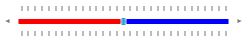

## Get Default Style

This article describes how users can customize the look of the RadSlider control. You can take advantage of the fact that we ship all our themes to our customers. You can follow the steps described in our [Editing Control Templates]() article and extract the default Style of the RadSlider component. The final look of the customized control will be similar to the following picture.

## What to Style

After you have the style and all the static resources it uses extracted you should be able to find two native repeat buttons called __"LargeIncreaseButton"__ and __"LargeDecreaseButton"__. Both buttons are styled with the same style which basically sets their __ControlTemplates__ to a __Grid__ panel with transparent background. In order to change the way the track of the RadSlider is visualized you can apply changes to those buttons. 

## Usecase

Let's say you need to change the color of the track in the left of the thumb to be different from the color of the track in the right of the thumb. You can apply different styles to those buttons. Note that the buttons are actually on top of the track itself. If users change their background the underlying track will be no longer visible. This is why the buttons are transparent by default. 

You can use the following definition to achieve the result mentioned at the beginning of the article.

#### __XAML__

    <Grid>
        <Grid.Resources>
            
            
            <ControlTemplate TargetType="telerik:RadSlider"
                             x:Key="SliderControlTemplate">
                <telerikPrimitives:LayoutTransformControl x:Name="layoutControl"
                                                          RenderTransformOrigin=".5 0">
                    <telerikPrimitives:LayoutTransformControl.LayoutTransform>
                        <TransformGroup>
                            <ScaleTransform />
                            <SkewTransform />
                            <RotateTransform />
                            <TranslateTransform />
                        </TransformGroup>
                    </telerikPrimitives:LayoutTransformControl.LayoutTransform>
                    <VisualStateManager.VisualStateGroups>
                        <VisualStateGroup x:Name="CommonStates">
                            <VisualState x:Name="Normal" />
                            <VisualState x:Name="Disabled">
                                <Storyboard />
                            </VisualState>
                        </VisualStateGroup>
                        <VisualStateGroup x:Name="OrientationStates">
                            <VisualState x:Name="Horizontal">
                                <Storyboard>
                                    <ObjectAnimationUsingKeyFrames Storyboard.TargetName="layoutControl"
                                                                   Storyboard.TargetProperty="LayoutTransform">
                                        <DiscreteObjectKeyFrame KeyTime="0">
                                            <DiscreteObjectKeyFrame.Value>
                                                <RotateTransform Angle="0" />
                                            </DiscreteObjectKeyFrame.Value>
                                        </DiscreteObjectKeyFrame>
                                    </ObjectAnimationUsingKeyFrames>
                                </Storyboard>
                            </VisualState>
                            <VisualState x:Name="Vertical">
                                <Storyboard>
                                    <ObjectAnimationUsingKeyFrames Storyboard.TargetName="layoutControl"
                                                                   Storyboard.TargetProperty="LayoutTransform">
                                        <DiscreteObjectKeyFrame KeyTime="0">
                                            <DiscreteObjectKeyFrame.Value>
                                                <RotateTransform Angle="-90" />
                                            </DiscreteObjectKeyFrame.Value>
                                        </DiscreteObjectKeyFrame>
                                    </ObjectAnimationUsingKeyFrames>
                                </Storyboard>
                            </VisualState>
                            <VisualState x:Name="ReversedHorizontal">
                                <Storyboard>
                                    <ObjectAnimationUsingKeyFrames Storyboard.TargetName="layoutControl"
                                                                   Storyboard.TargetProperty="LayoutTransform">
                                        <DiscreteObjectKeyFrame KeyTime="0">
                                            <DiscreteObjectKeyFrame.Value>
                                                <ScaleTransform ScaleX="-1" />
                                            </DiscreteObjectKeyFrame.Value>
                                        </DiscreteObjectKeyFrame>
                                    </ObjectAnimationUsingKeyFrames>
                                    <ObjectAnimationUsingKeyFrames Storyboard.TargetName="BottomTickBar"
                                                                   Storyboard.TargetProperty="RenderTransform">
                                        <DiscreteObjectKeyFrame KeyTime="0">
                                            <DiscreteObjectKeyFrame.Value>
                                                <ScaleTransform ScaleX="-1" />
                                            </DiscreteObjectKeyFrame.Value>
                                        </DiscreteObjectKeyFrame>
                                    </ObjectAnimationUsingKeyFrames>
                                    <ObjectAnimationUsingKeyFrames Storyboard.TargetName="TopTickBar"
                                                                   Storyboard.TargetProperty="RenderTransform">
                                        <DiscreteObjectKeyFrame KeyTime="0">
                                            <DiscreteObjectKeyFrame.Value>
                                                <ScaleTransform ScaleX="-1" />
                                            </DiscreteObjectKeyFrame.Value>
                                        </DiscreteObjectKeyFrame>
                                    </ObjectAnimationUsingKeyFrames>
                                </Storyboard>
                            </VisualState>
                            <VisualState x:Name="ReversedVertical">
                                <Storyboard>
                                    <ObjectAnimationUsingKeyFrames Storyboard.TargetName="layoutControl"
                                                                   Storyboard.TargetProperty="LayoutTransform">
                                        <DiscreteObjectKeyFrame KeyTime="0">
                                            <DiscreteObjectKeyFrame.Value>
                                                <TransformGroup>
                                                    <ScaleTransform ScaleY="-1" />
                                                    <RotateTransform Angle="90" />
                                                </TransformGroup>
                                            </DiscreteObjectKeyFrame.Value>
                                        </DiscreteObjectKeyFrame>
                                    </ObjectAnimationUsingKeyFrames>
                                    <ObjectAnimationUsingKeyFrames Storyboard.TargetName="BottomTickBar"
                                                                   Storyboard.TargetProperty="RenderTransform">
                                        <DiscreteObjectKeyFrame KeyTime="0">
                                            <DiscreteObjectKeyFrame.Value>
                                                <TransformGroup>
                                                    <ScaleTransform ScaleY="-1" />
                                                    <RotateTransform Angle="-180" />
                                                </TransformGroup>
                                            </DiscreteObjectKeyFrame.Value>
                                        </DiscreteObjectKeyFrame>
                                    </ObjectAnimationUsingKeyFrames>
                                    <ObjectAnimationUsingKeyFrames Storyboard.TargetName="TopTickBar"
                                                                   Storyboard.TargetProperty="RenderTransform">
                                        <DiscreteObjectKeyFrame KeyTime="0">
                                            <DiscreteObjectKeyFrame.Value>
                                                <TransformGroup>
                                                    <ScaleTransform ScaleY="-1" />
                                                    <RotateTransform Angle="-180" />
                                                </TransformGroup>
                                            </DiscreteObjectKeyFrame.Value>
                                        </DiscreteObjectKeyFrame>
                                    </ObjectAnimationUsingKeyFrames>
                                </Storyboard>
                            </VisualState>
                        </VisualStateGroup>
                        <VisualStateGroup x:Name="TickPlacementStates">
                            <VisualState x:Name="NoneTicks">
                                <Storyboard>
                                    <ObjectAnimationUsingKeyFrames Storyboard.TargetName="TopTickBar"
                                                                   Storyboard.TargetProperty="Visibility">
                                        <DiscreteObjectKeyFrame KeyTime="0">
                                            <DiscreteObjectKeyFrame.Value>
                                                <Visibility>Collapsed</Visibility>
                                            </DiscreteObjectKeyFrame.Value>
                                        </DiscreteObjectKeyFrame>
                                    </ObjectAnimationUsingKeyFrames>
                                    <ObjectAnimationUsingKeyFrames Storyboard.TargetName="BottomTickBar"
                                                                   Storyboard.TargetProperty="Visibility">
                                        <DiscreteObjectKeyFrame KeyTime="0">
                                            <DiscreteObjectKeyFrame.Value>
                                                <Visibility>Collapsed</Visibility>
                                            </DiscreteObjectKeyFrame.Value>
                                        </DiscreteObjectKeyFrame>
                                    </ObjectAnimationUsingKeyFrames>
                                </Storyboard>
                            </VisualState>
                            <VisualState x:Name="TopTicks">
                                <Storyboard>
                                    <ObjectAnimationUsingKeyFrames Storyboard.TargetName="TopTickBar"
                                                                   Storyboard.TargetProperty="Visibility">
                                        <DiscreteObjectKeyFrame KeyTime="0">
                                            <DiscreteObjectKeyFrame.Value>
                                                <Visibility>Visible</Visibility>
                                            </DiscreteObjectKeyFrame.Value>
                                        </DiscreteObjectKeyFrame>
                                    </ObjectAnimationUsingKeyFrames>
                                    <ObjectAnimationUsingKeyFrames Storyboard.TargetName="BottomTickBar"
                                                                   Storyboard.TargetProperty="Visibility">
                                        <DiscreteObjectKeyFrame KeyTime="0">
                                            <DiscreteObjectKeyFrame.Value>
                                                <Visibility>Collapsed</Visibility>
                                            </DiscreteObjectKeyFrame.Value>
                                        </DiscreteObjectKeyFrame>
                                    </ObjectAnimationUsingKeyFrames>
                                </Storyboard>
                            </VisualState>
                            <VisualState x:Name="BottomTicks">
                                <Storyboard>
                                    <ObjectAnimationUsingKeyFrames Storyboard.TargetName="TopTickBar"
                                                                   Storyboard.TargetProperty="Visibility">
                                        <DiscreteObjectKeyFrame KeyTime="0">
                                            <DiscreteObjectKeyFrame.Value>
                                                <Visibility>Collapsed</Visibility>
                                            </DiscreteObjectKeyFrame.Value>
                                        </DiscreteObjectKeyFrame>
                                    </ObjectAnimationUsingKeyFrames>
                                    <ObjectAnimationUsingKeyFrames Storyboard.TargetName="BottomTickBar"
                                                                   Storyboard.TargetProperty="Visibility">
                                        <DiscreteObjectKeyFrame KeyTime="0">
                                            <DiscreteObjectKeyFrame.Value>
                                                <Visibility>Visible</Visibility>
                                            </DiscreteObjectKeyFrame.Value>
                                        </DiscreteObjectKeyFrame>
                                    </ObjectAnimationUsingKeyFrames>
                                </Storyboard>
                            </VisualState>
                            <VisualState x:Name="BothTicks">
                                <Storyboard>
                                    <ObjectAnimationUsingKeyFrames Storyboard.TargetName="TopTickBar"
                                                                   Storyboard.TargetProperty="Visibility">
                                        <DiscreteObjectKeyFrame KeyTime="0">
                                            <DiscreteObjectKeyFrame.Value>
                                                <Visibility>Visible</Visibility>
                                            </DiscreteObjectKeyFrame.Value>
                                        </DiscreteObjectKeyFrame>
                                    </ObjectAnimationUsingKeyFrames>
                                    <ObjectAnimationUsingKeyFrames Storyboard.TargetName="BottomTickBar"
                                                                   Storyboard.TargetProperty="Visibility">
                                        <DiscreteObjectKeyFrame KeyTime="0">
                                            <DiscreteObjectKeyFrame.Value>
                                                <Visibility>Visible</Visibility>
                                            </DiscreteObjectKeyFrame.Value>
                                        </DiscreteObjectKeyFrame>
                                    </ObjectAnimationUsingKeyFrames>
                                </Storyboard>
                            </VisualState>
                        </VisualStateGroup>
                        <VisualStateGroup x:Name="RangeStates">
                            <VisualState x:Name="SingleThumb" />
                            <VisualState x:Name="RangeThumbs">
                                <Storyboard>
                                    <ObjectAnimationUsingKeyFrames Storyboard.TargetName="RangeThumbsPanel"
                                                                   Storyboard.TargetProperty="Visibility">
                                        <DiscreteObjectKeyFrame KeyTime="0">
                                            <DiscreteObjectKeyFrame.Value>
                                                <Visibility>Visible</Visibility>
                                            </DiscreteObjectKeyFrame.Value>
                                        </DiscreteObjectKeyFrame>
                                    </ObjectAnimationUsingKeyFrames>
                                    <ObjectAnimationUsingKeyFrames Storyboard.TargetName="SingleThumbHost"
                                                                   Storyboard.TargetProperty="Visibility">
                                        <DiscreteObjectKeyFrame KeyTime="0">
                                            <DiscreteObjectKeyFrame.Value>
                                                <Visibility>Collapsed</Visibility>
                                            </DiscreteObjectKeyFrame.Value>
                                        </DiscreteObjectKeyFrame>
                                    </ObjectAnimationUsingKeyFrames>
                                </Storyboard>
                            </VisualState>
                        </VisualStateGroup>
                    </VisualStateManager.VisualStateGroups>
                    <Grid UseLayoutRounding="True">
                        <Grid.ColumnDefinitions>
                            <ColumnDefinition Width="Auto" />
                            <ColumnDefinition Width="Auto" />
                            <ColumnDefinition Width="Auto" />
                            <ColumnDefinition Width="*" />
                            <ColumnDefinition Width="Auto" />
                        </Grid.ColumnDefinitions>
                        <Grid.RowDefinitions>
                            <RowDefinition Height="Auto" />
                            <RowDefinition Height="Auto" />
                            <RowDefinition Height="Auto" />
                        </Grid.RowDefinitions>
                        <telerik:RadTickBar x:Name="TopTickBar"
                                            Grid.Column="1"
                                            Grid.ColumnSpan="3"
                                            ItemTemplate="{TemplateBinding TickTemplate}"
                                            ItemsSource="{TemplateBinding ResultTicks}"
                                            ItemTemplateSelector="{TemplateBinding TickTemplateSelector}"
                                            Maximum="{TemplateBinding Maximum}"
                                            Minimum="{TemplateBinding Minimum}"
                                            IsDirectionReversed="{TemplateBinding IsDirectionReversed}"
                                            Style="{TemplateBinding TickBarStyle}"
                                            RenderTransformOrigin="0.5,0.5">
                            <telerik:RadTickBar.RenderTransform>
                                <TransformGroup>
                                    <ScaleTransform />
                                    <SkewTransform />
                                    <RotateTransform />
                                    <TranslateTransform />
                                </TransformGroup>
                            </telerik:RadTickBar.RenderTransform>
                        </telerik:RadTickBar>
                        <ContentControl Style="{TemplateBinding TrackStyle}"
                                        x:Name="Track"
                                        Grid.Column="1"
                                        Grid.ColumnSpan="3"
                                        Grid.Row="1"
                                        VerticalAlignment="Center"
                                        Background="{TemplateBinding Background}" />
                        <RepeatButton x:Name="DecreaseButton"
                                      Grid.Row="1"
                                      Delay="{TemplateBinding Delay}"
                                      Interval="{TemplateBinding RepeatInterval}"
                                      Visibility="{TemplateBinding HandlesVisibility}"
                                      Style="{TemplateBinding DecreaseHandleStyle}" />
                        <RepeatButton x:Name="LargeDecreaseButton"
                                      Grid.Column="1"
                                      Grid.Row="1"
                                      Style="{StaticResource BeforeTrackStyle}"
                                      Delay="{TemplateBinding Delay}"
                                      Interval="{TemplateBinding RepeatInterval}" />
                        <Grid Grid.Row="1"
                              Grid.Column="2">
                            <Thumb x:Name="SingleThumbHost"
                                   Style="{TemplateBinding ThumbStyle}"
                                   Visibility="{TemplateBinding ThumbVisibility}" />
                            <StackPanel x:Name="RangeThumbsPanel"
                                        Orientation="Horizontal"
                                        Visibility="Collapsed">
                                <Thumb x:Name="RangeStartThumb"
                                       Style="{TemplateBinding ThumbStyle}"
                                       Visibility="{TemplateBinding ThumbVisibility}" />
                                <Thumb x:Name="RangeMiddleThumb"
                                       Style="{TemplateBinding SelectionMiddleThumbStyle}" />
                                <Thumb x:Name="RangeEndThumb"
                                       Style="{TemplateBinding AlternateThumbStyle}"
                                       Visibility="{TemplateBinding ThumbVisibility}" />
                            </StackPanel>
                        </Grid>
                        <RepeatButton x:Name="LargeIncreaseButton"
                                      Grid.Column="3"
                                      Grid.Row="1"
                                      Style="{StaticResource AfterTrackStyle}"
                                      Delay="{TemplateBinding Delay}"
                                      Interval="{TemplateBinding RepeatInterval}" />
                        <RepeatButton x:Name="IncreaseButton"
                                      Grid.Row="1"
                                      Grid.Column="4"
                                      Delay="{TemplateBinding Delay}"
                                      Interval="{TemplateBinding RepeatInterval}"
                                      Visibility="{TemplateBinding HandlesVisibility}"
                                      RenderTransformOrigin="0.5,0.5"
                                      Style="{TemplateBinding IncreaseHandleStyle}" />
                        <telerik:RadTickBar x:Name="BottomTickBar"
                                            Grid.Row="2"
                                            Grid.Column="1"
                                            Grid.ColumnSpan="3"
                                            Maximum="{TemplateBinding Maximum}"
                                            Minimum="{TemplateBinding Minimum}"
                                            ItemsSource="{TemplateBinding ResultTicks}"
                                            ItemTemplate="{TemplateBinding TickTemplate}"
                                            ItemTemplateSelector="{TemplateBinding TickTemplateSelector}"
                                            IsDirectionReversed="{TemplateBinding IsDirectionReversed}"
                                            Style="{TemplateBinding TickBarStyle}"
                                            RenderTransformOrigin="0.5,0.5">
                            <telerik:RadTickBar.RenderTransform>
                                <TransformGroup>
                                    <ScaleTransform />
                                    <SkewTransform />
                                    <RotateTransform />
                                    <TranslateTransform />
                                </TransformGroup>
                            </telerik:RadTickBar.RenderTransform>
                        </telerik:RadTickBar>
                    </Grid>
                </telerikPrimitives:LayoutTransformControl>
            </ControlTemplate>
        </Grid.Resources>
        <telerik:RadSlider Minimum="0"
                           Maximum="30"
                           Value="15"
                           Margin="0 50 0 0"
                           Width="250"
                           HandlesVisibility="Visible"
                           Template="{StaticResource SliderControlTemplate}"
                           TickFrequency="1"
                           TickPlacement="Both">
        </telerik:RadSlider>
    </Grid>
