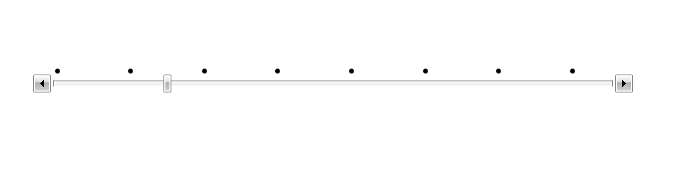

# How to customize the look of the tick marks using TickTemplateSelector

## 

The __TickTemplateSelector__ property gives you the ability to display ticks 
        with different templates.____This tutorial will walk you through the common task of
        creating and applying __TickTemplateSelector.__

Having the following Slider declaration, every fourth tick will be displayed: 

#### __XAML__

{{region radslider-tick-templateselector_0}}
	        <telerik:RadSlider x:Name="MySlider" 
	                           HandlesVisibility="Visible"
	                           IsSnapToTickEnabled="True"
	                           Maximum="30"
	                           SmallChange="1"
	                           TickFrequency="1"
	                           TickPlacement="TopLeft" />
	{{endregion}}

First, you have to create two DataTemplates in the resources of your application. In the first one the tick marks will be displayed as Ellipses and the second one will be empty. 

#### __XAML__

{{region radslider-tick-templateselector_1}}
	        <DataTemplate x:Key="EllipseTemplate">
	            <Grid>
	                <Ellipse Width="5" 
	                         Height="5"
	                         Fill="Black" />
	            </Grid>
	        </DataTemplate>
	
	        <DataTemplate x:Key="EmptyTemplate">
	            <Grid />
	        </DataTemplate>
	{{endregion}}

The next step is to create the __TickTemplateSelector__ and choose the
        appropriate template depending on the numeric value of the tick:

>When you create a __TickTemplateSelector__, you must derive from 
          the __DataTemplateSelector__ class.

#### __C#__

{{region radslider-tick-templateselector_2}}
	public class TickTemplateSelector : DataTemplateSelector
	{
	}
	{{endregion}}

#### __VB.NET__

{{region radslider-tick-templateselector_3}}
	Public Class TickTemplateSelector
	       Inherits DataTemplateSelector
	End Class
	{{endregion}}

Override, the __Sele____ctTemplate__ method and implement 
        your custom logic in it. The method accepts as arguments:

* __object -__ the actual object being bound

* __DependancyObject -__the container for the object argument. 

#### __C#__

{{region radslider-tick-templateselector_4}}
	public class TickTemplateSelector : DataTemplateSelector
	{
	  public DataTemplate EllipseTemplate { get; set; }
	  public DataTemplate EmptyTemplate { get; set; }
	  public override DataTemplate SelectTemplate(object item, DependencyObject container)
	  {
	    double tick = Convert.ToDouble(item);
	    if (tick % 4 == 0.0)
	     {
	       return EllipseTemplate;
	     }
	    else
	     {
	       return EmptyTemplate;
	     }
	  }
	}
	{{endregion}}

#### __VB.NET__

{{region radslider-tick-templateselector_5}}
	Public Class TickTemplateSelector
	       Inherits DataTemplateSelector
	       Public EllipseTempl As DataTemplate
	       Public Property EllipseTemplate() As DataTemplate
	              Get
	                 Return EllipseTempl
	              End Get
	              Set(ByVal value As DataTemplate)
	                 EllipseTempl = value
	              End Set
	       End Property
	       Public EmptyTempl As DataTemplate
	       Public Property EmptyTemplate() As DataTemplate
	              Get
	                 Return EmptyTempl
	              End Get
	              Set(ByVal value As DataTemplate)
	                 EmptyTempl = value
	              End Set
	       End Property
	       Public Overrides Function SelectTemplate(ByVal item As Object, ByVal container As DependencyObject) As DataTemplate
	              Dim tick As Double = Convert.ToDouble(item)
	              If tick Mod 4 = 0 Then
	                 Return EllipseTempl
	              Else
	                 Return EmptyTempl
	              End If
	       End Function
	End Class
	{{endregion}}

Define the created selector as a resource in the XAML and set it to the 
        __TickTemplateSelector__ property.

#### __XAML__

{{region radslider-tick-templateselector_6}}
	        <local:TickTemplateSelector x:Key="TickTemplateSelector" 
	                                    EllipseTemplate="{StaticResource EllipseTemplate}"
	                                    EmptyTemplate="{StaticResource EmptyTemplate}" />
	{{endregion}}

#### __XAML__

{{region radslider-tick-templateselector_7}}
	        <telerik:RadSlider x:Name="MySlider" 
	                           HandlesVisibility="Visible"
	                           IsSnapToTickEnabled="True"
	                           Maximum="30"
	                           SmallChange="1"
	                           TickFrequency="1"
	                           TickPlacement="TopLeft"
	                           TickTemplate="{x:Null}"
	                           TickTemplateSelector="{StaticResource TickTemplateSelector}" />
	{{endregion}}

