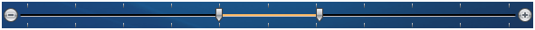

# {{ site.framework_name }} Slider Overview

Thank you for choosing Telerik __RadSlider__ !

__RadSlider__ is a flexible UI component that allows users to select a value from a defined range. The control is completely customizable in terms of appearance and offers numerous configuration options like orientation, small change, mouse wheel support, selection range, snap to tick, tick placement, tick template, etc.




				

## Key Features

* __Orientation__ - Set the orientation of the slider to either horizontal or vertical as per your needs					

* __Styling and Appearance__ -The control is fully customizable in terms of UI. You can change the control’s appearance as per your very custom needs					

* __Move the Thumb to the Mouse Pointer__ - Allow the thumb of the slider move to the location of the mouse click that occurs while the mouse pointer pauses on the slider track

* __Move Slider to the Closest Tick__ - Allow the slider move the thumb to the closest tick mark					


## Telerik UI for WPF Support and Learning Resources

* [Telerik UI for WPF Slider Homepage](https://www.telerik.com/products/wpf/slider.aspx)
* [Get Started with the Telerik UI for WPF Slider]()
* [Telerik UI for WPF API Reference](https://docs.telerik.com/devtools/wpf/api/)
* [Getting Started with Telerik UI for WPF Components]()
* [Telerik UI for WPF Virtual Classroom (Training Courses for Registered Users)](https://learn.telerik.com/learn/course/external/view/elearning/16/telerik-ui-for-wpf) 
* [Telerik UI for WPF Slider Forums](https://www.telerik.com/forums/wpf)
* [Telerik UI for WPF Knowledge Base](https://docs.telerik.com/devtools/wpf/knowledge-base)


