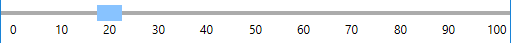
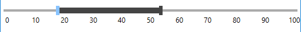
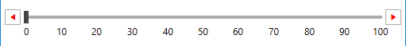
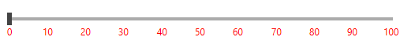
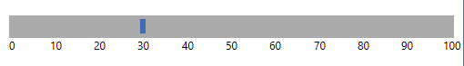

# {{ site.framework_name }} RadSlider Overview

__RadSlider__ allows you to easily modify its appearance by providing some useful properties.

> The pictures in this article demonstrate the RadSlider in the __Office2016__ theme.

## ThumbStyle

Via the ThumbStyle property you can control the appearance of the thumb which is used to control the **Value**.

#### [XAML] Example 1: Specify ThumbStyle

{{region xaml-radslider-styling-overview_0}}
    <Grid>
        <Grid.Resources>
            
        </Grid.Resources>
        <telerik:RadSlider Minimum="0" 
                           Maximum="100" 
                           TickFrequency="10"
                           TickPlacement="BottomRight" 
                           ThumbStyle="{StaticResource ThumbStyle}">
            <telerik:RadSlider.TickTemplate>
                <DataTemplate>
                    <TextBlock Text="{Binding}" />
                </DataTemplate>
            </telerik:RadSlider.TickTemplate>
        </telerik:RadSlider>
    </Grid>
{{endregion}}

#### __Figure 1: RadSlider with custom ThumbStyle__

## SelectionMiddleThumbStyle

Via the SelectionMiddleThumbStyle property you can control the appearance of the middle thumb which is displayed when the __IsSelectionRangeEnabled__ property is True.

#### [XAML] Example 2: Specify SelectionMiddleThumbStyle

{{region xaml-radslider-styling-overview_1}}
    <Grid>
        <Grid.Resources>
            
        </Grid.Resources>
        <telerik:RadSlider Minimum="0" 
                           Maximum="100" 
                           TickFrequency="10"
                           TickPlacement="BottomRight" 
                           IsSelectionRangeEnabled="True"
                           Margin="5"
                           SelectionMiddleThumbStyle="{StaticResource SelectionMiddleThumbStyle}">
            <telerik:RadSlider.TickTemplate>
                <DataTemplate>
                    <TextBlock Text="{Binding}" />
                </DataTemplate>
            </telerik:RadSlider.TickTemplate>
        </telerik:RadSlider>
    </Grid>
{{endregion}}

#### __Figure 2: RadSlider with custom SelectionMiddleThumbStyle__

## DecreaseHandleStyle and IncreaseHandleStyle

The DecreaseHandleStyle and IncreaseHandleStyle properties allow you to modify the appearance of the two repeat buttons which increase and decrease the Value. They are shown when the __HandlesVisibility__ is True.

#### [XAML] Example 3: Set DecreaseHandleStyle and IncreaseHandleStyle
{{region xaml-radslider-styling-overview_2}}
    <Grid>
        <Grid.Resources>
            
            
        </Grid.Resources>
        <telerik:RadSlider Minimum="0" 
                           Maximum="100" 
                           TickFrequency="10"
                           TickPlacement="BottomRight" 
                           Margin="5"
                           HandlesVisibility="Visible"
                           DecreaseHandleStyle="{StaticResource DecreaseHandleStyle}"
                           IncreaseHandleStyle="{StaticResource IncreaseHandleStyle}">
            <telerik:RadSlider.TickTemplate>
                <DataTemplate>
                    <TextBlock Text="{Binding}" />
                </DataTemplate>
            </telerik:RadSlider.TickTemplate>
        </telerik:RadSlider>
    </Grid>
{{endregion}}

#### __Figure 3: RadSlider with custom DecreaseHandleStyle and IncreaseHandleStyle__

## TickBarStyle

The TickBarStyle property allows you to modify the appearance of the bottom and top tickbars - the controls which displays the ticks.

#### [XAML] Example 4: Set TickBarStyle

{{region xaml-radslider-styling-overview_3}}
    <Grid>
        <Grid.Resources>
            
        </Grid.Resources>
        <telerik:RadSlider Minimum="0" 
                           Maximum="100" 
                           TickFrequency="10"
                           TickPlacement="BottomRight" 
                           Margin="10"
                           TickBarStyle="{StaticResource TickBarStyle}">
            <telerik:RadSlider.TickTemplate>
                <DataTemplate>
                    <TextBlock Text="{Binding}" />
                </DataTemplate>
            </telerik:RadSlider.TickTemplate>
        </telerik:RadSlider>
    </Grid>
{{endregion}}

#### __Figure 4: RadSlider with custom TickBarStyle__

## TrackStyle

The TrackStyle property lets you modify the appearance of the RadSlider track.

#### [XAML] Example 5: Set TrackStyle

{{region xaml-radslider-styling-overview_4}}
    <Grid>
        <Grid.Resources>
            
        </Grid.Resources>
        <telerik:RadSlider Minimum="0" 
                           Maximum="100" 
                           TickFrequency="10"
                           TickPlacement="BottomRight" 
                           Margin="10"
                           TrackStyle="{StaticResource CustomTrackStyle}">
            <telerik:RadSlider.TickTemplate>
                <DataTemplate>
                    <TextBlock Text="{Binding}" />
                </DataTemplate>
            </telerik:RadSlider.TickTemplate>
        </telerik:RadSlider>
    </Grid>
{{endregion}}

#### __Figure 5: RadSlider with custom TrackStyle__

>tip The styles in the examples are based on the default styles for the theme. This is the correct approach when the [implicit styling](#setting-a-theme-using-implicit-styles) approach is used. If the [StyleManager](#setting-a-theme-using-stylemanager) theming mechanism is chosen there is no need to base the custom styles on the default one. 

>tip In order to learn how to further modify any of the elements referenced in the article by extracting their control template, read the [Editing Control Templates]() article.
