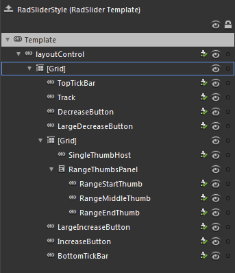

# Template Structure

Like most SilverlightWPF controls, the __RadSlider__ also allows you to template it in order to change the control from the inside. Except for templating the whole control, you can template parts of it or even independent controls related to it.
			

>tipFor more information about templating and how to modify the default templates of the __RadControls__ read [the common topics](http://www.telerik.com/help/silverlight/common-styling-appearance-edit-control-templates-blend.html)[the common topics](http://www.telerik.com/help/wpf/common-styling-appearance-edit-control-templates-blend.html) on this matter.
			

##  RadSlider Template Structure

This section will explain the structure of the __RadSlider__'s template. Here is a snapshot of the template generated in Expression Blend.

It contains the following parts:

* __layoutControl__- is of type __LayoutTransformControl__ and represents the layout root for the template.
						

* __[Grid]__ - represents the host control for the __RadSlider__ control elements.
								

* __TopTickBar__ -  is of type __RadTickBar__ and is used to display the __TopLeft__ positioned ticks
									

* __Track__ - is the __ContentControl__ that represents the __RadSlider__ track
									

* __DecreaseButton__ - is a __RepeatButton__ that represents the left handle of the __RadSlider__

* __LargeDecreaseButton__ - - is a __RepeatButton__ that is used to implement large decrease change
									

* __[Grid]__ - represents the host control for the __RadSlider__ thumb and __SelectonRange__ elements
										

* __SingleThumbHost__ - is of type __Thumb__ and represents the single thumb of the __RadSlider__

* __RangeThumbsPanel__ - is the __StackPanel__ that hosts the __SelectionRange__ elements
												

* __RangeStartThumb__ - is of type __Thumb__ and represents the __SelectionStart__ thumb in a selection range
													

* __RangeMiddleThumb__ - is of type __Thumb__ and represents the selection range
													

* __RangeEndThumb__  - is of type __Thumb__ and represents the __SelectionEnd__ thumb in a selection range
													

* __LargeIncreaseButton__ - is a __RepeatButton__ that is used to implement large increase change
									

* __IncreaseButton__ - is a __RepeatButton__ that represents the right handle of the __RadSlider__

* __BottomTickBar__ - is of type __RadTickBar__ and is used to display the __BottomRight__ positioned ticks
									
