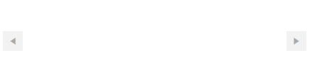
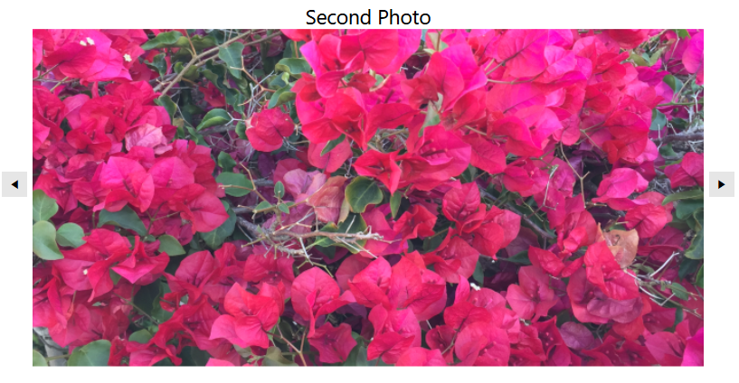
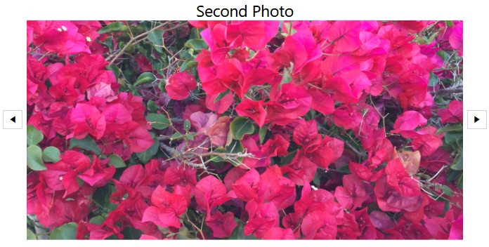

# Getting Started with {{ site.framework_name }} SlideView

This tutorial will walk you through the creation of a sample application that contains a `RadSlideView` control.

## Adding Telerik Assemblies Using NuGet

To use __RadSlideView__ when working with NuGet packages, install the `Telerik.Windows.Controls.for.Wpf.Xaml` package. The [package name may vary]() slightly based on the Telerik dlls set - [Xaml or NoXaml]()

Read more about NuGet installation in the [Installing UI for WPF from NuGet Package]() article.

>tip With the 2025 Q1 release, the Telerik UI for WPF has a new licensing mechanism. You can learn more about it [here]().

## Adding Assembly References Manually

If you are not using NuGet packages, you can add a reference to the following assemblies:

* __Telerik.Licensing.Runtime__
* __Telerik.Windows.Controls__

## Defining the RadSlideView

You can add RadSlideView manually in XAML as demonstrated in the following example:

#### __[XAML] Adding RadSlideView in XAML__
{{region radslideview-getting-started-0}}
    <telerik:RadSlideView/>
{{endregion}}

__Empty RadSlideView__

## Data Binding

RadSlideView allows you to data bind it to a collection of business objects. To do so, bind the collection to the `ItemsSource` property of the control.

The following example will demonstrate a simple data binding scenario.

#### __[C#] Defining the model__
{{region radslideview-getting-started-1}}
    public class Photo
    {
        public string Title { get; set; }
        public string ImagePath { get; set; }
    }
{{endregion}}

#### __[VB.NET] Defining the model__
{{region radslideview-getting-started-2}}
    Public Class Photo
        Public Property Title As String
        Public Property ImagePath As String
    End Class
{{endregion}}

#### __[C#] Defining the view model__
{{region radslideview-getting-started-3}}
    public class PhotosViewModel
    {
        public PhotosViewModel()
        {
            this.Photos = new ObservableCollection<Photo>()
            {
                new Photo() { Title = "First Photo", ImagePath = "FirstPhoto.png" },
                new Photo() { Title = "Second Photo", ImagePath = "SecondPhoto.png" },
                new Photo() { Title = "Third Photo", ImagePath = "ThirdPhoto.png" },
            };
        }
        public ObservableCollection<Photo> Photos { get; set; } 
    }
{{endregion}}

#### __[VB.NET] Defining the view model__
{{region radslideview-getting-started-4}}
    Public Class PhotosViewModel
        Public Sub New()
            Me.Photos = New ObservableCollection(Of Photo)() From {
                New Photo() With {
                    .Title = "First Photo",
                    .ImagePath = "FirstPhoto.png"
                },
                New Photo() With {
                    .Title = "Second Photo",
                    .ImagePath = "SecondPhoto.png"
                },
                New Photo() With {
                    .Title = "Third Photo",
                    .ImagePath = "ThirdPhoto.png"
                }
            }
        End Sub

        Public Property Photos As ObservableCollection(Of Photo)
    End Class
{{endregion}}

#### __[XAML] Binding the collection to the ItemsSource property__
{{region radslideview-getting-started-5}}
    <Grid>
        <Grid.Resources>
            <local:PhotosViewModel x:Key="PhotosViewModel"/>
        </Grid.Resources>
        <telerik:RadSlideView DataContext="{StaticResource PhotosViewModel}"
                              ItemsSource="{Binding Photos}">
        </telerik:RadSlideView>
    </Grid>
{{endregion}}

#### __[XAML] Customizing the appearance of the bound items via the ItemTemplate property of RadSlideView__
{{region radslideview-getting-started-6}}
    <Grid>
        <Grid.Resources>
            <local:PhotosViewModel x:Key="PhotosViewModel"/>
        </Grid.Resources>
        <telerik:RadSlideView DataContext="{StaticResource PhotosViewModel}"
                              ItemsSource="{Binding Photos}"
                              SelectedIndex="0"
                              ShowButtonsOverContent="False"
                              HorizontalAlignment="Center"
                              VerticalAlignment="Center">
            <telerik:RadSlideView.ItemTemplate>
                <DataTemplate>
                    <Grid>
                        <Grid.RowDefinitions>
                            <RowDefinition Height="Auto"/>
                            <RowDefinition Height="*"/>
                        </Grid.RowDefinitions>
                        <TextBlock Text="{Binding Title}"
                                   FontSize="18"
                                   HorizontalAlignment="Center"
                                   VerticalAlignment="Center"/>
                        <Image Source="{Binding ImagePath}" Grid.Row="1"/>
                    </Grid>
                </DataTemplate>
            </telerik:RadSlideView.ItemTemplate>
        </telerik:RadSlideView>
    </Grid>
{{endregion}}

__RadSlideView in a sample data-binding scenario__

## Setting a Theme

The controls from our suite support different themes. You can see how to apply a theme different than the default one in the [Setting a Theme]() help article.

>important Changing the theme using implicit styles will affect all controls that have styles defined in the merged resource dictionaries. This is applicable only for the controls in the scope in which the resources are merged. 

* Choose between the themes and add reference to the corresponding theme assembly (ex: __Telerik.Windows.Themes.Windows8.dll__). You can see the different themes applied in the __Theming__ examples from our [WPF Controls Examples](https://demos.telerik.com/wpf/)[Silverlight Controls Examples](https://demos.telerik.com/silverlight/#PanelBar/Theming) application.

* Merge the ResourceDictionaries with the namespace required for the controls that you are using from the theme assembly. For the RadSlideView, you will need to merge the following resources:

	* __Telerik.Windows.Controls__

The following example demonstrates how to merge the ResourceDictionaries so that they are applied globally for the entire application.

#### __[XAML] Merge the ResourceDictionaries__
{{region radslideview-getting-started-7}}
    <Application.Resources>
    	<ResourceDictionary>
    		<ResourceDictionary.MergedDictionaries>
    			<ResourceDictionary Source="/Telerik.Windows.Themes.Windows8;component/Themes/System.Windows.xaml"/>
    			<ResourceDictionary Source="/Telerik.Windows.Themes.Windows8;component/Themes/Telerik.Windows.Controls.xaml"/>
    		</ResourceDictionary.MergedDictionaries>
    	</ResourceDictionary>
    </Application.Resources>
{{endregion}}

>Alternatively, you can use the theme of the control via the [StyleManager](https://docs.telerik.com/devtools/wpf/styling-and-appearance/stylemanager/common-styling-apperance-setting-theme-wpf).

The following image shows a RadSlideView with the __Windows8__ theme applied.

__RadSlideView with the Windows8 theme__


## Telerik UI for WPF Learning Resources

* [Telerik UI for WPF SlideView Component](https://www.telerik.com/products/wpf/slideview.aspx)
* [Getting Started with Telerik UI for WPF Components]()
* [Telerik UI for WPF Installation]()
* [Telerik UI for WPF and WinForms Integration]()
* [Telerik UI for WPF Visual Studio Templates]()
* [Setting a Theme with Telerik UI for WPF]()
* [Telerik UI for WPF Virtual Classroom (Training Courses for Registered Users)](https://learn.telerik.com/learn/course/external/view/elearning/16/telerik-ui-for-wpf) 
* [Telerik UI for WPF License Agreement](https://www.telerik.com/purchase/license-agreement/wpf-dlw-s)


## See Also
* [Animations]()
* [Navigation Buttons]()