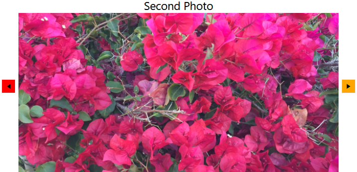

# Navigation Buttons

The navigation buttons allow you to navigate through the data. `RadSlideView` provides the ability to control their visibility, position, and style. Furthermore, you can also specify an auto-hide period, after which the buttons will be automatically hidden, as well as enable or disable infinite scrolling.

## Controlling the Visibility of the Buttons

The visibility of the navigation buttons is controlled via the `ButtonVisibility` property of RadSlideView. This property is of the type `ButtonVisibility` and it exposes the following options:

* `Collapsed`&mdash;This option will prevent the buttons from showing.
* `Visible`&mdash;With this option, the buttons will be visible.
* `VisibleOnMouseOver`&mdash;This option is the default one. With it, the buttons will be visible when the mouse is over the RadSlideView control.
* `HiddenWhenDisabled`&mdash;When this option is chosen, each button will be hidden when it is in disabled state.

__Setting the ButtonVisibility property to Visible__
```XAML
    <telerik:RadSlideView ButtonVisibility="Visible"/>
```

__RadSlideView with visible buttons__


## Controlling the Position of the Navigation Buttons

RadSlideView allows you to control the navigation buttons' position. They can be displayed either over the content or next to it. This behavior is controlled via the `ShowButtonsOverContent` property. The default value is __true__, with which the buttons will be displayed over the content.

__Setting the ShowButtonsOverContent property__
```XAML
    <telerik:RadSlideView ShowButtonsOverContent="False"/>
```

__RadSlideView with buttons displayed outside of the content__


## Customizing the Appearance of the Navigation Buttons

RadSlideView exposes the `PreviousButtonStyle` and `NextButtonStyle` properties that will allow you to set custom styles to the navigation buttons. Both buttons are of the type `RadButton` and the custom styles will have to target this type of element.

__Setting custom styles to the PreviousButtonStyle and NextButtonStyle properties__
```XAML
    <Grid>
        <Grid.Resources>
             <!--Set BasedOn property if NoXaml assemblies are used: BasedOn="{StaticResource SlideViewPreviousButtonStyle}"-->
            <Style x:Key="CustomSlideViewPreviousButtonStyle" TargetType="telerik:RadButton">
                <Setter Property="Background" Value="Red"/>
            </Style>
             <!--Set BasedOn property if NoXaml assemblies are used: BasedOn="{StaticResource SlideViewNextButtonStyle}"-->
            <Style x:Key="CustomSlideViewNextButtonStyle" TargetType="telerik:RadButton">
                <Setter Property="Background" Value="Orange"/>
            </Style>
        </Grid.Resources>
        <telerik:RadSlideView PreviousButtonStyle="{StaticResource CustomSlideViewPreviousButtonStyle}"
                              NextButtonStyle="{StaticResource CustomSlideViewNextButtonStyle}"/>
    </Grid>
```

__RadSlideView with custom styles for the navigation buttons__



## Setting an Auto-Hide Interval for the Navigation Buttons

You can specify a time interval, after which the navigation buttons will become hidden. This interval will begin after the mouse is out of the control or it stops moving when it's over it. To apply such a time interval, you can set the`AutoHideButtonsDelay` property of RadSlideView. This property has a type of nullable `TimeSpan`. By default, this property will be __null__ and the buttons will not become hidden.

__Setting an auto-hide interval for the navigation buttons__
```XAML
    <telerik:RadSlideView AutoHideButtonsDelay="00:00:05"/>
```

## See Also
* [Animations]()