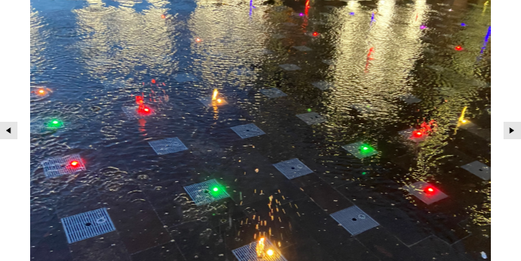

# {{ site.framework_name }} SlideView Overview

SlideView is a flexible navigation control that allows you to slide between different views, thus providing an interactive navigation. With it, you can build a gallery display to show your images and content efficiently.





>tip Get started with the control with its [Getting Started]() help article that shows how to use it in a basic scenario.

## Key Features

* __Navigation__&mdash;The SlideView control allows you to navigate through the data either in a loop or from end to end.
* __Animation__&mdash;This compoment comes out of the box with support for animations when navigating the data.
* __Orientation__&mdash;SlideView allows you to customize how the data will be navigated. The possible options are vertically or horizontally.
* __Customizing navigation buttons__&mdash;The SlideView component provides the ability to customize the navigation buttons. You can learn more about this functionality in the [Navigation Buttons]() article.

> Check out the demos application at [demos.telerik.com](https://demos.telerik.com/wpf/).

## See Also
* [Visual Structure]()
* [Getting Started]()