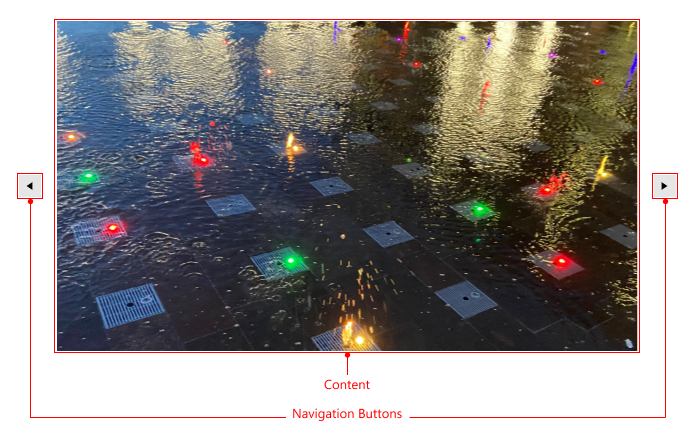

# Visual Structure

This section defines terms and concepts used in the scope of the `RadSlideView` control with which you have to get familiar before you continue to read its documentation. They can also be helpful when contacting our support service in order to describe your issue better.

* __Current Item__&mdash;Currently selected item.
* __Navigation Buttons__&mdash;Navigation buttons used for changing the current item.

>tip  Get started with the control with its [Getting Started]() help article that shows how to use it in a basic scenario.

## See Also
* [Getting Started]()
* [Animations]()
* [Navigation Buttons]()