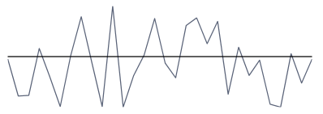
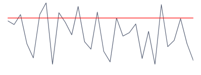

# Axis

This article will show you how to control the range of the plotted data and how to show and customize the axis indicator.

## Showing the Axis

The axis indicator is a horizontal line drawn accross the sparkline control. 

To show the axis set the __ShowAxis__ property of the sparkline control to True. 

> By default the axis will be shown on value 0. This means that if the axis' range doesn't contain the 0 value, the axis won't be displayed. In this case you can set the __AxisOriginValue__ property of the sparkline control manually.

#### __[XAML] Example 1: Setting ShowAxis__
{{region radsparkline-features-axis-0}}
	<telerik:RadLinearSparkline ShowAxis="True" />
{{endregion}}

#### Figure 1: Sparkline Axis

## Customizing the Axis

The sparkline provides couple of properties that can be used to customize the axis. 

To set the stroke of the axis, set the __AxisStroke__ property.

To set the origin value of the axis (in relation to the vertical axis), set the __AxisOriginValue__ property. This controls the vertical position of the axis. The default origin is 0.

#### __[XAML] Example 2: Customizing the axis indicator__
{{region radsparkline-features-axis-1}}
	<telerik:RadLinearSparkline ShowAxis="True"
								AxisStroke="Red"                             
								AxisOriginValue="150"/>
{{endregion}}

#### Figure 1: Sparkline Customized Axis

## Controlling the Data Range

By default the axes of the sparkline will auto calculate their ranges based on the plotted data. To manually adjust the range set the __AutoRange__ property to __False__. Then you can use the __MinXValue__,  __MaxXValue__ and __MinYValue__, __MaxYValue__ properties to set minimum and maximum values of the horizontal and the vertical axes.

#### __[XAML] Example 3: Setting manual range__
{{region radsparkline-features-axis-2}}
	<telerik:RadColumnSparkline AutoRange="False"
								MinXValue="100"
								MaxXValue="300"
								MinYValue="10"
								MaxYValue="80"/>
{{endregion}}

## See Also
* [Getting Started]()
* [Indicators]()
* [Data Binding]()
