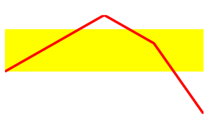
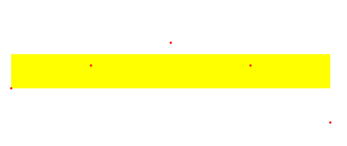
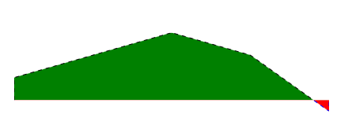

# Sparkline Types

The sparkline suite contains several controls that provide different visualization for the plotted data. See how to set up those in the [Getting Started]() article.

* __Line__: You can display the data as a set of points connected by a line via the __RadLinearSparkline__ control.

	

* __Scatter point__: You can display the data as a set of points via the __RadScatterSparkline__ control.

	
	
* __Area__: You can display the data as a set of points connected by a line forming a colored area via the __RadAreaSparkline__ control.

	
	
* __Column__: You can display the data as a set of columns (bars) via the __RadColumnSparkline__ control.

	
	
* __Win/Loss__: You can display the data as a set of equally sized columns (bars) that indicate positive/negative values, via the __RadColumnSparkline__ control.
	
	

## Type-Specific Properties

This section will go over the properties that are specific for each type of sparkline. For the purposes of the next examples, we will setup the model and viewmodel shown in __Example 1__.

__Example 1: Setting up the model and viewmodel__
<snippet id='radsparkline-getting-started-sparkline-getting-started-types-block_1-cs' />
<snippet id='radsparkline-getting-started-sparkline-getting-started-types-block_2-vb' />

#### RadLinearSparkline

* __ShowNormalRange__: A boolean property indicating whether or not to display a rectangle indicating what is the normal range for the displayed values. In order for the normal range to be displayed, you have to set the __NormalRangeTop__ and __NormalRangeBottom__ properties as well. 
* __NormalRangeTop__: The value used as the top of the normal range.
* __NormalRangeBottom__: The value used as the bottom of the normal range.
* __NormalRangeFill__: The brush used as the fill of the normal range. 
* __LineStroke__: The brush used for the line representing the data. 
* __LineShapeStyle__: The style, which will be applied to the line. The __TargetType__ of the Style should be __Polyline__. 

>important If the Stroke property is set through the LineShapeStyle along with the LineStroke property, the value of the LineStroke property will be respected. 

__Example 2: Setting up the RadLinearSparkline__
<snippet id='radsparkline-getting-started-sparkline-getting-started-types-block_3-xaml' />

#### __Figure 1: Result from Example 2__

#### RadScatterSparkline
* __ShowNormalRange__: A boolean property indicating whether or not to display a rectangle indicating what is the normal range for the displayed values. In order for the normal range to be displayed, you have to set the __NormalRangeTop__ and __NormalRangeBottom__ properties as well. 
* __NormalRangeTop__: The value used as the top of the normal range.
* __NormalRangeBottom__: The value used as the bottom of the normal range.
* __NormalRangeFill__: The brush used as the fill of the normal range. 
* __ItemFill__: The brush that will be used for the fill of the ellipses representing the data. 
* __ItemStyle__: This property allows you to apply a style for the items representing the data. The __TargetType__ of the Style should be __telerik:ScatterItem__. Use this property, if you want to change the shape with which the data points are visualized. 

__Example 3: Setting up the RadScatterSparkline__
<snippet id='radsparkline-getting-started-sparkline-getting-started-types-block_4-xaml' />

#### __Figure 2: Result from Example 3__

#### RadAreaSparkline
* __PositiveAreaFill__: The brush that will be used for the fill of the positive part of the data. 
* __PositiveAreaStroke__: The brush that will be used for the line surrounding the positive part of the data. 
* __PositiveLineShapeStyle__: The style that will be applied to the polyline surrounding the positive part of the data. The __TargetType__ of this style should be __Polyline__.
* __PositiveAreaShapeStyle__: The style that will be applied to the shape representing the positive part of the data. The __TargetType__ of this style should be __Polyline__.
* __NegativeAreaFill__: The brush that will be used for the fill of the negative part of the data. 
* __NegativeAreaStroke__: The brush that will be used for the line surrounding the negative part of the data. 
* __NegativeLineShapeStyle__: The style that will be applied to the polyline surrounding the negative part of the data. The __TargetType__ of this style should be __Polyline__.
* __NegativeAreaShapeStyle__: The style that will be applied to the shape representing the negative part of the data. The __TargetType__ of this style should be __Polyline__.

__Example 4: Setting up the RadAreaSparkline__
<snippet id='radsparkline-getting-started-sparkline-getting-started-types-block_5-xaml' />

#### __Figure 3: Result from Example 4__

#### RadColumnSparkline
* __ColumnLayoutMode__: Determines how the column representing the data points will be positioned. Takes a [ColumnLayoutMode](https://docs.telerik.com/devtools/wpf/api/telerik.windows.controls.sparklines.columnlayoutmode) as a value. 
* __ColumnWidthPercent__: Specifies how much of the allocated space will the columns take. The space available for one column is calculated by dividing the entire space by the number of items. 

__Example 5: Setting up the RadColumnSparkline__
<snippet id='radsparkline-getting-started-sparkline-getting-started-types-block_6-xaml' />

#### __Figure 4: Result from Example 5__

	


## Telerik UI for WPF Learning Resources

* [Telerik UI for WPF Sparklines Component](https://www.telerik.com/products/wpf/sparklines.aspx)
* [Getting Started with Telerik UI for WPF Components]()
* [Telerik UI for WPF Installation]()
* [Telerik UI for WPF and WinForms Integration]()
* [Telerik UI for WPF Visual Studio Templates]()
* [Setting a Theme with Telerik UI for WPF]()
* [Telerik UI for WPF Virtual Classroom (Training Courses for Registered Users)](https://learn.telerik.com/learn/course/external/view/elearning/16/telerik-ui-for-wpf) 
* [Telerik UI for WPF License Agreement](https://www.telerik.com/purchase/license-agreement/wpf-dlw-s)


## See Also
* [Indicators]()
* [Data Binding]()
