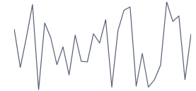
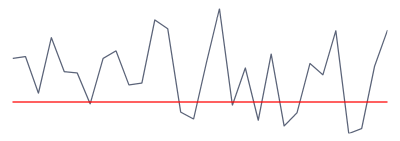

# Getting Started with {{ site.framework_name }} Sparklines

This tutorial will walk you through the creation of a sample application that contains __RadLinearSparkline__. The other controls from the RadSparkline suite are set up using the same principle.

* [Adding Telerik Assemblies Using NuGet](#adding-telerik-assemblies-using-nuget)
* [Adding Assembly References Manually](#adding-assembly-references-manually)
* [Sparkline Types](#sparkline-types)
* [Defining Sparkline](#defining-sparkline)
* [Showing Axis](#showing-axis)

## Adding Telerik Assemblies Using NuGet

To use __RadSparkline__ when working with NuGet packages, install the `Telerik.Windows.Controls.DataVisualization.for.Wpf.Xaml` package. The [package name may vary]() slightly based on the Telerik dlls set - [Xaml or NoXaml]()

Read more about NuGet installation in the [Installing UI for WPF from NuGet Package]() article.

>tip With the 2025 Q1 release, the Telerik UI for WPF has a new licensing mechanism. You can learn more about it [here]().

## Adding Assembly References Manually

If you are not using NuGet packages, you can add a reference to the following assemblies:

* __Telerik.Licensing.Runtime__
* __Telerik.Windows.Controls__
* __Telerik.Windows.Controls.DataVisualization__
* __Telerik.Windows.Data__

## Sparkline Types

The sparkline bundle contains few controls which can be used for different data visualization. The supported visualizations are line, scatter points, area, column and win/loss bars. Read more about this in the [Sparkline Types]() article.

## Defining Sparkline

To show the sparkline control you can define a custom model for the data points as shown in __Example 1__. Then create a collection with the model and set it to the ItemsSource of the sparkline control (see __Example 3__).

__Example 1: Create the model__
```C#
	public class PlotInfo
    {
        public double YValue { get; set; }
        public double XValue { get; set; }
    }
```

__Example 2: Define the sparkline__
```XAML
	<telerik:RadLinearSparkline x:Name="sparkline"
								YValuePath="YValue"
								XValuePath="XValue"	/>
```

The __XValuePath__ and __YValuePath__ properties should be set to the names of the corresponding properties in the data point model (in this case PlotInfo).

__Example 3: Populate and set the ItemsSource__
```C#
	var randomNumberGenerator = new Random();
	var source = new ObservableCollection<PlotInfo>();
	for (int i = 0; i < 30; i++)
	{
		source.Add(new PlotInfo() { XValue = i, YValue = randomNumberGenerator.Next(100, 300) });
	}
	this.sparkline.ItemsSource = source;
```

#### Figure 1: RadLinearSparkline


## Showing Axis

You can show the axis of the sparkline control by setting its __ShowAxis__ property to True. The axis is horizontal. Read more about customizing the axis range and appearance in the [Axis]() article.

> By default the axis will be shown on value 0. This means that if the axis' range doesn't contain the 0 value, the axis won't be displayed. In this case you can set the __AxisOriginValue__ property of the sparkline control manually.

#### Figure 2: Sparkline axis


## Setting a Theme

The controls from our suite support different themes. You can see how to apply a theme different than the default one in the [Setting a Theme]() help article.

>important Changing the theme using implicit styles will affect all controls that have styles defined in the merged resource dictionaries. This is applicable only for the controls in the scope in which the resources are merged. 

To change the theme, you can follow the steps below:

* Choose between the themes and add reference to the corresponding theme assembly (ex: **Telerik.Windows.Themes.Windows8.dll**). You can see the different themes applied in the **Theming** examples from our [WPF Controls Examples](https://demos.telerik.com/wpf/)[Silverlight Controls Examples](https://demos.telerik.com/silverlight/#Slider/Theming) application.

* Merge the ResourceDictionaries with the namespace required for the controls that you are using from the theme assembly. For the RadSparkLine, you will need to merge the following resources:

	* __Telerik.Windows.Controls__
	* __Telerik.Windows.Controls.DataVisualization__

__Example 3__ demonstrates how to merge the ResourceDictionaries so that they are applied globally for the entire application.

__Example 3: Merge the ResourceDictionaries__  
```XAML
	<Application.Resources>
		<ResourceDictionary>
			<ResourceDictionary.MergedDictionaries>
				<ResourceDictionary Source="/Telerik.Windows.Themes.Windows8;component/Themes/System.Windows.xaml"/>
				<ResourceDictionary Source="/Telerik.Windows.Themes.Windows8;component/Themes/Telerik.Windows.Controls.xaml"/>
				<ResourceDictionary Source="/Telerik.Windows.Themes.Windows8;component/Themes/Telerik.Windows.DataVisualization.xaml"/>
			</ResourceDictionary.MergedDictionaries>
		</ResourceDictionary>
	</Application.Resources>
```

>Alternatively, you can use the theme of the control via the [StyleManager](https://docs.telerik.com/devtools/wpf/styling-and-appearance/stylemanager/common-styling-apperance-setting-theme-wpf)[StyleManager](https://docs.telerik.com/devtools/silverlight/styling-and-appearance/stylemanager/common-styling-apperance-setting-theme).

__Figure 1__ shows a RadSparkLine with the **Windows8** theme applied.

#### __Figure 1: RadSparkLine with the Windows8 theme__


## See Also
* [Indicators]()
* [Data Binding]()
