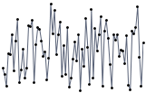
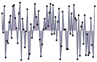

# Most important properties, settings and elements

## 

__1.Markers__

The markers are visual indicators, showing the location of each point along the graph line. This setting is applicable to spark lines of type __RadLinearSparklineBase__. This type pertains to a __line__ type sparkline, as well as an __area__ one. These two types, along with the setting are demonstrated below:
Line      

         
Area      

The markers are enabled by setting the ShowMarkers property, as demonstrated by the code snippet below:

#### __C#__

{{region radsparkline_most_important_properties,_settings_and_elements_0}}
	RadSparklineBase line = new RadLinearSparkline();
	line.ShowMarkers = true;
	{{endregion}}

__2. High point__
This is a visual indicator, which highlights the single highest-value datapoint in a series. In case there is more than one high point, all such points are highlighted. If the spark line is of type __RadColumnSparkline__ *or* __RadWinLossSparkLine__, the bar which represents the highest value is highlighted.
The highpoint is enabled by setting the ShowHighPointIndicator, as demonstrated by the code snippet below:

#### __C#__

{{region radsparkline_most_important_properties,_settings_and_elements_1}}
	RadLinearSparkline  line = new RadLinearSparkline();
	line.ShowHighPointIndicators = true;
	{{endregion}}

__3. Low point__
This is a visual indicator, which highlights the single lowest-value datapoint in a series. In case there is more than one such point, all similar points are highlighted. If the spark line is of type __RadColumnSparkline__ *or* __RadWinLossSparkLine__, the bar which represents the lowest value is highlighted.
The low point is enabled by setting the ShowLowPointIndicator property:

#### __C#__

{{region radsparkline_most_important_properties,_settings_and_elements_2}}
	RadLinearSparkline  line = new RadLinearSparkline();
	line. ShowLowPointIndicators = true;
	{{endregion}}

__4. Negative points__ 
These visual indicators highlight all negative data points in a series. If the spark line is of type __RadColumnSparkline__ *or* __RadWinLossSparkLine__, the bars which represent negative values are highlighted.
The negative points indicators are enabled by setting the ShowNegativePointsIndicator to true.

#### __C#__

{{region radsparkline_most_important_properties,_settings_and_elements_3}}
	RadLinearSparkline  line = new RadLinearSparkline();
	line.ShowNegativePointIndicators = true;
	{{endregion}}

__5. First point__ 
This is a visual indicator, which highlights the first data point in a series. If the spark line is of type __RadColumnSparkline__ *or* __RadWinLossSparkLine__, the bar which represents the first data point is highlighted. If the spark line is of type __RadColumnSparkline__ *or* __RadWinLossSparkLine__, the first bar is highlighted.
The first point is indicated in the series, by setting the __ShowFirstPointIndicator__ property, as demonstrated below:

#### __C#__

{{region radsparkline_most_important_properties,_settings_and_elements_4}}
	RadLinearSparkline  line = new RadLinearSparkline();
	line. ShowFirstPointIndicator = true;
	{{endregion}}

__6. Last point__
This is a visual indicator, which highlights the last data point in a series. If the spark line is of type __RadColumnSparkline__ *or* __RadWinLossSparkLine__, the bar which represents the last value is highlighted. The last point is indicated in the series, by setting the __ShowLastPointIndicator__ property, as demonstrated below: 

#### __C#__

{{region radsparkline_most_important_properties,_settings_and_elements_5}}
	RadLinearSparkline  line = new RadLinearSparkline();
	line. ShowLastPointIndicator = true;
	{{endregion}}

__Empty points__

There are cases when the collection of data, to which the Sparkline is bound may contain empty elements, with no data to which the control can bind and visualize. The behavior of the control in such cases is governed by the __EmptyPointBehavior__ property of the control, which is demonstrated below:

#### __C#__

{{region radsparkline_most_important_properties,_settings_and_elements_6}}
	RadScatterSparkline chart = new RadScatterSparkline(); 
	chart.EmptyPointBehavior = EmptyPointBehavior.DropPoint;
	{{endregion}}

There are two possible settings - __DropPoint__, and __ShowAsZero__. The first one removes the point, whereas the second visualizes the point as though its original value was zero.
