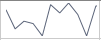
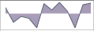
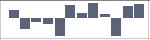
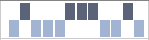

# Overview

## 



Thank you for choosing Telerik __RadSparkline__!

The __RadSparkline__ control is an information graphic, which is characterized by small size, excellent performance and lightweight. By definition, the Sparkline is mainly used to outline trends, however, it is very flexible in terms of data points generation and can contain from just a few points, to as many as thousands of data points.

In terms of data visualization, the __RadSparkline__ control is comparable to __RadChart__, however, in order to maximize performance, the spark lines do not utilize this many visual indicators, as well as x or y axis or multiple axes.

>In order to use __RadSparkline__control in your projects you have to add references to __Telerik.Windows.Controls.Charting.dll, Telerik.Windows.Controls.dll, Telerik.Windows.Controls.DataVisualization.dll and Telerik.Windows.Data.dll.__

__Types of Sparklines__Currently, the Sparkline control has the following subtypes:

1. __Line__, which is of type __RadLinearSparkline__. This type of sparkline represents a set of points, connected by a line.

         
      

2. __Scatter__, which is of type __RadScatterSparkline__. This represents the data points as a set of scattered, separate points. This is demonstrated in the screenshot below:

         
      

3. __Area__, which is of type __RadAreaSparkline__. The area represents a series of datapoints, connected by a line, as well as the space defined by the line and the median (which is usually the 0-value axis, however the value may be specified to be different from 0). This is demonstrated by the screenshot below:

         
      

4. __Column__, which is of type __RadColumnSparkline__. This type is very similar to a bar, and is a precise match of the value of each datapoint. Its vertical direction is an indicator of the value - positive or negative.

         
      

5. __Win/Loss__ is of type __RadWinLossSparkline__. This type of sparkline is very similar to the __column__ type, with the only difference being that all datapoints, or bars are of equal size. There is no visual indicator of the precise value of each datapoint, but simply of its positive or negative nature. This is demonstrated in the screenshot below:

         
      

